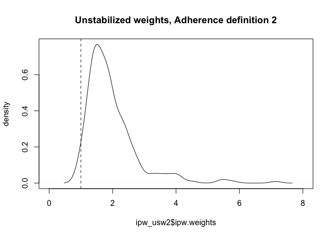

## Estimation of a* per-protocol effect for GIVE-MOVE

*(there are several) 

Based primarily on:
[Guidelines for estimating causal effects in pragmatic randomized trials](https://arxiv.org/abs/1911.06030) by Murray, Swanson and Hernan

Causal estimand of interest: The effect of successfully receiving GRT-guided strategy in intervention and VL-guided strategy in control.

We estimate the per-protocol effect of GRT-/VL-guided strategy, i.e., the effect of GRT-guided strategy if all the participants who were randomly assigned to the intervention group had received the GRT-guided strategy in intervention and the VL-guided strategy in control. The risk of VL failure may have differed between the participants who received guided strategy and those who who did not receive it; therefore, our analysis should adjust for participant and site baseline covariates that may predict adherence to protocol.

Note: We assume a point treatment situation. However, we could also argue for a sustained intervention strategy (e.g. since no-one in control should have received GRT over the entire study period). Then, we would need to adjust for time-varying confounding over study period (using g-methods or similar).

1. We start with defining non-adherence to treatment strategy in each group:

Intervention group:

* Participants not receiving a GRT although they were supposed to have one: 3 participants

* Participants not having the decision visit within six months (24 weeks) after randomization: 26 participants

Control group:

* Participants receiving a GRT although they were not supposed to have one: 3 participants

* Participants not receiving a VL although they were supposed to have one: 1 participant

* Participants not having the decision visit within six months (24 weeks) after randomization: 10 participants

Note: Not having a VL result within the 9-month window (6 participants in intervention and 7 participants in control) is already part of the primary endpoint (one component of the composite endpoint), so in my view makes more sense not to count them as a protocol deviation but as part of the estimand. But since these were also part of the per protocol set, will use two definitions of per protocol set and observe the result.

2. Define the DAG: See slide in folder "DAG"

3. Define the method used:
Because a point intervention is delivered at or close to the time of randomization, only covariates at or before the time of randomization influence adherence to a point intervention. To validly estimate the per-protocol effect, baseline variables which predict adherence and are prognostic for the outcome need to be accounted for, either through direct adjustment or via an instrumental variable analysis. Inverse probability and standardization allow calculation of absolute risks in the study population and preserve the marginal (unconditional) interpretation and are therefore preferable for a direct adjustment approach. Other commonly used adjustment methods, like propensity score adjustment or matching or instrumental variable, typically make strong assumptions about no effect heterogeneity (rely on the assumption of effect homogeneity across levels of all covariates), among others, and do not easily yield unconditional absolute risks - but would also be an option (with a slighly different interpretation). Murray et al suggest inverse probability weighting.

### Load packages

```r
library(tidyverse)
library(readxl)
library(writexl)
library(tableone)
library(data.table)
library(kableExtra)
library(lme4)
library(jtools) # for summ() and plot_summs
library(broom.mixed) # for plot_summs
library(sandwich) # for robust sandwich SE
library(ipw) # IPW
library(survey) # survey design for IPW
```

### Load Data

```r
analysis <- read_csv("/Users/amstutzal/Documents/GitHub/GIVE-MOVE/data/analysis.csv")
fup <- read_csv("/Users/amstutzal/Documents/GitHub/GIVE-MOVE/data/fup.csv")
```

### Explore data, identify per protocol variables

```r
## protocol deviation variables
# table(analysis$arm, analysis$prot_dev1) #Both: not having the decision visit within six months (24 weeks) after randomization
# table(analysis$arm, analysis$prot_dev2) #Cont: not receiving a VL although was supposed to have one
# table(analysis$arm, analysis$prot_dev3) #Int: Not receiving a GRT although they were supposed to have one
# table(analysis$arm, analysis$prot_dev4) #Both: Not having a VL result within the 9-month window and not having reached the primary endpoint before or at the 9-month visit
# table(analysis$arm, analysis$prot_dev5) #Cont: GRT although they were not supposed to have one

## define non-adherence to treatment strategy/protocol 1: As per protocol in GIVE-MOVE draft paper
analysis <- analysis %>%
  mutate(ppadh = case_when(prot_dev1 == 1 | prot_dev2 == 1
                           | prot_dev3 == 1 | prot_dev4 == 1
                           | prot_dev5 == 1 ~ 0,
                           TRUE ~ 1))
# table(analysis$ppadh, useNA = "always")
tbl1 <- table(analysis$arm, analysis$ppadh)
# adherence rate, by arm
tbl2 <- round(100*prop.table(table(analysis$arm, analysis$ppadh),1),0) # 88% adherence in cont / 79% adherence in int
# Define new row and column names
new_row_names1 <- c("Control", "Intervention")
new_col_names1 <- c("Non-adherent", "Adherent")
new_row_names2 <- c("Control, in %", "Intervention, in %")
new_col_names2 <- c("Non-adherent", "Adherent")
# Assign new names to rows and columns
rownames(tbl1) <- new_row_names1
colnames(tbl1) <- new_col_names1
rownames(tbl2) <- new_row_names2
colnames(tbl2) <- new_col_names2
# Assign the table
tbl_adh1_original <- tbl1
tbl_adh2_original <- tbl2

## define non-adherence to treatment strategy/protocol 2: Without LTFU
analysis <- analysis %>%
  mutate(ppadh2 = case_when(prot_dev1 == 1 | prot_dev2 == 1
                           | prot_dev3 == 1
                           | prot_dev5 == 1 ~ 0,
                           TRUE ~ 1))
# table(analysis$ppadh2, useNA = "always")
tbl1 <- table(analysis$arm, analysis$ppadh2)
# adherence rate, by arm
tbl2 <- round(100*prop.table(table(analysis$arm, analysis$ppadh2),1),0) #90% adherence in cont / 81% adherence in int
# Define new row and column names
new_row_names1 <- c("Control", "Intervention")
new_col_names1 <- c("Non-adherent", "Adherent")
new_row_names2 <- c("Control, in %", "Intervention, in %")
new_col_names2 <- c("Non-adherent", "Adherent")
# Assign new names to rows and columns
rownames(tbl1) <- new_row_names1
colnames(tbl1) <- new_col_names1
rownames(tbl2) <- new_row_names2
colnames(tbl2) <- new_col_names2
# Assign the table
tbl_adh1_new <- tbl1
tbl_adh2_new <- tbl2
```

##### Adherence Definition 1, as per GIVE-MOVE draft paper

|             | Non-adherent| Adherent|
|:------------|------------:|--------:|
|Control      |           17|      123|
|Intervention |           31|      113|


|                   | Non-adherent| Adherent|
|:------------------|------------:|--------:|
|Control, in %      |           12|       88|
|Intervention, in % |           22|       78|

##### Adherence Definition 2, without assuming LTFU as protocol deviation

|             | Non-adherent| Adherent|
|:------------|------------:|--------:|
|Control      |           14|      126|
|Intervention |           27|      117|


|                   | Non-adherent| Adherent|
|:------------------|------------:|--------:|
|Control, in %      |           10|       90|
|Intervention, in % |           19|       81|

### Identify primary model variables and run primary ITT analysis

```r
# table(analysis$arm, analysis$ppadh, useNA = "always") #adherence to protocol variable
# table(analysis$arm, useNA = "always") #arm variable
# table(analysis$arm, analysis$endpoint, useNA = "always") #primary outcome variable // no missing
# table(analysis$arm, analysis$agegr_der, useNA = "always") #age stratification variable
# table(analysis$arm, analysis$stsite_der2, useNA = "always") #country stratification variable
# table(analysis$arm, analysis$regimen_der2, useNA = "always") #regimen stratification variable

## ITT analysis, adjusted for stratification variables
ITT <- analysis %>% 
  glm(endpoint ~ arm + agegr_der + stsite_der2 + regimen_der2,
              family = "binomial", data=.)
## ITT analysis, unadjusted
ITT_unadj <- analysis %>% 
  glm(endpoint ~ arm ,
      # + agegr_der
      # + stsite_der2
      # + regimen_der2,
              family = "binomial", data=.)
```

##### ITT analysis, adjusted for stratification variables (primary analysis model)
  <table class="table table-striped table-hover table-condensed table-responsive" style="width: auto !important; margin-left: auto; margin-right: auto;border-bottom: 0;">
 <thead>
  <tr>
   <th style="text-align:left;">   </th>
   <th style="text-align:right;"> exp(Est.) </th>
   <th style="text-align:right;"> 2.5% </th>
   <th style="text-align:right;"> 97.5% </th>
   <th style="text-align:right;"> z val. </th>
   <th style="text-align:right;"> p </th>
  </tr>
 </thead>
<tbody>
  <tr>
   <td style="text-align:left;font-weight: bold;"> (Intercept) </td>
   <td style="text-align:right;"> 0.68 </td>
   <td style="text-align:right;"> 0.36 </td>
   <td style="text-align:right;"> 1.29 </td>
   <td style="text-align:right;"> -1.17 </td>
   <td style="text-align:right;"> 0.24 </td>
  </tr>
  <tr>
   <td style="text-align:left;font-weight: bold;"> arm </td>
   <td style="text-align:right;"> 0.79 </td>
   <td style="text-align:right;"> 0.49 </td>
   <td style="text-align:right;"> 1.27 </td>
   <td style="text-align:right;"> -0.96 </td>
   <td style="text-align:right;"> 0.34 </td>
  </tr>
  <tr>
   <td style="text-align:left;font-weight: bold;"> agegr_der&gt;= 12 and 
   </td>
<td style="text-align:right;"> 1.23 </td>
   <td style="text-align:right;"> 0.68 </td>
   <td style="text-align:right;"> 2.23 </td>
   <td style="text-align:right;"> 0.69 </td>
   <td style="text-align:right;"> 0.49 </td>
  </tr>
  <tr>
   <td style="text-align:left;font-weight: bold;"> stsite_der2Tanzania </td>
   <td style="text-align:right;"> 1.08 </td>
   <td style="text-align:right;"> 0.63 </td>
   <td style="text-align:right;"> 1.84 </td>
   <td style="text-align:right;"> 0.28 </td>
   <td style="text-align:right;"> 0.78 </td>
  </tr>
  <tr>
   <td style="text-align:left;font-weight: bold;"> regimen_der2NNRTI-based </td>
   <td style="text-align:right;"> 1.19 </td>
   <td style="text-align:right;"> 0.38 </td>
   <td style="text-align:right;"> 3.76 </td>
   <td style="text-align:right;"> 0.30 </td>
   <td style="text-align:right;"> 0.76 </td>
  </tr>
  <tr>
   <td style="text-align:left;font-weight: bold;"> regimen_der2PI-based </td>
   <td style="text-align:right;"> 2.47 </td>
   <td style="text-align:right;"> 1.33 </td>
   <td style="text-align:right;"> 4.57 </td>
   <td style="text-align:right;"> 2.87 </td>
   <td style="text-align:right;"> 0.00 </td>
  </tr>
</tbody>
<tfoot><tr><td style="padding: 0; " colspan="100%">
<sup></sup> Standard errors: MLE</td></tr></tfoot>
</table>

##### ITT analysis, unadjusted
  <table class="table table-striped table-hover table-condensed table-responsive" style="width: auto !important; margin-left: auto; margin-right: auto;border-bottom: 0;">
 <thead>
  <tr>
   <th style="text-align:left;">   </th>
   <th style="text-align:right;"> exp(Est.) </th>
   <th style="text-align:right;"> 2.5% </th>
   <th style="text-align:right;"> 97.5% </th>
   <th style="text-align:right;"> z val. </th>
   <th style="text-align:right;"> p </th>
  </tr>
 </thead>
<tbody>
  <tr>
   <td style="text-align:left;font-weight: bold;"> (Intercept) </td>
   <td style="text-align:right;"> 1.09 </td>
   <td style="text-align:right;"> 0.78 </td>
   <td style="text-align:right;"> 1.52 </td>
   <td style="text-align:right;"> 0.51 </td>
   <td style="text-align:right;"> 0.61 </td>
  </tr>
  <tr>
   <td style="text-align:left;font-weight: bold;"> arm </td>
   <td style="text-align:right;"> 0.80 </td>
   <td style="text-align:right;"> 0.50 </td>
   <td style="text-align:right;"> 1.27 </td>
   <td style="text-align:right;"> -0.95 </td>
   <td style="text-align:right;"> 0.34 </td>
  </tr>
</tbody>
<tfoot><tr><td style="padding: 0; " colspan="100%">
<sup></sup> Standard errors: MLE</td></tr></tfoot>
</table>

### Baseline characteristics, by adherence and by arm

```r
# Only relevant site variable in current dataset: table(analysis$stsite)
# Currently omitted: "Immunosuppression" (derived), "Full orphan" (derived), "ART regimen"

vars.list <- c("arm","ppadh","agegr_der","stsite_der2","regimen_der2","sex","scrvl","whocur","cd4count","hepbres","wt","time_on_art_yrs","time_on_curr_art_yrs","regcursat","missyn","miss2dyn","care","fathervit","mothervit","travtim","travcost","travmod", "stsite")

df_pp <- analysis[,colnames(analysis)%in%vars.list]
df_pp <- df_pp[,match(vars.list,colnames(df_pp))]

colnames(df_pp) <- vars.list <- c("ARM","Adherent to treatment strategy","Age","Country","ART core agent","Sex","Viral load prior to enrolment","Clinical WHO stage", "CD4 cell count", "Hepatitis B surface antigen", "Weight", "Time since initiation of first documented ART regimen (years)", "Time since initiation of current ART regimen (years)", "Satisfaction with current regimen (self-reported)", "Missed ≥1 dose of ART over the past 4 weeks (self-reported)", "No drug intake for 2 days or more (self-reported)", "Primary caregiver", "Vital state of mother", "Vital state of father", "Travel time to healthcare facility (one way; minutes)", "Cost of travel to healthcare facility (one way; USD)", "Main mode of travel to healthcare facility", "Site")

char_vars <- c("Clinical WHO stage","Main mode of travel to healthcare facility", "Site")
# Convert character variables to factors
df_pp <- df_pp %>%
  mutate(across(all_of(char_vars), factor))
# Create ordinal factors
analysis$regcursat <- ordered(analysis$regcursat, 
                                  levels = c("Very dissatisfied", "Somewhat dissatisfied", 
                                             "Neutral", "Somewhat satisfied", "Very satisfied"))
analysis$whocur <- ordered(analysis$whocur, 
                                  levels = c("T1", "T2", 
                                             "T3", "T4"))

# # all participants, by arm
# table_pp <- CreateTableOne(data = df_pp, vars = vars.list[!vars.list %in% c("Adherent to treatment strategy", "ARM")], strata = "ARM", includeNA = TRUE, test = TRUE, addOverall = TRUE)
# capture.output(table_pp <- print(table_pp, nonnormal = vars.list,catDigits = 1,SMD = TRUE,showAllLevels = TRUE,test = TRUE,printToggle = FALSE,missing = TRUE))
# #print
# # knitr::kable(table_pp, caption = "Baseline characteristics, by arm")

# Replace the strata variable labels
df_pp$`Adherent to treatment strategy` <- ifelse(df_pp$`Adherent to treatment strategy` == 0, "Non-Adherent", "Adherent")

# all participants, by adherence
table_pp_adh <- CreateTableOne(data = df_pp, vars = vars.list[!vars.list %in% c("Adherent to treatment strategy", "ARM")], strata = "Adherent to treatment strategy", includeNA = TRUE, test = TRUE, addOverall = TRUE)
capture.output(table_pp_adh <- print(table_pp_adh, nonnormal = vars.list,catDigits = 1,SMD = TRUE,showAllLevels = TRUE,test = TRUE,printToggle = FALSE,missing = TRUE))
```

```
## character(0)
```

```r
#print
knitr::kable(table_pp_adh, caption = "Baseline characteristics, by adherence status")
```

<table>
<caption>Baseline characteristics, by adherence status</caption>
 <thead>
  <tr>
   <th style="text-align:left;">   </th>
   <th style="text-align:left;"> level </th>
   <th style="text-align:left;"> Overall </th>
   <th style="text-align:left;"> Adherent </th>
   <th style="text-align:left;"> Non-Adherent </th>
   <th style="text-align:left;"> p </th>
   <th style="text-align:left;"> test </th>
   <th style="text-align:left;"> Missing </th>
  </tr>
 </thead>
<tbody>
  <tr>
   <td style="text-align:left;"> n </td>
   <td style="text-align:left;">  </td>
   <td style="text-align:left;"> 284 </td>
   <td style="text-align:left;"> 236 </td>
   <td style="text-align:left;"> 48 </td>
   <td style="text-align:left;">  </td>
   <td style="text-align:left;">  </td>
   <td style="text-align:left;">  </td>
  </tr>
  <tr>
   <td style="text-align:left;"> Age (%) </td>
   <td style="text-align:left;"> &gt;= 0.5 and &lt; 12 </td>
   <td style="text-align:left;"> 116 (40.8) </td>
   <td style="text-align:left;"> 95 (40.3) </td>
   <td style="text-align:left;"> 21 (43.8) </td>
   <td style="text-align:left;"> 0.773 </td>
   <td style="text-align:left;">  </td>
   <td style="text-align:left;"> 0.0 </td>
  </tr>
  <tr>
   <td style="text-align:left;">  </td>
   <td style="text-align:left;"> &gt;= 12 and &lt; 19 </td>
   <td style="text-align:left;"> 168 (59.2) </td>
   <td style="text-align:left;"> 141 (59.7) </td>
   <td style="text-align:left;"> 27 (56.2) </td>
   <td style="text-align:left;">  </td>
   <td style="text-align:left;">  </td>
   <td style="text-align:left;">  </td>
  </tr>
  <tr>
   <td style="text-align:left;"> Country (%) </td>
   <td style="text-align:left;"> Lesotho </td>
   <td style="text-align:left;"> 203 (71.5) </td>
   <td style="text-align:left;"> 168 (71.2) </td>
   <td style="text-align:left;"> 35 (72.9) </td>
   <td style="text-align:left;"> 0.947 </td>
   <td style="text-align:left;">  </td>
   <td style="text-align:left;"> 0.0 </td>
  </tr>
  <tr>
   <td style="text-align:left;">  </td>
   <td style="text-align:left;"> Tanzania </td>
   <td style="text-align:left;"> 81 (28.5) </td>
   <td style="text-align:left;"> 68 (28.8) </td>
   <td style="text-align:left;"> 13 (27.1) </td>
   <td style="text-align:left;">  </td>
   <td style="text-align:left;">  </td>
   <td style="text-align:left;">  </td>
  </tr>
  <tr>
   <td style="text-align:left;"> ART core agent (%) </td>
   <td style="text-align:left;"> INSTI-based </td>
   <td style="text-align:left;"> 170 (59.9) </td>
   <td style="text-align:left;"> 140 (59.3) </td>
   <td style="text-align:left;"> 30 (62.5) </td>
   <td style="text-align:left;"> 0.697 </td>
   <td style="text-align:left;">  </td>
   <td style="text-align:left;"> 0.0 </td>
  </tr>
  <tr>
   <td style="text-align:left;">  </td>
   <td style="text-align:left;"> NNRTI-based </td>
   <td style="text-align:left;"> 13 ( 4.6) </td>
   <td style="text-align:left;"> 10 ( 4.2) </td>
   <td style="text-align:left;"> 3 ( 6.2) </td>
   <td style="text-align:left;">  </td>
   <td style="text-align:left;">  </td>
   <td style="text-align:left;">  </td>
  </tr>
  <tr>
   <td style="text-align:left;">  </td>
   <td style="text-align:left;"> PI-based </td>
   <td style="text-align:left;"> 101 (35.6) </td>
   <td style="text-align:left;"> 86 (36.4) </td>
   <td style="text-align:left;"> 15 (31.2) </td>
   <td style="text-align:left;">  </td>
   <td style="text-align:left;">  </td>
   <td style="text-align:left;">  </td>
  </tr>
  <tr>
   <td style="text-align:left;"> Sex (%) </td>
   <td style="text-align:left;"> Female </td>
   <td style="text-align:left;"> 158 (55.6) </td>
   <td style="text-align:left;"> 132 (55.9) </td>
   <td style="text-align:left;"> 26 (54.2) </td>
   <td style="text-align:left;"> 0.948 </td>
   <td style="text-align:left;">  </td>
   <td style="text-align:left;"> 0.0 </td>
  </tr>
  <tr>
   <td style="text-align:left;">  </td>
   <td style="text-align:left;"> Male </td>
   <td style="text-align:left;"> 126 (44.4) </td>
   <td style="text-align:left;"> 104 (44.1) </td>
   <td style="text-align:left;"> 22 (45.8) </td>
   <td style="text-align:left;">  </td>
   <td style="text-align:left;">  </td>
   <td style="text-align:left;">  </td>
  </tr>
  <tr>
   <td style="text-align:left;"> Viral load prior to enrolment (median [IQR]) </td>
   <td style="text-align:left;">  </td>
   <td style="text-align:left;"> 6600.00 [1465.25, 36225.00] </td>
   <td style="text-align:left;"> 6685.00 [1372.50, 36225.00] </td>
   <td style="text-align:left;"> 6160.00 [2910.00, 35845.50] </td>
   <td style="text-align:left;"> 0.428 </td>
   <td style="text-align:left;"> nonnorm </td>
   <td style="text-align:left;"> 0.0 </td>
  </tr>
  <tr>
   <td style="text-align:left;"> Clinical WHO stage (%) </td>
   <td style="text-align:left;"> T1 </td>
   <td style="text-align:left;"> 274 (96.5) </td>
   <td style="text-align:left;"> 228 (96.6) </td>
   <td style="text-align:left;"> 46 (95.8) </td>
   <td style="text-align:left;"> 0.531 </td>
   <td style="text-align:left;">  </td>
   <td style="text-align:left;"> 0.0 </td>
  </tr>
  <tr>
   <td style="text-align:left;">  </td>
   <td style="text-align:left;"> T2 </td>
   <td style="text-align:left;"> 5 ( 1.8) </td>
   <td style="text-align:left;"> 4 ( 1.7) </td>
   <td style="text-align:left;"> 1 ( 2.1) </td>
   <td style="text-align:left;">  </td>
   <td style="text-align:left;">  </td>
   <td style="text-align:left;">  </td>
  </tr>
  <tr>
   <td style="text-align:left;">  </td>
   <td style="text-align:left;"> T3 </td>
   <td style="text-align:left;"> 3 ( 1.1) </td>
   <td style="text-align:left;"> 3 ( 1.3) </td>
   <td style="text-align:left;"> 0 ( 0.0) </td>
   <td style="text-align:left;">  </td>
   <td style="text-align:left;">  </td>
   <td style="text-align:left;">  </td>
  </tr>
  <tr>
   <td style="text-align:left;">  </td>
   <td style="text-align:left;"> T4 </td>
   <td style="text-align:left;"> 2 ( 0.7) </td>
   <td style="text-align:left;"> 1 ( 0.4) </td>
   <td style="text-align:left;"> 1 ( 2.1) </td>
   <td style="text-align:left;">  </td>
   <td style="text-align:left;">  </td>
   <td style="text-align:left;">  </td>
  </tr>
  <tr>
   <td style="text-align:left;"> CD4 cell count (median [IQR]) </td>
   <td style="text-align:left;">  </td>
   <td style="text-align:left;"> 605.00 [425.00, 835.50] </td>
   <td style="text-align:left;"> 605.00 [425.00, 834.50] </td>
   <td style="text-align:left;"> 625.50 [436.25, 854.00] </td>
   <td style="text-align:left;"> 0.879 </td>
   <td style="text-align:left;"> nonnorm </td>
   <td style="text-align:left;"> 15.8 </td>
  </tr>
  <tr>
   <td style="text-align:left;"> Hepatitis B surface antigen (%) </td>
   <td style="text-align:left;"> Negative </td>
   <td style="text-align:left;"> 218 (76.8) </td>
   <td style="text-align:left;"> 183 (77.5) </td>
   <td style="text-align:left;"> 35 (72.9) </td>
   <td style="text-align:left;"> 0.754 </td>
   <td style="text-align:left;">  </td>
   <td style="text-align:left;"> 21.8 </td>
  </tr>
  <tr>
   <td style="text-align:left;">  </td>
   <td style="text-align:left;"> Positive </td>
   <td style="text-align:left;"> 4 ( 1.4) </td>
   <td style="text-align:left;"> 3 ( 1.3) </td>
   <td style="text-align:left;"> 1 ( 2.1) </td>
   <td style="text-align:left;">  </td>
   <td style="text-align:left;">  </td>
   <td style="text-align:left;">  </td>
  </tr>
  <tr>
   <td style="text-align:left;">  </td>
   <td style="text-align:left;"> NA </td>
   <td style="text-align:left;"> 62 (21.8) </td>
   <td style="text-align:left;"> 50 (21.2) </td>
   <td style="text-align:left;"> 12 (25.0) </td>
   <td style="text-align:left;">  </td>
   <td style="text-align:left;">  </td>
   <td style="text-align:left;">  </td>
  </tr>
  <tr>
   <td style="text-align:left;"> Weight (median [IQR]) </td>
   <td style="text-align:left;">  </td>
   <td style="text-align:left;"> 34.10 [21.98, 44.60] </td>
   <td style="text-align:left;"> 34.65 [22.23, 45.02] </td>
   <td style="text-align:left;"> 29.85 [21.65, 41.42] </td>
   <td style="text-align:left;"> 0.336 </td>
   <td style="text-align:left;"> nonnorm </td>
   <td style="text-align:left;"> 0.0 </td>
  </tr>
  <tr>
   <td style="text-align:left;"> Time since initiation of first documented ART regimen (years) (median [IQR]) </td>
   <td style="text-align:left;">  </td>
   <td style="text-align:left;"> 6.00 [3.00, 10.00] </td>
   <td style="text-align:left;"> 6.00 [3.00, 10.00] </td>
   <td style="text-align:left;"> 7.00 [4.00, 11.00] </td>
   <td style="text-align:left;"> 0.349 </td>
   <td style="text-align:left;"> nonnorm </td>
   <td style="text-align:left;"> 0.0 </td>
  </tr>
  <tr>
   <td style="text-align:left;"> Time since initiation of current ART regimen (years) (median [IQR]) </td>
   <td style="text-align:left;">  </td>
   <td style="text-align:left;"> 2.00 [1.00, 3.00] </td>
   <td style="text-align:left;"> 2.00 [1.00, 3.00] </td>
   <td style="text-align:left;"> 1.50 [1.00, 2.25] </td>
   <td style="text-align:left;"> 0.333 </td>
   <td style="text-align:left;"> nonnorm </td>
   <td style="text-align:left;"> 0.0 </td>
  </tr>
  <tr>
   <td style="text-align:left;"> Satisfaction with current regimen (self-reported) (%) </td>
   <td style="text-align:left;"> Neutral </td>
   <td style="text-align:left;"> 11 ( 3.9) </td>
   <td style="text-align:left;"> 8 ( 3.4) </td>
   <td style="text-align:left;"> 3 ( 6.2) </td>
   <td style="text-align:left;"> 0.425 </td>
   <td style="text-align:left;">  </td>
   <td style="text-align:left;"> 1.4 </td>
  </tr>
  <tr>
   <td style="text-align:left;">  </td>
   <td style="text-align:left;"> Somewhat dissatisfied </td>
   <td style="text-align:left;"> 29 (10.2) </td>
   <td style="text-align:left;"> 26 (11.0) </td>
   <td style="text-align:left;"> 3 ( 6.2) </td>
   <td style="text-align:left;">  </td>
   <td style="text-align:left;">  </td>
   <td style="text-align:left;">  </td>
  </tr>
  <tr>
   <td style="text-align:left;">  </td>
   <td style="text-align:left;"> Somewhat satisfied </td>
   <td style="text-align:left;"> 70 (24.6) </td>
   <td style="text-align:left;"> 59 (25.0) </td>
   <td style="text-align:left;"> 11 (22.9) </td>
   <td style="text-align:left;">  </td>
   <td style="text-align:left;">  </td>
   <td style="text-align:left;">  </td>
  </tr>
  <tr>
   <td style="text-align:left;">  </td>
   <td style="text-align:left;"> Very dissatisfied </td>
   <td style="text-align:left;"> 17 ( 6.0) </td>
   <td style="text-align:left;"> 14 ( 5.9) </td>
   <td style="text-align:left;"> 3 ( 6.2) </td>
   <td style="text-align:left;">  </td>
   <td style="text-align:left;">  </td>
   <td style="text-align:left;">  </td>
  </tr>
  <tr>
   <td style="text-align:left;">  </td>
   <td style="text-align:left;"> Very satisfied </td>
   <td style="text-align:left;"> 153 (53.9) </td>
   <td style="text-align:left;"> 127 (53.8) </td>
   <td style="text-align:left;"> 26 (54.2) </td>
   <td style="text-align:left;">  </td>
   <td style="text-align:left;">  </td>
   <td style="text-align:left;">  </td>
  </tr>
  <tr>
   <td style="text-align:left;">  </td>
   <td style="text-align:left;"> NA </td>
   <td style="text-align:left;"> 4 ( 1.4) </td>
   <td style="text-align:left;"> 2 ( 0.8) </td>
   <td style="text-align:left;"> 2 ( 4.2) </td>
   <td style="text-align:left;">  </td>
   <td style="text-align:left;">  </td>
   <td style="text-align:left;">  </td>
  </tr>
  <tr>
   <td style="text-align:left;"> Missed ≥1 dose of ART over the past 4 weeks (self-reported) (%) </td>
   <td style="text-align:left;"> No </td>
   <td style="text-align:left;"> 152 (53.5) </td>
   <td style="text-align:left;"> 128 (54.2) </td>
   <td style="text-align:left;"> 24 (50.0) </td>
   <td style="text-align:left;"> 0.287 </td>
   <td style="text-align:left;">  </td>
   <td style="text-align:left;"> 1.4 </td>
  </tr>
  <tr>
   <td style="text-align:left;">  </td>
   <td style="text-align:left;"> Unknown </td>
   <td style="text-align:left;"> 33 (11.6) </td>
   <td style="text-align:left;"> 26 (11.0) </td>
   <td style="text-align:left;"> 7 (14.6) </td>
   <td style="text-align:left;">  </td>
   <td style="text-align:left;">  </td>
   <td style="text-align:left;">  </td>
  </tr>
  <tr>
   <td style="text-align:left;">  </td>
   <td style="text-align:left;"> Yes </td>
   <td style="text-align:left;"> 95 (33.5) </td>
   <td style="text-align:left;"> 80 (33.9) </td>
   <td style="text-align:left;"> 15 (31.2) </td>
   <td style="text-align:left;">  </td>
   <td style="text-align:left;">  </td>
   <td style="text-align:left;">  </td>
  </tr>
  <tr>
   <td style="text-align:left;">  </td>
   <td style="text-align:left;"> NA </td>
   <td style="text-align:left;"> 4 ( 1.4) </td>
   <td style="text-align:left;"> 2 ( 0.8) </td>
   <td style="text-align:left;"> 2 ( 4.2) </td>
   <td style="text-align:left;">  </td>
   <td style="text-align:left;">  </td>
   <td style="text-align:left;">  </td>
  </tr>
  <tr>
   <td style="text-align:left;"> No drug intake for 2 days or more (self-reported) (%) </td>
   <td style="text-align:left;"> No </td>
   <td style="text-align:left;"> 19 ( 6.7) </td>
   <td style="text-align:left;"> 17 ( 7.2) </td>
   <td style="text-align:left;"> 2 ( 4.2) </td>
   <td style="text-align:left;"> 0.758 </td>
   <td style="text-align:left;">  </td>
   <td style="text-align:left;"> 66.5 </td>
  </tr>
  <tr>
   <td style="text-align:left;">  </td>
   <td style="text-align:left;"> Unknown </td>
   <td style="text-align:left;"> 3 ( 1.1) </td>
   <td style="text-align:left;"> 2 ( 0.8) </td>
   <td style="text-align:left;"> 1 ( 2.1) </td>
   <td style="text-align:left;">  </td>
   <td style="text-align:left;">  </td>
   <td style="text-align:left;">  </td>
  </tr>
  <tr>
   <td style="text-align:left;">  </td>
   <td style="text-align:left;"> Yes </td>
   <td style="text-align:left;"> 73 (25.7) </td>
   <td style="text-align:left;"> 61 (25.8) </td>
   <td style="text-align:left;"> 12 (25.0) </td>
   <td style="text-align:left;">  </td>
   <td style="text-align:left;">  </td>
   <td style="text-align:left;">  </td>
  </tr>
  <tr>
   <td style="text-align:left;">  </td>
   <td style="text-align:left;"> NA </td>
   <td style="text-align:left;"> 189 (66.5) </td>
   <td style="text-align:left;"> 156 (66.1) </td>
   <td style="text-align:left;"> 33 (68.8) </td>
   <td style="text-align:left;">  </td>
   <td style="text-align:left;">  </td>
   <td style="text-align:left;">  </td>
  </tr>
  <tr>
   <td style="text-align:left;"> Primary caregiver (%) </td>
   <td style="text-align:left;"> Both parents </td>
   <td style="text-align:left;"> 35 (12.3) </td>
   <td style="text-align:left;"> 26 (11.0) </td>
   <td style="text-align:left;"> 9 (18.8) </td>
   <td style="text-align:left;"> 0.387 </td>
   <td style="text-align:left;">  </td>
   <td style="text-align:left;"> 2.1 </td>
  </tr>
  <tr>
   <td style="text-align:left;">  </td>
   <td style="text-align:left;"> Father </td>
   <td style="text-align:left;"> 28 ( 9.9) </td>
   <td style="text-align:left;"> 22 ( 9.3) </td>
   <td style="text-align:left;"> 6 (12.5) </td>
   <td style="text-align:left;">  </td>
   <td style="text-align:left;">  </td>
   <td style="text-align:left;">  </td>
  </tr>
  <tr>
   <td style="text-align:left;">  </td>
   <td style="text-align:left;"> Grandparent(s) </td>
   <td style="text-align:left;"> 58 (20.4) </td>
   <td style="text-align:left;"> 53 (22.5) </td>
   <td style="text-align:left;"> 5 (10.4) </td>
   <td style="text-align:left;">  </td>
   <td style="text-align:left;">  </td>
   <td style="text-align:left;">  </td>
  </tr>
  <tr>
   <td style="text-align:left;">  </td>
   <td style="text-align:left;"> Mother </td>
   <td style="text-align:left;"> 102 (35.9) </td>
   <td style="text-align:left;"> 85 (36.0) </td>
   <td style="text-align:left;"> 17 (35.4) </td>
   <td style="text-align:left;">  </td>
   <td style="text-align:left;">  </td>
   <td style="text-align:left;">  </td>
  </tr>
  <tr>
   <td style="text-align:left;">  </td>
   <td style="text-align:left;"> Other </td>
   <td style="text-align:left;"> 55 (19.4) </td>
   <td style="text-align:left;"> 45 (19.1) </td>
   <td style="text-align:left;"> 10 (20.8) </td>
   <td style="text-align:left;">  </td>
   <td style="text-align:left;">  </td>
   <td style="text-align:left;">  </td>
  </tr>
  <tr>
   <td style="text-align:left;">  </td>
   <td style="text-align:left;"> NA </td>
   <td style="text-align:left;"> 6 ( 2.1) </td>
   <td style="text-align:left;"> 5 ( 2.1) </td>
   <td style="text-align:left;"> 1 ( 2.1) </td>
   <td style="text-align:left;">  </td>
   <td style="text-align:left;">  </td>
   <td style="text-align:left;">  </td>
  </tr>
  <tr>
   <td style="text-align:left;"> Vital state of mother (%) </td>
   <td style="text-align:left;"> Alive </td>
   <td style="text-align:left;"> 174 (61.3) </td>
   <td style="text-align:left;"> 141 (59.7) </td>
   <td style="text-align:left;"> 33 (68.8) </td>
   <td style="text-align:left;"> 0.317 </td>
   <td style="text-align:left;">  </td>
   <td style="text-align:left;"> 0.0 </td>
  </tr>
  <tr>
   <td style="text-align:left;">  </td>
   <td style="text-align:left;"> Dead </td>
   <td style="text-align:left;"> 85 (29.9) </td>
   <td style="text-align:left;"> 75 (31.8) </td>
   <td style="text-align:left;"> 10 (20.8) </td>
   <td style="text-align:left;">  </td>
   <td style="text-align:left;">  </td>
   <td style="text-align:left;">  </td>
  </tr>
  <tr>
   <td style="text-align:left;">  </td>
   <td style="text-align:left;"> Unknown </td>
   <td style="text-align:left;"> 25 ( 8.8) </td>
   <td style="text-align:left;"> 20 ( 8.5) </td>
   <td style="text-align:left;"> 5 (10.4) </td>
   <td style="text-align:left;">  </td>
   <td style="text-align:left;">  </td>
   <td style="text-align:left;">  </td>
  </tr>
  <tr>
   <td style="text-align:left;"> Vital state of father (%) </td>
   <td style="text-align:left;"> Alive </td>
   <td style="text-align:left;"> 201 (70.8) </td>
   <td style="text-align:left;"> 164 (69.5) </td>
   <td style="text-align:left;"> 37 (77.1) </td>
   <td style="text-align:left;"> 0.367 </td>
   <td style="text-align:left;">  </td>
   <td style="text-align:left;"> 0.0 </td>
  </tr>
  <tr>
   <td style="text-align:left;">  </td>
   <td style="text-align:left;"> Dead </td>
   <td style="text-align:left;"> 80 (28.2) </td>
   <td style="text-align:left;"> 70 (29.7) </td>
   <td style="text-align:left;"> 10 (20.8) </td>
   <td style="text-align:left;">  </td>
   <td style="text-align:left;">  </td>
   <td style="text-align:left;">  </td>
  </tr>
  <tr>
   <td style="text-align:left;">  </td>
   <td style="text-align:left;"> Unknown </td>
   <td style="text-align:left;"> 3 ( 1.1) </td>
   <td style="text-align:left;"> 2 ( 0.8) </td>
   <td style="text-align:left;"> 1 ( 2.1) </td>
   <td style="text-align:left;">  </td>
   <td style="text-align:left;">  </td>
   <td style="text-align:left;">  </td>
  </tr>
  <tr>
   <td style="text-align:left;"> Travel time to healthcare facility (one way; minutes) (median [IQR]) </td>
   <td style="text-align:left;">  </td>
   <td style="text-align:left;"> 60.00 [30.00, 120.00] </td>
   <td style="text-align:left;"> 60.00 [30.00, 120.00] </td>
   <td style="text-align:left;"> 55.00 [20.00, 97.50] </td>
   <td style="text-align:left;"> 0.301 </td>
   <td style="text-align:left;"> nonnorm </td>
   <td style="text-align:left;"> 0.0 </td>
  </tr>
  <tr>
   <td style="text-align:left;"> Cost of travel to healthcare facility (one way; USD) (median [IQR]) </td>
   <td style="text-align:left;">  </td>
   <td style="text-align:left;"> 36.00 [16.00, 1050.00] </td>
   <td style="text-align:left;"> 36.00 [16.75, 1050.00] </td>
   <td style="text-align:left;"> 54.00 [16.00, 1125.00] </td>
   <td style="text-align:left;"> 0.996 </td>
   <td style="text-align:left;"> nonnorm </td>
   <td style="text-align:left;"> 0.0 </td>
  </tr>
  <tr>
   <td style="text-align:left;"> Main mode of travel to healthcare facility (%) </td>
   <td style="text-align:left;"> Bicycle </td>
   <td style="text-align:left;"> 1 ( 0.4) </td>
   <td style="text-align:left;"> 0 ( 0.0) </td>
   <td style="text-align:left;"> 1 ( 2.1) </td>
   <td style="text-align:left;"> 0.063 </td>
   <td style="text-align:left;">  </td>
   <td style="text-align:left;"> 0.0 </td>
  </tr>
  <tr>
   <td style="text-align:left;">  </td>
   <td style="text-align:left;"> Private motorised vehicle (own or borrowed) </td>
   <td style="text-align:left;"> 3 ( 1.1) </td>
   <td style="text-align:left;"> 3 ( 1.3) </td>
   <td style="text-align:left;"> 0 ( 0.0) </td>
   <td style="text-align:left;">  </td>
   <td style="text-align:left;">  </td>
   <td style="text-align:left;">  </td>
  </tr>
  <tr>
   <td style="text-align:left;">  </td>
   <td style="text-align:left;"> Ride (horse/donkey) </td>
   <td style="text-align:left;"> 1 ( 0.4) </td>
   <td style="text-align:left;"> 1 ( 0.4) </td>
   <td style="text-align:left;"> 0 ( 0.0) </td>
   <td style="text-align:left;">  </td>
   <td style="text-align:left;">  </td>
   <td style="text-align:left;">  </td>
  </tr>
  <tr>
   <td style="text-align:left;">  </td>
   <td style="text-align:left;"> Taxi / public transport </td>
   <td style="text-align:left;"> 275 (96.8) </td>
   <td style="text-align:left;"> 230 (97.5) </td>
   <td style="text-align:left;"> 45 (93.8) </td>
   <td style="text-align:left;">  </td>
   <td style="text-align:left;">  </td>
   <td style="text-align:left;">  </td>
  </tr>
  <tr>
   <td style="text-align:left;">  </td>
   <td style="text-align:left;"> Walk </td>
   <td style="text-align:left;"> 4 ( 1.4) </td>
   <td style="text-align:left;"> 2 ( 0.8) </td>
   <td style="text-align:left;"> 2 ( 4.2) </td>
   <td style="text-align:left;">  </td>
   <td style="text-align:left;">  </td>
   <td style="text-align:left;">  </td>
  </tr>
  <tr>
   <td style="text-align:left;"> Site (%) </td>
   <td style="text-align:left;"> Baylor Clinic Butha-Buthe </td>
   <td style="text-align:left;"> 53 (18.7) </td>
   <td style="text-align:left;"> 52 (22.0) </td>
   <td style="text-align:left;"> 1 ( 2.1) </td>
   <td style="text-align:left;"> 0.019 </td>
   <td style="text-align:left;">  </td>
   <td style="text-align:left;"> 0.0 </td>
  </tr>
  <tr>
   <td style="text-align:left;">  </td>
   <td style="text-align:left;"> Baylor Clinic Hlotse </td>
   <td style="text-align:left;"> 43 (15.1) </td>
   <td style="text-align:left;"> 35 (14.8) </td>
   <td style="text-align:left;"> 8 (16.7) </td>
   <td style="text-align:left;">  </td>
   <td style="text-align:left;">  </td>
   <td style="text-align:left;">  </td>
  </tr>
  <tr>
   <td style="text-align:left;">  </td>
   <td style="text-align:left;"> Baylor Clinic Maseru </td>
   <td style="text-align:left;"> 34 (12.0) </td>
   <td style="text-align:left;"> 27 (11.4) </td>
   <td style="text-align:left;"> 7 (14.6) </td>
   <td style="text-align:left;">  </td>
   <td style="text-align:left;">  </td>
   <td style="text-align:left;">  </td>
  </tr>
  <tr>
   <td style="text-align:left;">  </td>
   <td style="text-align:left;"> Baylor Clinic Mohale's Hoek </td>
   <td style="text-align:left;"> 19 ( 6.7) </td>
   <td style="text-align:left;"> 12 ( 5.1) </td>
   <td style="text-align:left;"> 7 (14.6) </td>
   <td style="text-align:left;">  </td>
   <td style="text-align:left;">  </td>
   <td style="text-align:left;">  </td>
  </tr>
  <tr>
   <td style="text-align:left;">  </td>
   <td style="text-align:left;"> Baylor Clinic Mokhotlong </td>
   <td style="text-align:left;"> 36 (12.7) </td>
   <td style="text-align:left;"> 26 (11.0) </td>
   <td style="text-align:left;"> 10 (20.8) </td>
   <td style="text-align:left;">  </td>
   <td style="text-align:left;">  </td>
   <td style="text-align:left;">  </td>
  </tr>
  <tr>
   <td style="text-align:left;">  </td>
   <td style="text-align:left;"> Ifakara One-Stop Clinic </td>
   <td style="text-align:left;"> 38 (13.4) </td>
   <td style="text-align:left;"> 32 (13.6) </td>
   <td style="text-align:left;"> 6 (12.5) </td>
   <td style="text-align:left;">  </td>
   <td style="text-align:left;">  </td>
   <td style="text-align:left;">  </td>
  </tr>
  <tr>
   <td style="text-align:left;">  </td>
   <td style="text-align:left;"> Mbagala Rangi Tatu Hospital </td>
   <td style="text-align:left;"> 14 ( 4.9) </td>
   <td style="text-align:left;"> 12 ( 5.1) </td>
   <td style="text-align:left;"> 2 ( 4.2) </td>
   <td style="text-align:left;">  </td>
   <td style="text-align:left;">  </td>
   <td style="text-align:left;">  </td>
  </tr>
  <tr>
   <td style="text-align:left;">  </td>
   <td style="text-align:left;"> Seboche Mission Hospital </td>
   <td style="text-align:left;"> 18 ( 6.3) </td>
   <td style="text-align:left;"> 16 ( 6.8) </td>
   <td style="text-align:left;"> 2 ( 4.2) </td>
   <td style="text-align:left;">  </td>
   <td style="text-align:left;">  </td>
   <td style="text-align:left;">  </td>
  </tr>
  <tr>
   <td style="text-align:left;">  </td>
   <td style="text-align:left;"> Temeke Regional Referral Hospital </td>
   <td style="text-align:left;"> 15 ( 5.3) </td>
   <td style="text-align:left;"> 11 ( 4.7) </td>
   <td style="text-align:left;"> 4 ( 8.3) </td>
   <td style="text-align:left;">  </td>
   <td style="text-align:left;">  </td>
   <td style="text-align:left;">  </td>
  </tr>
  <tr>
   <td style="text-align:left;">  </td>
   <td style="text-align:left;"> Upendano Dispensary </td>
   <td style="text-align:left;"> 14 ( 4.9) </td>
   <td style="text-align:left;"> 13 ( 5.5) </td>
   <td style="text-align:left;"> 1 ( 2.1) </td>
   <td style="text-align:left;">  </td>
   <td style="text-align:left;">  </td>
   <td style="text-align:left;">  </td>
  </tr>
</tbody>
</table>

```r
# # intervention arm only
df_pp_int <- df_pp %>%
  filter(ARM == 1)
# table_pp_int <- CreateTableOne(data = df_pp_int, vars = vars.list[!vars.list %in% c("Adherent to treatment strategy", "ARM")], strata = "Adherent to treatment strategy", includeNA = TRUE, test = TRUE, addOverall = TRUE)
# capture.output(table_pp_int <- print(table_pp_int, nonnormal = vars.list,catDigits = 1,SMD = TRUE,showAllLevels = TRUE,test = TRUE,printToggle = FALSE,missing = TRUE))
# 
# #print
# knitr::kable(table_pp_int,caption = "Baseline characteristics of intervention participants, by adherence to treatment strategy")

## control arm only 
df_pp_cont <- df_pp %>%
  filter(ARM == 0)
# table_pp_cont <- CreateTableOne(data = df_pp_cont, vars = vars.list[!vars.list %in% c("Adherent to treatment strategy", "ARM")], strata = "Adherent to treatment strategy", includeNA = TRUE, test = TRUE, addOverall = TRUE)
# capture.output(table_pp_cont <- print(table_pp_cont, nonnormal = vars.list,catDigits = 1,SMD = TRUE,showAllLevels = TRUE,test = TRUE,printToggle = FALSE,missing = TRUE))
# 
# #print
# knitr::kable(table_pp_cont, caption = "Baseline characteristics of control participants, by adherence to treatment strategy")

# ## overall tables, by arm. a) Intervention non-adherers to Cont population (only adherers), b) Cont non-adherers to Int pop (only adherers)
# # a) Intervention non-adherers to Cont population (only adherers)
# table_pp_int <- CreateTableOne(data = df_pp_int, vars = vars.list[!vars.list %in% c("Adherent to treatment strategy", "ARM")], strata = "Adherent to treatment strategy", includeNA = TRUE, test = FALSE, addOverall = FALSE)
# capture.output(table_pp_int <- print(table_pp_int, nonnormal = vars.list,catDigits = 1,SMD = TRUE,showAllLevels = TRUE,test = FALSE,printToggle = FALSE,missing = FALSE))
# 
# df_pp_cont_adh <- df_pp_cont %>%
#   filter(`Adherent to treatment strategy` == "Adherent")
# table_pp_cont_adh <- CreateTableOne(data = df_pp_cont_adh, vars = vars.list[!vars.list %in% c("Adherent to treatment strategy", "ARM")], includeNA = TRUE, test = FALSE, addOverall = FALSE)
# capture.output(table_pp_cont_adh <- print(table_pp_cont_adh, nonnormal = vars.list,catDigits = 1,SMD = TRUE,showAllLevels = TRUE,test = FALSE,printToggle = FALSE,missing = FALSE))
# 
# #print both alongside
# table_pp_overall_int_nonadh <- cbind(table_pp_cont_adh, table_pp_int)
# knitr::kable(table_pp_overall_int_nonadh, caption = "Baseline characteristics, control group (only adherers) and intervention participants by adherence status")
# 
# # b) Cont non-adherers to Int pop (only adherers)
# table_pp_cont <- CreateTableOne(data = df_pp_cont, vars = vars.list[!vars.list %in% c("Adherent to treatment strategy", "ARM")], strata = "Adherent to treatment strategy", includeNA = TRUE, test = FALSE, addOverall = FALSE)
# capture.output(table_pp_cont <- print(table_pp_cont, nonnormal = vars.list,catDigits = 1,SMD = TRUE,showAllLevels = TRUE,test = FALSE,printToggle = FALSE,missing = FALSE))
# 
# df_pp_int_adh <- df_pp_int %>%
#   filter(`Adherent to treatment strategy` == "Adherent")
# table_pp_int_adh <- CreateTableOne(data = df_pp_int_adh, vars = vars.list[!vars.list %in% c("Adherent to treatment strategy", "ARM")], includeNA = TRUE, test = FALSE, addOverall = FALSE)
# capture.output(table_pp_int_adh <- print(table_pp_int_adh, nonnormal = vars.list,catDigits = 1,SMD = TRUE,showAllLevels = TRUE,test = FALSE,printToggle = FALSE,missing = FALSE))
# 
# #print both alongside
# table_pp_overall_cont_nonadh <- cbind(table_pp_int_adh, table_pp_cont)
# knitr::kable(table_pp_overall_cont_nonadh, caption = "Baseline characteristics, intervention group (only adherers) and control participants by adherence status")
```

### Investigate further, esp. regarding predictors for non-adherence

```r
# Convert character variables to factors
char_vars <- c("agegr_der", "stsite_der2" , "regimen_der2" , "sex" , "whocur" , "hepbres" , "regcursat" , "missyn" , "miss2dyn" , "care" , "fathervit" , "mothervit" , "travmod" , "stsite")
analysis <- analysis %>%
  mutate(across(all_of(char_vars), factor))

# Convert numeric variables to integer
num_vars <- c("scrvl","cd4count", "wt", "time_on_art_yrs", "time_on_curr_art_yrs", "travtim", "travcost")
analysis <- analysis %>%
  mutate(across(all_of(num_vars), as.integer))

# multivariable logistic regression model, overall, on adherence
model <- analysis %>% 
  glm(ppadh ~ agegr_der + stsite_der2 + regimen_der2 + sex + scrvl + whocur 
               + cd4count + hepbres + wt + time_on_art_yrs + time_on_curr_art_yrs 
               + regcursat 
               #+ missyn 
               #+ miss2dyn 
               + care + fathervit + mothervit 
               + travtim + travcost + travmod 
               + stsite,
              family = "binomial", data=.)

# Extract the coefficients, convert to ORs, round them, extract their standard errors, and calculate 95% CI
coefficients <- coef(summary(model))
odds_ratios <- exp(coefficients[, 1])
odds_ratios_rounded <- round(odds_ratios, digits = 2)
standard_errors <- coefficients[, 2]
lower_ci <- exp(odds_ratios - 1.96 * standard_errors)
upper_ci <- exp(odds_ratios + 1.96 * standard_errors)

# Combine the adjusted Odds Ratios and Confidence Intervals into a data frame
odds_ci_data <- data.frame(odds_ratios_rounded = odds_ratios_rounded,
                           lower_ci = lower_ci,
                           upper_ci = upper_ci)
```

##### Multivariable model predicting non-adherence

```r
kable(odds_ci_data, format = "markdown", table.attr = 'class="table"') %>%
  kable_styling(bootstrap_options = "striped", full_width = FALSE)
```


|                                        | odds_ratios_rounded|     lower_ci|     upper_ci|
|:---------------------------------------|-------------------:|------------:|------------:|
|(Intercept)                             |        2.506179e+09|          Inf|          Inf|
|agegr_der>= 12 and < 19                 |        8.800000e-01| 3.150489e-01| 1.844696e+01|
|stsite_der2Tanzania                     |        3.000000e-02| 1.787770e-02| 5.904851e+01|
|regimen_der2NNRTI-based                 |        2.000000e-02| 3.669250e-02| 2.829376e+01|
|regimen_der2PI-based                    |        4.580000e+00| 1.139784e+01| 8.300953e+02|
|sexMale                                 |        6.600000e-01| 5.788789e-01| 6.454523e+00|
|scrvl                                   |        1.000000e+00| 2.718274e+00| 2.718285e+00|
|whocur.L                                |        5.870000e+00| 0.000000e+00|          Inf|
|whocur.Q                                |        0.000000e+00| 0.000000e+00|          Inf|
|whocur.C                                |        0.000000e+00| 0.000000e+00|          Inf|
|cd4count                                |        1.000000e+00| 2.713443e+00| 2.723977e+00|
|hepbresPositive                         |        1.500000e+01| 5.021777e+04| 2.111653e+08|
|wt                                      |        1.180000e+00| 2.892330e+00| 3.675493e+00|
|time_on_art_yrs                         |        6.900000e-01| 1.555504e+00| 2.533572e+00|
|time_on_curr_art_yrs                    |        1.590000e+00| 3.053616e+00| 7.906374e+00|
|regcursat.L                             |        4.550000e+00| 1.032135e+01| 8.722656e+02|
|regcursat.Q                             |        9.200000e-01| 2.185352e-01| 2.905871e+01|
|regcursat.C                             |        1.040000e+00| 4.535184e-01| 1.760543e+01|
|regcursat^4                             |        1.000000e-01| 7.098960e-02| 1.713051e+01|
|careFather                              |        3.500000e-01| 1.087061e-01| 1.849189e+01|
|careGrandparent(s)                      |        1.150000e+00| 2.524565e-01| 3.915517e+01|
|careMother                              |        1.050000e+00| 3.931255e-01| 2.083789e+01|
|careOther                               |        9.500000e-01| 1.941580e-01| 3.468758e+01|
|fathervitDead                           |        5.300000e-01| 3.080628e-01| 9.405372e+00|
|fathervitUnknown                        |        1.070000e+00| 2.351549e-01| 3.639400e+01|
|mothervitDead                           |        4.990000e+00| 2.005584e+01| 1.083082e+03|
|travtim                                 |        9.900000e-01| 2.660543e+00| 2.723750e+00|
|travcost                                |        1.000000e+00| 2.717959e+00| 2.719254e+00|
|travmodRide (horse/donkey)              |        1.000000e-02| 0.000000e+00|          Inf|
|travmodTaxi / public transport          |        0.000000e+00| 0.000000e+00|          Inf|
|travmodWalk                             |        0.000000e+00| 0.000000e+00|          Inf|
|stsiteBaylor Clinic Hlotse              |        2.000000e-02| 2.774480e-02| 3.717793e+01|
|stsiteBaylor Clinic Maseru              |        1.300000e-01| 1.969570e-02| 6.581369e+01|
|stsiteBaylor Clinic Mohale's Hoek       |        0.000000e+00| 2.182460e-02| 4.596696e+01|
|stsiteBaylor Clinic Mokhotlong          |        4.000000e-02| 5.093610e-02| 2.147340e+01|
|stsiteIfakara One-Stop Clinic           |        1.400000e+00| 1.192241e-01| 1.376942e+02|
|stsiteMbagala Rangi Tatu Hospital       |        4.000000e-02| 3.710310e-02| 2.939591e+01|
|stsiteSeboche Mission Hospital          |        1.700000e-01| 2.521110e-02| 5.564716e+01|
|stsiteTemeke Regional Referral Hospital |        2.670000e+00| 2.909588e-01| 7.237631e+02|

### Inverse Probability Weighting

We will estimate inverse probability weights to generate a pseudo population, in which covariates no longer predict adherence ("the adherents are made similar to the non-adherents" by upweighting those adherents that have similar characteristics as those non-adherent), allowing adherence to appear to be randomized with respect to the observed covariate distribution. So, in this pseudo-population everyone either adheres to treatment or not. 

We can do this manually (using logistic regression models to predict the probability (=propensity) of treatment and then calculate the (un)stabilized weights) or estimate the weights on the PP population using the [ipw package](https://cran.r-project.org/web/packages/ipw/index.html) 

The package entails functions to estimate the probability to receive the observed treatment, based on individual characteristics. "ipwpoint" function is the function for point treatment situations as in our case. It can calculate unstabilized and stabilized weights. 
* Unstabilized weights are based on the inverse of the probability of receiving the observed treatment assignment, i.e. be adherent in the respective arm. 
* Stabilized weights take into account the fact that the estimated probabilities used in the calculation of unstabilized weights might not be very accurate, especially when treatment assignment is highly imbalanced or when the estimated probabilities are close to zero. Stabilized weights aim to reduce the variability and potential instability caused by extreme probabilities. 

We will use the cluster-version of robust sandwich SE to correctly estimate the SE of the treatment effect estimate since there are multiple observations per participant (another option would be bootstrapping... next time)


```r
# covariates and adherent datasets
df_ipw <- analysis %>% # adherent definition 1 (with LTFU as non-adherent)
  select("arm","scrno","endpoint","ppadh","ppadh2","agegr_der","stsite_der2","regimen_der2","sex","scrvl",
               "whocur","cd4count","hepbres","wt","time_on_art_yrs","time_on_curr_art_yrs",
               "regcursat","care","fathervit","mothervit","travtim","travcost","travmod", "stsite") %>% 
  filter(ppadh == 1)
# table(df_ipw$arm, df_ipw$ppadh) # arm becomes our adherent exposure=treatment

df_ipw2 <- analysis %>% # adherent definition 2 (without LTFU as non-adherent)
  select("arm","scrno","endpoint","ppadh","ppadh2","agegr_der","stsite_der2","regimen_der2","sex","scrvl",
               "whocur","cd4count","hepbres","wt","time_on_art_yrs","time_on_curr_art_yrs",
               "regcursat","care","fathervit","mothervit","travtim","travcost","travmod", "stsite") %>% 
  filter(ppadh2 == 1)
# table(df_ipw2$arm, df_ipw2$ppadh2) # arm becomes our adherent exposure=treatment

# adjusted and unadjusted PP model // definition 1
PP_adj <- df_ipw %>% 
  glm(endpoint ~ arm + agegr_der + stsite_der2 + regimen_der2,
              family = "binomial", data=.)
# summ(PP_adj, exp = T, confint = T, model.info = F, model.fit = F, digits = 3)
PP_unadj <- df_ipw %>% 
  glm(endpoint ~ arm,
              family = "binomial", data=.)
# summ(PP_unadj, exp = T, confint = T, model.info = F, model.fit = F, digits = 3)
# adjusted and unadjusted PP model // definition 2
PP_adj2 <- df_ipw2 %>% 
  glm(endpoint ~ arm + agegr_der + stsite_der2 + regimen_der2,
              family = "binomial", data=.)
# summ(PP_adj2, exp = T, confint = T, model.info = F, model.fit = F, digits = 3)
PP_unadj2 <- df_ipw2 %>% 
  glm(endpoint ~ arm,
              family = "binomial", data=.)
# summ(PP_unadj2, exp = T, confint = T, model.info = F, model.fit = F, digits = 3)


### Now, use IPW instead

# with stabilized weights // definition 1
# did not conjverge with the following: cd4count, hepbres, regcursat, missyn, miss2dyn, care
ipw_sw <- ipwpoint(exposure = arm,
  family = "binomial",  # arm is binary
  link = "logit",
  numerator = ~ 1,
  denominator = ~ agegr_der + stsite_der2 + regimen_der2 + sex + scrvl 
  + whocur 
  + wt + time_on_art_yrs + time_on_curr_art_yrs + fathervit + mothervit + travtim + travcost 
  + travmod 
  + stsite
  ,
  data = as.data.frame(df_ipw))

# summary(ipw_sw$ipw.weights)
ipwplot(weights = ipw_sw$ipw.weights, logscale = FALSE, main = "Stabilized weights, Adherence definition 1", xlim = c(0, 8))
```

<!-- -->

```r
df_ipw$sw <- ipw_sw$ipw.weights

# use the weights in the outcome model and use the robust sandwich estimator (HC0) for 95%CI
PP_ipw_sw <- df_ipw %>% 
  glm(endpoint ~ arm, weights = sw,
              family = "binomial", data=.)
# summ(PP_ipw_sw, exp = T, confint = T, model.info = F, model.fit = F, robust = "HC0")

# with unstabilized weights // definition 1
ipw_usw <- ipwpoint(exposure = arm,
  family = "binomial",  # arm is binary
  link = "logit",
  numerator = NULL,
  denominator = ~ agegr_der + stsite_der2 + regimen_der2 + sex + scrvl 
   + whocur 
  + wt + time_on_art_yrs + time_on_curr_art_yrs + fathervit + mothervit + travtim + travcost 
   + travmod 
   + stsite
  ,
  data = as.data.frame(df_ipw))

# summary(ipw_usw$ipw.weights)
ipwplot(weights = ipw_usw$ipw.weights, logscale = FALSE, main = "Unstabilized weights, Adherence definition 1", xlim = c(0, 8))
```

<!-- -->

```r
df_ipw$usw <- ipw_usw$ipw.weights

# use the weights in the outcome model
PP_ipw_usw <- df_ipw %>% 
  glm(endpoint ~ arm, weights = usw,
              family = "binomial", data=.)
# summ(PP_ipw_usw, exp = T, confint = T, model.info = F, model.fit = F, robust = "HC0")

# with stabilized weights // definition 2
ipw_sw2 <- ipwpoint(exposure = arm,
  family = "binomial",  # arm is binary
  link = "logit",
  numerator = ~ 1,
  denominator = ~ agegr_der + stsite_der2 + regimen_der2 + sex + scrvl 
   + whocur 
  + wt + time_on_art_yrs + time_on_curr_art_yrs + fathervit + mothervit + travtim + travcost 
   + travmod 
   + stsite
  ,
  data = as.data.frame(df_ipw2))

# summary(ipw_sw2$ipw.weights)
ipwplot(weights = ipw_sw2$ipw.weights, logscale = FALSE, main = "Stabilized weights, Adherence definition 2", xlim = c(0, 8))
```

<!-- -->

```r
df_ipw2$sw <- ipw_sw2$ipw.weights

# use the weights in the outcome model
PP_ipw_sw2 <- df_ipw2 %>% 
  glm(endpoint ~ arm, weights = sw,
              family = "binomial", data=.)
# summ(PP_ipw_sw2, exp = T, confint = T, model.info = F, model.fit = F, robust = "HC0")

# with unstabilized weights // definition 2
ipw_usw2 <- ipwpoint(exposure = arm,
  family = "binomial",  # arm is binary
  link = "logit",
  numerator = NULL,
  denominator = ~ agegr_der + stsite_der2 + regimen_der2 + sex + scrvl 
   + whocur 
  + wt + time_on_art_yrs + time_on_curr_art_yrs + fathervit + mothervit + travtim + travcost 
   + travmod 
   + stsite
  ,
  data = as.data.frame(df_ipw2))

# summary(ipw_usw2$ipw.weights)
ipwplot(weights = ipw_usw2$ipw.weights, logscale = FALSE, main = "Unstabilized weights, Adherence definition 2", xlim = c(0, 8))
```

<!-- -->

```r
df_ipw2$usw <- ipw_usw2$ipw.weights

# use the weights in the outcome model
PP_ipw_usw2 <- df_ipw2 %>% 
  glm(endpoint ~ arm, weights = usw,
              family = "binomial", data=.)
# summ(PP_ipw_usw2, exp = T, confint = T, model.info = F, model.fit = F, robust = "HC0")
```

##### Check the summary of the weights

```r
## check the summary of the unstabilized weights, Adherence definition 1:
round(summary(df_ipw$usw), 3)
```

```
##    Min. 1st Qu.  Median    Mean 3rd Qu.    Max. 
##   1.000   1.428   1.751   1.963   2.183   8.010
```

```r
## check the summary of the unstabilized weights, Adherence definition 2:
round(summary(df_ipw2$usw), 3)
```

```
##    Min. 1st Qu.  Median    Mean 3rd Qu.    Max. 
##   1.000   1.444   1.788   1.963   2.241   7.139
```

```r
# Similarly, we can check the summary of the stabilized weights, Adherence definition 1:
round(summary(df_ipw$sw), 3)
```

```
##    Min. 1st Qu.  Median    Mean 3rd Qu.    Max. 
##   0.479   0.709   0.884   0.982   1.106   3.835
```

```r
# Similarly, we can check the summary of the stabilized weights, Adherence definition 2:
round(summary(df_ipw2$sw), 3)
```

```
##    Min. 1st Qu.  Median    Mean 3rd Qu.    Max. 
##   0.481   0.712   0.890   0.981   1.124   3.438
```
####### We can see that the mean of stabilized weights (for both adherence definitions) is 1, while it is 1.9 for unstabilized weights. According to guidance, mean of stabilized weights should be around 1. For both unstabilized and stabilized weights, it seems there are no extreme weights. So, no truncation needed.


##### Check the distribution of the covariates by the treatment status on the pseudo population

```r
## check the distribution of the covariates by the treatment status on the pseudo population. The standardized mean difference (SMD) less than 0.10 is often recommended as a good covariate balancing (add ref, e.g. Zhongheng Zhang, Hwa Jung Kim, Guillaume Lonjon, Yibing Zhu, et al. Balance diagnostics after propensity score matching. Annals of translational medicine, 7(1), 2019.). To do this, now we will create a survey design using the weights:

# Design with unstabilized weight
design.unstab <- svydesign(ids = ~scrno, weights = ~usw, data = df_ipw2)
# Design with stabilized weight
design.stab <- svydesign(ids = ~scrno, weights = ~sw, data = df_ipw2)
# Then we will use the tableone package to see covariate balancing.

# Covariates
covariates <- c("agegr_der","stsite_der2","regimen_der2",
                 "sex","scrvl",
                "whocur",
                  "wt",
                  "time_on_art_yrs", 
                  "time_on_curr_art_yrs" ,
                  "fathervit","mothervit", 
                  "travtim","travcost"
                , "travmod"
                 , "stsite" 
                )
# Table stratified by treatment status
# tab.unstab <- svyCreateTableOne(vars = covariates, strata = "arm", data = design.unstab, test = F)
# print(tab.unstab, smd = T)

tab.stab <- svyCreateTableOne(vars = covariates, strata = "arm", data = design.stab, test = F)
print(tab.stab, smd = T)
```

```
##                                                 Stratified by arm
##                                                  0                    
##   n                                                  123.5            
##   agegr_der = >= 12 and < 19 (%)                      75.6 (61.2)     
##   stsite_der2 = Tanzania (%)                          34.5 (27.9)     
##   regimen_der2 (%)                                                    
##      INSTI-based                                      76.4 (61.8)     
##      NNRTI-based                                       4.9 ( 4.0)     
##      PI-based                                         42.2 (34.2)     
##   sex = Male (%)                                      56.4 (45.7)     
##   scrvl (mean (SD))                              113052.15 (726672.90)
##   whocur (%)                                                          
##      T1                                              120.7 (97.8)     
##      T2                                                1.2 ( 1.0)     
##      T3                                                1.6 ( 1.3)     
##      T4                                                0.0 ( 0.0)     
##   wt (mean (SD))                                     34.90 (16.14)    
##   time_on_art_yrs (mean (SD))                         7.07 (3.94)     
##   time_on_curr_art_yrs (mean (SD))                    2.60 (2.30)     
##   fathervit (%)                                                       
##      Alive                                            71.0 (57.5)     
##      Dead                                             41.8 (33.8)     
##      Unknown                                          10.7 ( 8.7)     
##   mothervit (%)                                                       
##      Alive                                            86.6 (70.1)     
##      Dead                                             35.8 (29.0)     
##      Unknown                                           1.1 ( 0.9)     
##   travtim (mean (SD))                                68.87 (57.18)    
##   travcost (mean (SD))                             1682.37 (4699.55)  
##   travmod (%)                                                         
##      Bicycle                                           0.0 ( 0.0)     
##      Private motorised vehicle (own or borrowed)       1.5 ( 1.2)     
##      Ride (horse/donkey)                               0.0 ( 0.0)     
##      Taxi / public transport                         120.9 (97.9)     
##      Walk                                              1.0 ( 0.8)     
##   stsite (%)                                                          
##      Baylor Clinic Butha-Buthe                        25.7 (20.8)     
##      Baylor Clinic Hlotse                             19.1 (15.4)     
##      Baylor Clinic Maseru                             16.1 (13.0)     
##      Baylor Clinic Mohale's Hoek                       6.4 ( 5.2)     
##      Baylor Clinic Mokhotlong                         13.7 (11.1)     
##      Ifakara One-Stop Clinic                          16.5 (13.4)     
##      Mbagala Rangi Tatu Hospital                       6.2 ( 5.0)     
##      Seboche Mission Hospital                          8.0 ( 6.5)     
##      Temeke Regional Referral Hospital                 5.3 ( 4.3)     
##      Upendano Dispensary                               6.4 ( 5.2)     
##                                                 Stratified by arm
##                                                  1                    SMD   
##   n                                                 115.0                   
##   agegr_der = >= 12 and < 19 (%)                     69.9 (60.8)       0.009
##   stsite_der2 = Tanzania (%)                         30.5 (26.5)       0.031
##   regimen_der2 (%)                                                     0.024
##      INSTI-based                                     70.9 (61.6)            
##      NNRTI-based                                      5.1 ( 4.4)            
##      PI-based                                        39.0 (33.9)            
##   sex = Male (%)                                     51.2 (44.6)       0.022
##   scrvl (mean (SD))                              79627.06 (358891.33)  0.058
##   whocur (%)                                                           0.192
##      T1                                             112.7 (98.0)            
##      T2                                               1.8 ( 1.6)            
##      T3                                               0.0 ( 0.0)            
##      T4                                               0.5 ( 0.4)            
##   wt (mean (SD))                                    34.73 (15.34)      0.010
##   time_on_art_yrs (mean (SD))                        7.01 (4.28)       0.014
##   time_on_curr_art_yrs (mean (SD))                   2.63 (2.55)       0.011
##   fathervit (%)                                                        0.006
##      Alive                                           65.8 (57.3)            
##      Dead                                            39.0 (33.9)            
##      Unknown                                         10.2 ( 8.9)            
##   mothervit (%)                                                        0.012
##      Alive                                           80.0 (69.6)            
##      Dead                                            33.9 (29.5)            
##      Unknown                                          1.0 ( 0.9)            
##   travtim (mean (SD))                               68.29 (46.00)      0.011
##   travcost (mean (SD))                            1482.42 (3455.42)    0.048
##   travmod (%)                                                          0.160
##      Bicycle                                          0.0 ( 0.0)            
##      Private motorised vehicle (own or borrowed)      1.3 ( 1.1)            
##      Ride (horse/donkey)                              0.5 ( 0.4)            
##      Taxi / public transport                        113.2 (98.5)            
##      Walk                                             0.0 ( 0.0)            
##   stsite (%)                                                           0.042
##      Baylor Clinic Butha-Buthe                       24.5 (21.3)            
##      Baylor Clinic Hlotse                            17.8 (15.5)            
##      Baylor Clinic Maseru                            14.5 (12.7)            
##      Baylor Clinic Mohale's Hoek                      6.1 ( 5.3)            
##      Baylor Clinic Mokhotlong                        13.5 (11.7)            
##      Ifakara One-Stop Clinic                         14.6 (12.7)            
##      Mbagala Rangi Tatu Hospital                      5.3 ( 4.6)            
##      Seboche Mission Hospital                         8.0 ( 6.9)            
##      Temeke Regional Referral Hospital                4.9 ( 4.2)            
##      Upendano Dispensary                              5.8 ( 5.0)
```
####### We see it's not 100% perfect, regarding WHO stage and transport mode, but for the other covariates it worked.


### Instrumental variable analysis
Just for fun, even though assumptions probably do not hold. 

We will use Two-stage least square (2SLS) with randomization as the instrumental variable and "adhering to the protocol" as the treatment variable.
In the first stage, the relation between treatment assignment and treatment adherence is estimated.
In the second stage, the effect of the GRT-strategy on the outcome is estimated, using the predicted values from the first stage as an independent variable in a logistic regression model.


```r
# Stage 1 of 2SLS // use entire dataset !

## Adherence definition 1 
# table(analysis$ppadh,analysis$arm)
s1 <- glm(ppadh ~ arm 
          + agegr_der + stsite_der2 + regimen_der2 
          + sex + scrvl 
          + whocur 
          + wt 
          + time_on_art_yrs + time_on_curr_art_yrs 
          + fathervit + mothervit 
          + travtim + travcost 
          + travmod 
          + stsite
          , data = analysis, family = binomial("logit"))
analysis$ppadh.new <- NA
analysis$ppadh.new <- predict(s1, type = "response")

# In the second stage, we will fit the outcome model (the logistic regression) with the predicted treatment from the first stage and the confounders. We should use the robust sandwich SE to estimate the SE of the treatment effect correctly to account for the clustering effect of multiple observations per participant (Cameron AC, Miller DL. A practitioner's guide to cluster-robust inference. J Hum Resour. 2015;50(2):317-372.)

# Stage 2 of 2SLS
PP_iv <- analysis %>% 
  glm(endpoint ~ ppadh.new
                 + agegr_der + stsite_der2 + regimen_der2 
                + sex + scrvl
                + whocur
                + wt
                + time_on_art_yrs + time_on_curr_art_yrs
                + fathervit + mothervit
                + travtim + travcost 
                + travmod
                + stsite
                ,
              family = "binomial", data=.)
# summ(PP_iv, exp = T, confint = T, model.info = F, model.fit = F, robust = "HC0")


## Adherence definition 2
# table(analysis$ppadh2,analysis$arm)
s1 <- glm(ppadh2 ~ arm 
          + agegr_der + stsite_der2 + regimen_der2 
          + sex + scrvl 
          + whocur 
          + wt 
          + time_on_art_yrs + time_on_curr_art_yrs 
          + fathervit + mothervit 
          + travtim + travcost 
          + travmod 
          + stsite
          , data = analysis, family = binomial("logit"))
analysis$ppadh.new <- NA
analysis$ppadh.new <- predict(s1, type = "response")

# In the second stage, we will fit the outcome model (the logistic regression) with the predicted treatment from the first stage and the confounders. We should use the robust sandwich SE to estimate the SE of the treatment effect correctly to account for the clustering effect of multiple observations per participant (Cameron AC, Miller DL. A practitioner's guide to cluster-robust inference. J Hum Resour. 2015;50(2):317-372.)

# Stage 2 of 2SLS
PP_iv2 <- analysis %>% 
  glm(endpoint ~ ppadh.new
                 + agegr_der + stsite_der2 + regimen_der2 
                + sex + scrvl
                + whocur
                + wt
                + time_on_art_yrs + time_on_curr_art_yrs
                + fathervit + mothervit
                + travtim + travcost 
                + travmod
                + stsite
                ,
              family = "binomial", data=.)
# summ(PP_iv2, exp = T, confint = T, model.info = F, model.fit = F, robust = "HC0")
```

##### Instrumental variable analysis, Adherence definition 1

```r
summ(PP_iv, exp = T, confint = T, model.info = F, model.fit = F, robust = "HC0")
```

  <table class="table table-striped table-hover table-condensed table-responsive" style="width: auto !important; margin-left: auto; margin-right: auto;border-bottom: 0;">
 <thead>
  <tr>
   <th style="text-align:left;">   </th>
   <th style="text-align:right;"> exp(Est.) </th>
   <th style="text-align:right;"> 2.5% </th>
   <th style="text-align:right;"> 97.5% </th>
   <th style="text-align:right;"> z val. </th>
   <th style="text-align:right;"> p </th>
  </tr>
 </thead>
<tbody>
  <tr>
   <td style="text-align:left;font-weight: bold;"> (Intercept) </td>
   <td style="text-align:right;"> 500839.15 </td>
   <td style="text-align:right;"> 22299.41 </td>
   <td style="text-align:right;"> 11248723.55 </td>
   <td style="text-align:right;"> 8.27 </td>
   <td style="text-align:right;"> 0.00 </td>
  </tr>
  <tr>
   <td style="text-align:left;font-weight: bold;"> ppadh.new </td>
   <td style="text-align:right;"> 1.60 </td>
   <td style="text-align:right;"> 0.04 </td>
   <td style="text-align:right;"> 64.97 </td>
   <td style="text-align:right;"> 0.25 </td>
   <td style="text-align:right;"> 0.80 </td>
  </tr>
  <tr>
   <td style="text-align:left;font-weight: bold;"> agegr_der&gt;= 12 and 
   </td>
<td style="text-align:right;"> 1.21 </td>
   <td style="text-align:right;"> 0.49 </td>
   <td style="text-align:right;"> 2.98 </td>
   <td style="text-align:right;"> 0.40 </td>
   <td style="text-align:right;"> 0.69 </td>
  </tr>
  <tr>
   <td style="text-align:left;font-weight: bold;"> stsite_der2Tanzania </td>
   <td style="text-align:right;"> 3.94 </td>
   <td style="text-align:right;"> 1.06 </td>
   <td style="text-align:right;"> 14.60 </td>
   <td style="text-align:right;"> 2.05 </td>
   <td style="text-align:right;"> 0.04 </td>
  </tr>
  <tr>
   <td style="text-align:left;font-weight: bold;"> regimen_der2NNRTI-based </td>
   <td style="text-align:right;"> 1.17 </td>
   <td style="text-align:right;"> 0.33 </td>
   <td style="text-align:right;"> 4.16 </td>
   <td style="text-align:right;"> 0.24 </td>
   <td style="text-align:right;"> 0.81 </td>
  </tr>
  <tr>
   <td style="text-align:left;font-weight: bold;"> regimen_der2PI-based </td>
   <td style="text-align:right;"> 1.96 </td>
   <td style="text-align:right;"> 0.81 </td>
   <td style="text-align:right;"> 4.74 </td>
   <td style="text-align:right;"> 1.49 </td>
   <td style="text-align:right;"> 0.14 </td>
  </tr>
  <tr>
   <td style="text-align:left;font-weight: bold;"> sexMale </td>
   <td style="text-align:right;"> 1.31 </td>
   <td style="text-align:right;"> 0.77 </td>
   <td style="text-align:right;"> 2.21 </td>
   <td style="text-align:right;"> 0.99 </td>
   <td style="text-align:right;"> 0.32 </td>
  </tr>
  <tr>
   <td style="text-align:left;font-weight: bold;"> scrvl </td>
   <td style="text-align:right;"> 1.00 </td>
   <td style="text-align:right;"> 1.00 </td>
   <td style="text-align:right;"> 1.00 </td>
   <td style="text-align:right;"> -1.03 </td>
   <td style="text-align:right;"> 0.30 </td>
  </tr>
  <tr>
   <td style="text-align:left;font-weight: bold;"> whocur.L </td>
   <td style="text-align:right;"> 68.53 </td>
   <td style="text-align:right;"> 9.90 </td>
   <td style="text-align:right;"> 474.41 </td>
   <td style="text-align:right;"> 4.28 </td>
   <td style="text-align:right;"> 0.00 </td>
  </tr>
  <tr>
   <td style="text-align:left;font-weight: bold;"> whocur.Q </td>
   <td style="text-align:right;"> 3932.44 </td>
   <td style="text-align:right;"> 447.82 </td>
   <td style="text-align:right;"> 34531.95 </td>
   <td style="text-align:right;"> 7.47 </td>
   <td style="text-align:right;"> 0.00 </td>
  </tr>
  <tr>
   <td style="text-align:left;font-weight: bold;"> whocur.C </td>
   <td style="text-align:right;"> 0.00 </td>
   <td style="text-align:right;"> 0.00 </td>
   <td style="text-align:right;"> 0.00 </td>
   <td style="text-align:right;"> -10.42 </td>
   <td style="text-align:right;"> 0.00 </td>
  </tr>
  <tr>
   <td style="text-align:left;font-weight: bold;"> wt </td>
   <td style="text-align:right;"> 0.98 </td>
   <td style="text-align:right;"> 0.96 </td>
   <td style="text-align:right;"> 1.01 </td>
   <td style="text-align:right;"> -0.99 </td>
   <td style="text-align:right;"> 0.32 </td>
  </tr>
  <tr>
   <td style="text-align:left;font-weight: bold;"> time_on_art_yrs </td>
   <td style="text-align:right;"> 0.97 </td>
   <td style="text-align:right;"> 0.88 </td>
   <td style="text-align:right;"> 1.07 </td>
   <td style="text-align:right;"> -0.57 </td>
   <td style="text-align:right;"> 0.57 </td>
  </tr>
  <tr>
   <td style="text-align:left;font-weight: bold;"> time_on_curr_art_yrs </td>
   <td style="text-align:right;"> 1.05 </td>
   <td style="text-align:right;"> 0.91 </td>
   <td style="text-align:right;"> 1.20 </td>
   <td style="text-align:right;"> 0.65 </td>
   <td style="text-align:right;"> 0.51 </td>
  </tr>
  <tr>
   <td style="text-align:left;font-weight: bold;"> fathervitDead </td>
   <td style="text-align:right;"> 0.89 </td>
   <td style="text-align:right;"> 0.45 </td>
   <td style="text-align:right;"> 1.76 </td>
   <td style="text-align:right;"> -0.35 </td>
   <td style="text-align:right;"> 0.73 </td>
  </tr>
  <tr>
   <td style="text-align:left;font-weight: bold;"> fathervitUnknown </td>
   <td style="text-align:right;"> 0.58 </td>
   <td style="text-align:right;"> 0.22 </td>
   <td style="text-align:right;"> 1.53 </td>
   <td style="text-align:right;"> -1.10 </td>
   <td style="text-align:right;"> 0.27 </td>
  </tr>
  <tr>
   <td style="text-align:left;font-weight: bold;"> mothervitDead </td>
   <td style="text-align:right;"> 0.72 </td>
   <td style="text-align:right;"> 0.38 </td>
   <td style="text-align:right;"> 1.38 </td>
   <td style="text-align:right;"> -0.99 </td>
   <td style="text-align:right;"> 0.32 </td>
  </tr>
  <tr>
   <td style="text-align:left;font-weight: bold;"> mothervitUnknown </td>
   <td style="text-align:right;"> 0.90 </td>
   <td style="text-align:right;"> 0.03 </td>
   <td style="text-align:right;"> 30.99 </td>
   <td style="text-align:right;"> -0.06 </td>
   <td style="text-align:right;"> 0.95 </td>
  </tr>
  <tr>
   <td style="text-align:left;font-weight: bold;"> travtim </td>
   <td style="text-align:right;"> 1.00 </td>
   <td style="text-align:right;"> 0.99 </td>
   <td style="text-align:right;"> 1.01 </td>
   <td style="text-align:right;"> -0.12 </td>
   <td style="text-align:right;"> 0.90 </td>
  </tr>
  <tr>
   <td style="text-align:left;font-weight: bold;"> travcost </td>
   <td style="text-align:right;"> 1.00 </td>
   <td style="text-align:right;"> 1.00 </td>
   <td style="text-align:right;"> 1.00 </td>
   <td style="text-align:right;"> 0.56 </td>
   <td style="text-align:right;"> 0.58 </td>
  </tr>
  <tr>
   <td style="text-align:left;font-weight: bold;"> travmodPrivate motorised vehicle (own or borrowed) </td>
   <td style="text-align:right;"> 0.00 </td>
   <td style="text-align:right;"> 0.00 </td>
   <td style="text-align:right;"> 0.00 </td>
   <td style="text-align:right;"> -6.70 </td>
   <td style="text-align:right;"> 0.00 </td>
  </tr>
  <tr>
   <td style="text-align:left;font-weight: bold;"> travmodRide (horse/donkey) </td>
   <td style="text-align:right;"> 0.04 </td>
   <td style="text-align:right;"> 0.00 </td>
   <td style="text-align:right;"> 5.93 </td>
   <td style="text-align:right;"> -1.28 </td>
   <td style="text-align:right;"> 0.20 </td>
  </tr>
  <tr>
   <td style="text-align:left;font-weight: bold;"> travmodTaxi / public transport </td>
   <td style="text-align:right;"> 0.00 </td>
   <td style="text-align:right;"> 0.00 </td>
   <td style="text-align:right;"> 0.00 </td>
   <td style="text-align:right;"> -7.76 </td>
   <td style="text-align:right;"> 0.00 </td>
  </tr>
  <tr>
   <td style="text-align:left;font-weight: bold;"> travmodWalk </td>
   <td style="text-align:right;"> 0.00 </td>
   <td style="text-align:right;"> 0.00 </td>
   <td style="text-align:right;"> 0.00 </td>
   <td style="text-align:right;"> -10.50 </td>
   <td style="text-align:right;"> 0.00 </td>
  </tr>
  <tr>
   <td style="text-align:left;font-weight: bold;"> stsiteBaylor Clinic Hlotse </td>
   <td style="text-align:right;"> 2.45 </td>
   <td style="text-align:right;"> 0.75 </td>
   <td style="text-align:right;"> 8.04 </td>
   <td style="text-align:right;"> 1.48 </td>
   <td style="text-align:right;"> 0.14 </td>
  </tr>
  <tr>
   <td style="text-align:left;font-weight: bold;"> stsiteBaylor Clinic Maseru </td>
   <td style="text-align:right;"> 1.27 </td>
   <td style="text-align:right;"> 0.41 </td>
   <td style="text-align:right;"> 3.96 </td>
   <td style="text-align:right;"> 0.41 </td>
   <td style="text-align:right;"> 0.68 </td>
  </tr>
  <tr>
   <td style="text-align:left;font-weight: bold;"> stsiteBaylor Clinic Mohale's Hoek </td>
   <td style="text-align:right;"> 2.76 </td>
   <td style="text-align:right;"> 0.40 </td>
   <td style="text-align:right;"> 19.23 </td>
   <td style="text-align:right;"> 1.02 </td>
   <td style="text-align:right;"> 0.31 </td>
  </tr>
  <tr>
   <td style="text-align:left;font-weight: bold;"> stsiteBaylor Clinic Mokhotlong </td>
   <td style="text-align:right;"> 1.44 </td>
   <td style="text-align:right;"> 0.41 </td>
   <td style="text-align:right;"> 5.05 </td>
   <td style="text-align:right;"> 0.57 </td>
   <td style="text-align:right;"> 0.57 </td>
  </tr>
  <tr>
   <td style="text-align:left;font-weight: bold;"> stsiteIfakara One-Stop Clinic </td>
   <td style="text-align:right;"> 0.17 </td>
   <td style="text-align:right;"> 0.04 </td>
   <td style="text-align:right;"> 0.79 </td>
   <td style="text-align:right;"> -2.26 </td>
   <td style="text-align:right;"> 0.02 </td>
  </tr>
  <tr>
   <td style="text-align:left;font-weight: bold;"> stsiteMbagala Rangi Tatu Hospital </td>
   <td style="text-align:right;"> 0.45 </td>
   <td style="text-align:right;"> 0.07 </td>
   <td style="text-align:right;"> 2.83 </td>
   <td style="text-align:right;"> -0.85 </td>
   <td style="text-align:right;"> 0.39 </td>
  </tr>
  <tr>
   <td style="text-align:left;font-weight: bold;"> stsiteSeboche Mission Hospital </td>
   <td style="text-align:right;"> 7.19 </td>
   <td style="text-align:right;"> 1.95 </td>
   <td style="text-align:right;"> 26.47 </td>
   <td style="text-align:right;"> 2.97 </td>
   <td style="text-align:right;"> 0.00 </td>
  </tr>
  <tr>
   <td style="text-align:left;font-weight: bold;"> stsiteTemeke Regional Referral Hospital </td>
   <td style="text-align:right;"> 1.52 </td>
   <td style="text-align:right;"> 0.26 </td>
   <td style="text-align:right;"> 9.00 </td>
   <td style="text-align:right;"> 0.46 </td>
   <td style="text-align:right;"> 0.65 </td>
  </tr>
  <tr>
   <td style="text-align:left;font-weight: bold;"> stsiteUpendano Dispensary </td>
   <td style="text-align:right;"> NA </td>
   <td style="text-align:right;"> NA </td>
   <td style="text-align:right;"> NA </td>
   <td style="text-align:right;"> NA </td>
   <td style="text-align:right;"> NA </td>
  </tr>
</tbody>
<tfoot><tr><td style="padding: 0; " colspan="100%">
<sup></sup> Standard errors: Robust, type = HC0</td></tr></tfoot>
</table>
###### As expected, massive uncertainty - and unsure if assumptions even valid

##### Instrumental variable analysis, Adherence definition 2

```r
summ(PP_iv2, exp = T, confint = T, model.info = F, model.fit = F, robust = "HC0")
```

  <table class="table table-striped table-hover table-condensed table-responsive" style="width: auto !important; margin-left: auto; margin-right: auto;border-bottom: 0;">
 <thead>
  <tr>
   <th style="text-align:left;">   </th>
   <th style="text-align:right;"> exp(Est.) </th>
   <th style="text-align:right;"> 2.5% </th>
   <th style="text-align:right;"> 97.5% </th>
   <th style="text-align:right;"> z val. </th>
   <th style="text-align:right;"> p </th>
  </tr>
 </thead>
<tbody>
  <tr>
   <td style="text-align:left;font-weight: bold;"> (Intercept) </td>
   <td style="text-align:right;"> 476056.70 </td>
   <td style="text-align:right;"> 45752.62 </td>
   <td style="text-align:right;"> 4953377.47 </td>
   <td style="text-align:right;"> 10.94 </td>
   <td style="text-align:right;"> 0.00 </td>
  </tr>
  <tr>
   <td style="text-align:left;font-weight: bold;"> ppadh.new </td>
   <td style="text-align:right;"> 0.86 </td>
   <td style="text-align:right;"> 0.02 </td>
   <td style="text-align:right;"> 35.95 </td>
   <td style="text-align:right;"> -0.08 </td>
   <td style="text-align:right;"> 0.93 </td>
  </tr>
  <tr>
   <td style="text-align:left;font-weight: bold;"> agegr_der&gt;= 12 and 
   </td>
<td style="text-align:right;"> 1.21 </td>
   <td style="text-align:right;"> 0.49 </td>
   <td style="text-align:right;"> 3.00 </td>
   <td style="text-align:right;"> 0.41 </td>
   <td style="text-align:right;"> 0.68 </td>
  </tr>
  <tr>
   <td style="text-align:left;font-weight: bold;"> stsite_der2Tanzania </td>
   <td style="text-align:right;"> 3.78 </td>
   <td style="text-align:right;"> 1.01 </td>
   <td style="text-align:right;"> 14.14 </td>
   <td style="text-align:right;"> 1.98 </td>
   <td style="text-align:right;"> 0.05 </td>
  </tr>
  <tr>
   <td style="text-align:left;font-weight: bold;"> regimen_der2NNRTI-based </td>
   <td style="text-align:right;"> 1.10 </td>
   <td style="text-align:right;"> 0.32 </td>
   <td style="text-align:right;"> 3.79 </td>
   <td style="text-align:right;"> 0.15 </td>
   <td style="text-align:right;"> 0.88 </td>
  </tr>
  <tr>
   <td style="text-align:left;font-weight: bold;"> regimen_der2PI-based </td>
   <td style="text-align:right;"> 2.06 </td>
   <td style="text-align:right;"> 0.88 </td>
   <td style="text-align:right;"> 4.80 </td>
   <td style="text-align:right;"> 1.68 </td>
   <td style="text-align:right;"> 0.09 </td>
  </tr>
  <tr>
   <td style="text-align:left;font-weight: bold;"> sexMale </td>
   <td style="text-align:right;"> 1.32 </td>
   <td style="text-align:right;"> 0.77 </td>
   <td style="text-align:right;"> 2.25 </td>
   <td style="text-align:right;"> 1.01 </td>
   <td style="text-align:right;"> 0.31 </td>
  </tr>
  <tr>
   <td style="text-align:left;font-weight: bold;"> scrvl </td>
   <td style="text-align:right;"> 1.00 </td>
   <td style="text-align:right;"> 1.00 </td>
   <td style="text-align:right;"> 1.00 </td>
   <td style="text-align:right;"> -0.96 </td>
   <td style="text-align:right;"> 0.34 </td>
  </tr>
  <tr>
   <td style="text-align:left;font-weight: bold;"> whocur.L </td>
   <td style="text-align:right;"> 60.17 </td>
   <td style="text-align:right;"> 9.40 </td>
   <td style="text-align:right;"> 385.08 </td>
   <td style="text-align:right;"> 4.33 </td>
   <td style="text-align:right;"> 0.00 </td>
  </tr>
  <tr>
   <td style="text-align:left;font-weight: bold;"> whocur.Q </td>
   <td style="text-align:right;"> 3482.41 </td>
   <td style="text-align:right;"> 435.30 </td>
   <td style="text-align:right;"> 27859.23 </td>
   <td style="text-align:right;"> 7.69 </td>
   <td style="text-align:right;"> 0.00 </td>
  </tr>
  <tr>
   <td style="text-align:left;font-weight: bold;"> whocur.C </td>
   <td style="text-align:right;"> 0.00 </td>
   <td style="text-align:right;"> 0.00 </td>
   <td style="text-align:right;"> 0.00 </td>
   <td style="text-align:right;"> -10.41 </td>
   <td style="text-align:right;"> 0.00 </td>
  </tr>
  <tr>
   <td style="text-align:left;font-weight: bold;"> wt </td>
   <td style="text-align:right;"> 0.99 </td>
   <td style="text-align:right;"> 0.96 </td>
   <td style="text-align:right;"> 1.02 </td>
   <td style="text-align:right;"> -0.83 </td>
   <td style="text-align:right;"> 0.40 </td>
  </tr>
  <tr>
   <td style="text-align:left;font-weight: bold;"> time_on_art_yrs </td>
   <td style="text-align:right;"> 0.96 </td>
   <td style="text-align:right;"> 0.88 </td>
   <td style="text-align:right;"> 1.06 </td>
   <td style="text-align:right;"> -0.77 </td>
   <td style="text-align:right;"> 0.44 </td>
  </tr>
  <tr>
   <td style="text-align:left;font-weight: bold;"> time_on_curr_art_yrs </td>
   <td style="text-align:right;"> 1.05 </td>
   <td style="text-align:right;"> 0.91 </td>
   <td style="text-align:right;"> 1.20 </td>
   <td style="text-align:right;"> 0.64 </td>
   <td style="text-align:right;"> 0.52 </td>
  </tr>
  <tr>
   <td style="text-align:left;font-weight: bold;"> fathervitDead </td>
   <td style="text-align:right;"> 0.92 </td>
   <td style="text-align:right;"> 0.47 </td>
   <td style="text-align:right;"> 1.81 </td>
   <td style="text-align:right;"> -0.23 </td>
   <td style="text-align:right;"> 0.82 </td>
  </tr>
  <tr>
   <td style="text-align:left;font-weight: bold;"> fathervitUnknown </td>
   <td style="text-align:right;"> 0.59 </td>
   <td style="text-align:right;"> 0.22 </td>
   <td style="text-align:right;"> 1.53 </td>
   <td style="text-align:right;"> -1.09 </td>
   <td style="text-align:right;"> 0.28 </td>
  </tr>
  <tr>
   <td style="text-align:left;font-weight: bold;"> mothervitDead </td>
   <td style="text-align:right;"> 0.74 </td>
   <td style="text-align:right;"> 0.39 </td>
   <td style="text-align:right;"> 1.39 </td>
   <td style="text-align:right;"> -0.94 </td>
   <td style="text-align:right;"> 0.35 </td>
  </tr>
  <tr>
   <td style="text-align:left;font-weight: bold;"> mothervitUnknown </td>
   <td style="text-align:right;"> 0.82 </td>
   <td style="text-align:right;"> 0.03 </td>
   <td style="text-align:right;"> 25.41 </td>
   <td style="text-align:right;"> -0.11 </td>
   <td style="text-align:right;"> 0.91 </td>
  </tr>
  <tr>
   <td style="text-align:left;font-weight: bold;"> travtim </td>
   <td style="text-align:right;"> 1.00 </td>
   <td style="text-align:right;"> 0.99 </td>
   <td style="text-align:right;"> 1.01 </td>
   <td style="text-align:right;"> -0.22 </td>
   <td style="text-align:right;"> 0.83 </td>
  </tr>
  <tr>
   <td style="text-align:left;font-weight: bold;"> travcost </td>
   <td style="text-align:right;"> 1.00 </td>
   <td style="text-align:right;"> 1.00 </td>
   <td style="text-align:right;"> 1.00 </td>
   <td style="text-align:right;"> 0.58 </td>
   <td style="text-align:right;"> 0.56 </td>
  </tr>
  <tr>
   <td style="text-align:left;font-weight: bold;"> travmodPrivate motorised vehicle (own or borrowed) </td>
   <td style="text-align:right;"> 0.00 </td>
   <td style="text-align:right;"> 0.00 </td>
   <td style="text-align:right;"> 0.00 </td>
   <td style="text-align:right;"> -6.68 </td>
   <td style="text-align:right;"> 0.00 </td>
  </tr>
  <tr>
   <td style="text-align:left;font-weight: bold;"> travmodRide (horse/donkey) </td>
   <td style="text-align:right;"> 0.07 </td>
   <td style="text-align:right;"> 0.00 </td>
   <td style="text-align:right;"> 13.90 </td>
   <td style="text-align:right;"> -0.99 </td>
   <td style="text-align:right;"> 0.32 </td>
  </tr>
  <tr>
   <td style="text-align:left;font-weight: bold;"> travmodTaxi / public transport </td>
   <td style="text-align:right;"> 0.00 </td>
   <td style="text-align:right;"> 0.00 </td>
   <td style="text-align:right;"> 0.00 </td>
   <td style="text-align:right;"> -8.59 </td>
   <td style="text-align:right;"> 0.00 </td>
  </tr>
  <tr>
   <td style="text-align:left;font-weight: bold;"> travmodWalk </td>
   <td style="text-align:right;"> 0.00 </td>
   <td style="text-align:right;"> 0.00 </td>
   <td style="text-align:right;"> 0.00 </td>
   <td style="text-align:right;"> -12.28 </td>
   <td style="text-align:right;"> 0.00 </td>
  </tr>
  <tr>
   <td style="text-align:left;font-weight: bold;"> stsiteBaylor Clinic Hlotse </td>
   <td style="text-align:right;"> 2.16 </td>
   <td style="text-align:right;"> 0.62 </td>
   <td style="text-align:right;"> 7.46 </td>
   <td style="text-align:right;"> 1.21 </td>
   <td style="text-align:right;"> 0.22 </td>
  </tr>
  <tr>
   <td style="text-align:left;font-weight: bold;"> stsiteBaylor Clinic Maseru </td>
   <td style="text-align:right;"> 1.15 </td>
   <td style="text-align:right;"> 0.43 </td>
   <td style="text-align:right;"> 3.10 </td>
   <td style="text-align:right;"> 0.28 </td>
   <td style="text-align:right;"> 0.78 </td>
  </tr>
  <tr>
   <td style="text-align:left;font-weight: bold;"> stsiteBaylor Clinic Mohale's Hoek </td>
   <td style="text-align:right;"> 2.16 </td>
   <td style="text-align:right;"> 0.38 </td>
   <td style="text-align:right;"> 12.21 </td>
   <td style="text-align:right;"> 0.87 </td>
   <td style="text-align:right;"> 0.38 </td>
  </tr>
  <tr>
   <td style="text-align:left;font-weight: bold;"> stsiteBaylor Clinic Mokhotlong </td>
   <td style="text-align:right;"> 1.26 </td>
   <td style="text-align:right;"> 0.34 </td>
   <td style="text-align:right;"> 4.67 </td>
   <td style="text-align:right;"> 0.34 </td>
   <td style="text-align:right;"> 0.73 </td>
  </tr>
  <tr>
   <td style="text-align:left;font-weight: bold;"> stsiteIfakara One-Stop Clinic </td>
   <td style="text-align:right;"> 0.17 </td>
   <td style="text-align:right;"> 0.04 </td>
   <td style="text-align:right;"> 0.78 </td>
   <td style="text-align:right;"> -2.28 </td>
   <td style="text-align:right;"> 0.02 </td>
  </tr>
  <tr>
   <td style="text-align:left;font-weight: bold;"> stsiteMbagala Rangi Tatu Hospital </td>
   <td style="text-align:right;"> 0.41 </td>
   <td style="text-align:right;"> 0.06 </td>
   <td style="text-align:right;"> 2.65 </td>
   <td style="text-align:right;"> -0.93 </td>
   <td style="text-align:right;"> 0.35 </td>
  </tr>
  <tr>
   <td style="text-align:left;font-weight: bold;"> stsiteSeboche Mission Hospital </td>
   <td style="text-align:right;"> 6.73 </td>
   <td style="text-align:right;"> 1.77 </td>
   <td style="text-align:right;"> 25.53 </td>
   <td style="text-align:right;"> 2.80 </td>
   <td style="text-align:right;"> 0.01 </td>
  </tr>
  <tr>
   <td style="text-align:left;font-weight: bold;"> stsiteTemeke Regional Referral Hospital </td>
   <td style="text-align:right;"> 1.37 </td>
   <td style="text-align:right;"> 0.23 </td>
   <td style="text-align:right;"> 8.28 </td>
   <td style="text-align:right;"> 0.34 </td>
   <td style="text-align:right;"> 0.73 </td>
  </tr>
  <tr>
   <td style="text-align:left;font-weight: bold;"> stsiteUpendano Dispensary </td>
   <td style="text-align:right;"> NA </td>
   <td style="text-align:right;"> NA </td>
   <td style="text-align:right;"> NA </td>
   <td style="text-align:right;"> NA </td>
   <td style="text-align:right;"> NA </td>
  </tr>
</tbody>
<tfoot><tr><td style="padding: 0; " colspan="100%">
<sup></sup> Standard errors: Robust, type = HC0</td></tr></tfoot>
</table>
###### As expected, massive uncertainty - and unsure if assumptions even valid


### Results, Adherence definition 1

##### Naive PP analysis, unadjusted
  <table class="table table-striped table-hover table-condensed table-responsive" style="width: auto !important; margin-left: auto; margin-right: auto;border-bottom: 0;">
 <thead>
  <tr>
   <th style="text-align:left;">   </th>
   <th style="text-align:right;"> exp(Est.) </th>
   <th style="text-align:right;"> 2.5% </th>
   <th style="text-align:right;"> 97.5% </th>
   <th style="text-align:right;"> z val. </th>
   <th style="text-align:right;"> p </th>
  </tr>
 </thead>
<tbody>
  <tr>
   <td style="text-align:left;font-weight: bold;"> (Intercept) </td>
   <td style="text-align:right;"> 0.89 </td>
   <td style="text-align:right;"> 0.63 </td>
   <td style="text-align:right;"> 1.27 </td>
   <td style="text-align:right;"> -0.63 </td>
   <td style="text-align:right;"> 0.53 </td>
  </tr>
  <tr>
   <td style="text-align:left;font-weight: bold;"> arm </td>
   <td style="text-align:right;"> 0.83 </td>
   <td style="text-align:right;"> 0.49 </td>
   <td style="text-align:right;"> 1.38 </td>
   <td style="text-align:right;"> -0.72 </td>
   <td style="text-align:right;"> 0.47 </td>
  </tr>
</tbody>
<tfoot><tr><td style="padding: 0; " colspan="100%">
<sup></sup> Standard errors: MLE</td></tr></tfoot>
</table>

##### Naive PP analysis, adjusted
  <table class="table table-striped table-hover table-condensed table-responsive" style="width: auto !important; margin-left: auto; margin-right: auto;border-bottom: 0;">
 <thead>
  <tr>
   <th style="text-align:left;">   </th>
   <th style="text-align:right;"> exp(Est.) </th>
   <th style="text-align:right;"> 2.5% </th>
   <th style="text-align:right;"> 97.5% </th>
   <th style="text-align:right;"> z val. </th>
   <th style="text-align:right;"> p </th>
  </tr>
 </thead>
<tbody>
  <tr>
   <td style="text-align:left;font-weight: bold;"> (Intercept) </td>
   <td style="text-align:right;"> 0.49 </td>
   <td style="text-align:right;"> 0.24 </td>
   <td style="text-align:right;"> 1.02 </td>
   <td style="text-align:right;"> -1.92 </td>
   <td style="text-align:right;"> 0.06 </td>
  </tr>
  <tr>
   <td style="text-align:left;font-weight: bold;"> arm </td>
   <td style="text-align:right;"> 0.84 </td>
   <td style="text-align:right;"> 0.50 </td>
   <td style="text-align:right;"> 1.42 </td>
   <td style="text-align:right;"> -0.65 </td>
   <td style="text-align:right;"> 0.51 </td>
  </tr>
  <tr>
   <td style="text-align:left;font-weight: bold;"> agegr_der&gt;= 12 and 
   </td>
<td style="text-align:right;"> 1.43 </td>
   <td style="text-align:right;"> 0.74 </td>
   <td style="text-align:right;"> 2.78 </td>
   <td style="text-align:right;"> 1.07 </td>
   <td style="text-align:right;"> 0.29 </td>
  </tr>
  <tr>
   <td style="text-align:left;font-weight: bold;"> stsite_der2Tanzania </td>
   <td style="text-align:right;"> 1.21 </td>
   <td style="text-align:right;"> 0.67 </td>
   <td style="text-align:right;"> 2.17 </td>
   <td style="text-align:right;"> 0.63 </td>
   <td style="text-align:right;"> 0.53 </td>
  </tr>
  <tr>
   <td style="text-align:left;font-weight: bold;"> regimen_der2NNRTI-based </td>
   <td style="text-align:right;"> 0.72 </td>
   <td style="text-align:right;"> 0.18 </td>
   <td style="text-align:right;"> 2.97 </td>
   <td style="text-align:right;"> -0.45 </td>
   <td style="text-align:right;"> 0.65 </td>
  </tr>
  <tr>
   <td style="text-align:left;font-weight: bold;"> regimen_der2PI-based </td>
   <td style="text-align:right;"> 2.46 </td>
   <td style="text-align:right;"> 1.24 </td>
   <td style="text-align:right;"> 4.87 </td>
   <td style="text-align:right;"> 2.59 </td>
   <td style="text-align:right;"> 0.01 </td>
  </tr>
</tbody>
<tfoot><tr><td style="padding: 0; " colspan="100%">
<sup></sup> Standard errors: MLE</td></tr></tfoot>
</table>

##### Inverse probability weighting, stabilized weights
  <table class="table table-striped table-hover table-condensed table-responsive" style="width: auto !important; margin-left: auto; margin-right: auto;border-bottom: 0;">
 <thead>
  <tr>
   <th style="text-align:left;">   </th>
   <th style="text-align:right;"> exp(Est.) </th>
   <th style="text-align:right;"> 2.5% </th>
   <th style="text-align:right;"> 97.5% </th>
   <th style="text-align:right;"> z val. </th>
   <th style="text-align:right;"> p </th>
  </tr>
 </thead>
<tbody>
  <tr>
   <td style="text-align:left;font-weight: bold;"> (Intercept) </td>
   <td style="text-align:right;"> 0.99 </td>
   <td style="text-align:right;"> 0.69 </td>
   <td style="text-align:right;"> 1.41 </td>
   <td style="text-align:right;"> -0.06 </td>
   <td style="text-align:right;"> 0.95 </td>
  </tr>
  <tr>
   <td style="text-align:left;font-weight: bold;"> arm </td>
   <td style="text-align:right;"> 0.68 </td>
   <td style="text-align:right;"> 0.41 </td>
   <td style="text-align:right;"> 1.15 </td>
   <td style="text-align:right;"> -1.44 </td>
   <td style="text-align:right;"> 0.15 </td>
  </tr>
</tbody>
<tfoot><tr><td style="padding: 0; " colspan="100%">
<sup></sup> Standard errors: MLE</td></tr></tfoot>
</table>

##### Inverse probability weighting, unstabilized weights
  <table class="table table-striped table-hover table-condensed table-responsive" style="width: auto !important; margin-left: auto; margin-right: auto;border-bottom: 0;">
 <thead>
  <tr>
   <th style="text-align:left;">   </th>
   <th style="text-align:right;"> exp(Est.) </th>
   <th style="text-align:right;"> 2.5% </th>
   <th style="text-align:right;"> 97.5% </th>
   <th style="text-align:right;"> z val. </th>
   <th style="text-align:right;"> p </th>
  </tr>
 </thead>
<tbody>
  <tr>
   <td style="text-align:left;font-weight: bold;"> (Intercept) </td>
   <td style="text-align:right;"> 0.99 </td>
   <td style="text-align:right;"> 0.77 </td>
   <td style="text-align:right;"> 1.28 </td>
   <td style="text-align:right;"> -0.08 </td>
   <td style="text-align:right;"> 0.94 </td>
  </tr>
  <tr>
   <td style="text-align:left;font-weight: bold;"> arm </td>
   <td style="text-align:right;"> 0.68 </td>
   <td style="text-align:right;"> 0.47 </td>
   <td style="text-align:right;"> 0.99 </td>
   <td style="text-align:right;"> -2.04 </td>
   <td style="text-align:right;"> 0.04 </td>
  </tr>
</tbody>
<tfoot><tr><td style="padding: 0; " colspan="100%">
<sup></sup> Standard errors: MLE</td></tr></tfoot>
</table>


### Results, Adherence definition 2

##### Naive PP analysis, unadjusted
  <table class="table table-striped table-hover table-condensed table-responsive" style="width: auto !important; margin-left: auto; margin-right: auto;border-bottom: 0;">
 <thead>
  <tr>
   <th style="text-align:left;">   </th>
   <th style="text-align:right;"> exp(Est.) </th>
   <th style="text-align:right;"> 2.5% </th>
   <th style="text-align:right;"> 97.5% </th>
   <th style="text-align:right;"> z val. </th>
   <th style="text-align:right;"> p </th>
  </tr>
 </thead>
<tbody>
  <tr>
   <td style="text-align:left;font-weight: bold;"> (Intercept) </td>
   <td style="text-align:right;"> 0.94 </td>
   <td style="text-align:right;"> 0.66 </td>
   <td style="text-align:right;"> 1.33 </td>
   <td style="text-align:right;"> -0.36 </td>
   <td style="text-align:right;"> 0.72 </td>
  </tr>
  <tr>
   <td style="text-align:left;font-weight: bold;"> arm </td>
   <td style="text-align:right;"> 0.85 </td>
   <td style="text-align:right;"> 0.51 </td>
   <td style="text-align:right;"> 1.41 </td>
   <td style="text-align:right;"> -0.62 </td>
   <td style="text-align:right;"> 0.54 </td>
  </tr>
</tbody>
<tfoot><tr><td style="padding: 0; " colspan="100%">
<sup></sup> Standard errors: MLE</td></tr></tfoot>
</table>

##### Naive PP analysis, adjusted
  <table class="table table-striped table-hover table-condensed table-responsive" style="width: auto !important; margin-left: auto; margin-right: auto;border-bottom: 0;">
 <thead>
  <tr>
   <th style="text-align:left;">   </th>
   <th style="text-align:right;"> exp(Est.) </th>
   <th style="text-align:right;"> 2.5% </th>
   <th style="text-align:right;"> 97.5% </th>
   <th style="text-align:right;"> z val. </th>
   <th style="text-align:right;"> p </th>
  </tr>
 </thead>
<tbody>
  <tr>
   <td style="text-align:left;font-weight: bold;"> (Intercept) </td>
   <td style="text-align:right;"> 0.54 </td>
   <td style="text-align:right;"> 0.27 </td>
   <td style="text-align:right;"> 1.09 </td>
   <td style="text-align:right;"> -1.71 </td>
   <td style="text-align:right;"> 0.09 </td>
  </tr>
  <tr>
   <td style="text-align:left;font-weight: bold;"> arm </td>
   <td style="text-align:right;"> 0.85 </td>
   <td style="text-align:right;"> 0.51 </td>
   <td style="text-align:right;"> 1.42 </td>
   <td style="text-align:right;"> -0.63 </td>
   <td style="text-align:right;"> 0.53 </td>
  </tr>
  <tr>
   <td style="text-align:left;font-weight: bold;"> agegr_der&gt;= 12 and 
   </td>
<td style="text-align:right;"> 1.44 </td>
   <td style="text-align:right;"> 0.75 </td>
   <td style="text-align:right;"> 2.74 </td>
   <td style="text-align:right;"> 1.10 </td>
   <td style="text-align:right;"> 0.27 </td>
  </tr>
  <tr>
   <td style="text-align:left;font-weight: bold;"> stsite_der2Tanzania </td>
   <td style="text-align:right;"> 1.10 </td>
   <td style="text-align:right;"> 0.62 </td>
   <td style="text-align:right;"> 1.97 </td>
   <td style="text-align:right;"> 0.33 </td>
   <td style="text-align:right;"> 0.74 </td>
  </tr>
  <tr>
   <td style="text-align:left;font-weight: bold;"> regimen_der2NNRTI-based </td>
   <td style="text-align:right;"> 0.87 </td>
   <td style="text-align:right;"> 0.24 </td>
   <td style="text-align:right;"> 3.17 </td>
   <td style="text-align:right;"> -0.21 </td>
   <td style="text-align:right;"> 0.83 </td>
  </tr>
  <tr>
   <td style="text-align:left;font-weight: bold;"> regimen_der2PI-based </td>
   <td style="text-align:right;"> 2.37 </td>
   <td style="text-align:right;"> 1.22 </td>
   <td style="text-align:right;"> 4.60 </td>
   <td style="text-align:right;"> 2.53 </td>
   <td style="text-align:right;"> 0.01 </td>
  </tr>
</tbody>
<tfoot><tr><td style="padding: 0; " colspan="100%">
<sup></sup> Standard errors: MLE</td></tr></tfoot>
</table>

##### Inverse probability weighting, stabilized weights
  <table class="table table-striped table-hover table-condensed table-responsive" style="width: auto !important; margin-left: auto; margin-right: auto;border-bottom: 0;">
 <thead>
  <tr>
   <th style="text-align:left;">   </th>
   <th style="text-align:right;"> exp(Est.) </th>
   <th style="text-align:right;"> 2.5% </th>
   <th style="text-align:right;"> 97.5% </th>
   <th style="text-align:right;"> z val. </th>
   <th style="text-align:right;"> p </th>
  </tr>
 </thead>
<tbody>
  <tr>
   <td style="text-align:left;font-weight: bold;"> (Intercept) </td>
   <td style="text-align:right;"> 1.07 </td>
   <td style="text-align:right;"> 0.75 </td>
   <td style="text-align:right;"> 1.52 </td>
   <td style="text-align:right;"> 0.36 </td>
   <td style="text-align:right;"> 0.72 </td>
  </tr>
  <tr>
   <td style="text-align:left;font-weight: bold;"> arm </td>
   <td style="text-align:right;"> 0.69 </td>
   <td style="text-align:right;"> 0.41 </td>
   <td style="text-align:right;"> 1.15 </td>
   <td style="text-align:right;"> -1.44 </td>
   <td style="text-align:right;"> 0.15 </td>
  </tr>
</tbody>
<tfoot><tr><td style="padding: 0; " colspan="100%">
<sup></sup> Standard errors: MLE</td></tr></tfoot>
</table>

##### Inverse probability weighting, unstabilized weights
  <table class="table table-striped table-hover table-condensed table-responsive" style="width: auto !important; margin-left: auto; margin-right: auto;border-bottom: 0;">
 <thead>
  <tr>
   <th style="text-align:left;">   </th>
   <th style="text-align:right;"> exp(Est.) </th>
   <th style="text-align:right;"> 2.5% </th>
   <th style="text-align:right;"> 97.5% </th>
   <th style="text-align:right;"> z val. </th>
   <th style="text-align:right;"> p </th>
  </tr>
 </thead>
<tbody>
  <tr>
   <td style="text-align:left;font-weight: bold;"> (Intercept) </td>
   <td style="text-align:right;"> 1.07 </td>
   <td style="text-align:right;"> 0.83 </td>
   <td style="text-align:right;"> 1.37 </td>
   <td style="text-align:right;"> 0.49 </td>
   <td style="text-align:right;"> 0.62 </td>
  </tr>
  <tr>
   <td style="text-align:left;font-weight: bold;"> arm </td>
   <td style="text-align:right;"> 0.69 </td>
   <td style="text-align:right;"> 0.48 </td>
   <td style="text-align:right;"> 0.99 </td>
   <td style="text-align:right;"> -2.03 </td>
   <td style="text-align:right;"> 0.04 </td>
  </tr>
</tbody>
<tfoot><tr><td style="padding: 0; " colspan="100%">
<sup></sup> Standard errors: MLE</td></tr></tfoot>
</table>

### Plot ORs, Adherence definition 1

```r
plot_summs(ITT, ITT_unadj, PP_adj, PP_unadj, PP_ipw_sw, PP_ipw_usw,
           scale = F,
           coefs = c("arm"),
           exp = T,
           robust = list(FALSE, FALSE, FALSE, FALSE, "HC0", "HC0"),
           legend.title = "Method / Adherence Definition 1",
           model.names = c("adjusted ITT", "unadjusted ITT", "adjusted PP", "unadjusted PP","IPW-PP stabilized","IPW-PP unstabilized"))
```

<!-- -->


### Plot ORs, Adherence definition 2

```r
plot_summs(ITT, ITT_unadj, PP_adj2, PP_unadj2, PP_ipw_sw2, PP_ipw_usw2,
           scale = F,
           coefs = c("arm"),
           exp = T,
           robust = list(FALSE, FALSE, FALSE, FALSE, "HC0", "HC0"),
           legend.title = "Method / Adherence Definition 2",
           model.names = c("adjusted ITT", "unadjusted ITT", "adjusted PP", "unadjusted PP","IPW-PP stabilized","IPW-PP unstabilized"))
```

<!-- -->
