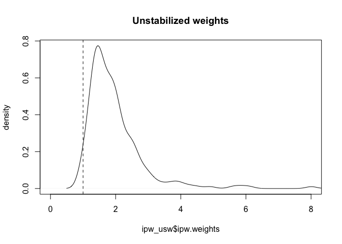
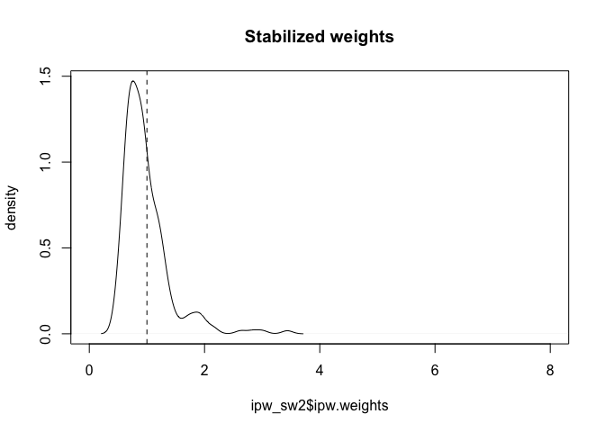
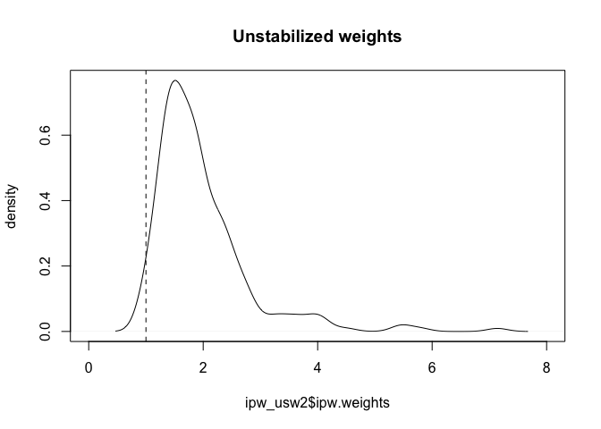

# Estimation of "a" per-protocol effect for GIVE-MOVE (there are several) 

Based primarily o: 
Guidelines for estimating causal effects in pragmatic randomized trials
Eleanor J. Murray1, Sonja A. Swanson2, Miguel A. Hernán

Causal estimand of interest: The effect of receiving the assigned treatment strategies
= The effect of successfully receiving GRT-guided strategy in intervention and VL-guided strategy in control
= Estimation of a per-protocol effect for a point intervention

We estimated the per-protocol effect of GRT-guided strategy, which was defined as the effect of GRT-guided strategy if all the participants who were randomly assigned to the intervention group had received the GRT-guided strategy. The risk of VL failure may have differed between the participants who received GRT-guided strategy and those who were assigned to GRT-guided strategy but did not receive it; therefore, our analysis should adjust for the baseline covariates of the participants and sites.

Note: We assume a point treatment situation. However, we could also argue for a sustained intervention strategy (e.g. since no-one in control should have received GRT over the entire study period). Then, we would need to adjust for time-varying confounding over study period (using g-methods).

Define non-adherence to treatment strategy in each group:

Intervention group:
1) Participants not receiving a GRT although they were supposed to have one: 3 participants
2) Participants not having the decision visit within six months (24 weeks) after randomization: 26 participants
- of which LTFU: XXX ?
- otherwise: missing/delayed GRT (that's already part of number 1?! why not summarized under 2?)

Control group:
1) Participants receiving a GRT although they were not supposed to have one: 3 participants
2) Participants not receiving a VL although they were supposed to have one: 1 participant
3) Participants not having the decision visit within six months (24 weeks) after randomization: 10 participants
- of which LTFU: XXX ?
- otherwise: missing/delayed VL (that's already part of number 2?! why not summarized under 3?)

Note: Not having a VL result within the 9-month window and not having reached the primary endpoint before or at the 9-month visit (13 participants) is part of the primary endpoint/estimand. If not part of primary causal estimand, then use multiple imputation or IPW for LTFU.

Define DAG: See slide in folder "DAG"

Define method used:
Because a point intervention is delivered at or close to the time of randomization, only covariates at or before the time of randomization can influence adherence to a point intervention. To validly estimate the per-protocol effect, baseline variables which predict adherence and are prognostic for the outcome need to be accounted for, either through direct adjustment or via an instrumental variable analysis.
Inverse probability and standardization allow calculation of absolute risks in the study population and preserve the marginal (unconditional) interpretation and are therefore preferable for direct adjustment. 
Other commonly used adjustment methods, like outcome regression and propensity score adjustment or matching, typically make strong assumptions about no effect heterogeneity (rely on the assumption of effect homogeneity across levels of all covariates), and do not easily yield unconditional absolute risks.
(as a exploratory analysis, we may add an instrumental variable analyis, however, this analysis would rely on stronger assumptions and harder to interpret)
Since point exposures happen only once, they typically require only control for baseline confounding. (However, estimating causal effects of point exposures on time to event may still require adjustment for time-varying confounders of loss to follow-up and the outcome.)


# Load packages

```r
library(tidyverse)
library(readxl)
library(tableone)
library(data.table)
library(writexl)
library(lme4)
library(msm)
library(sjPlot) # for tab_model
library(jtools) # for summ() and plot_summs
library(broom.mixed) # for plot_summs
library(sandwich) # for robust sandwich SE
library(ipw) # IPW
library(survey) # survey design for IPW
library(car) # VIF
```

# Load Data


# Explore data, identify primary model variables and run primary ITT analysis

```r
names(analysis)
```

```
##   [1] "scrno"                "wt"                   "ht"                  
##   [4] "muac"                 "age_curr_der"         "nutrst"              
##   [7] "nutrsup"              "whocur"               "whocur34"            
##  [10] "comoryn"              "tb"                   "thrush"              
##  [13] "other_comor"          "whoart"               "cd4art"              
##  [16] "cd4artpc"             "date_hivdx"           "date_art_start"      
##  [19] "artcurrstdat"         "dosetype"             "regimen_der"         
##  [22] "curr_art"             "reg_freq"             "hepbres"             
##  [25] "cd4count"             "cd4pc"                "fbc_leu"             
##  [28] "fbc_hb"               "fbc_plat"             "creares"             
##  [31] "alt_unit"             "alt_res"              "ast_unit"            
##  [34] "ast_res"              "crypto_res"           "tbsputum_res"        
##  [37] "vdrl_res"             "pillcnt_dynvar"       "adhassyn"            
##  [40] "regcursat"            "pillcnt"              "pillcnt_unk"         
##  [43] "spit"                 "missyn"               "miss2dyn"            
##  [46] "pillcnt_dynvar2"      "pillcnt_unk2"         "trialsite"           
##  [49] "crftitle"             "careyn"               "care"                
##  [52] "carespec"             "residence"            "residencespec"       
##  [55] "fathervit"            "mothervit"            "trtsup"              
##  [58] "travtim"              "travcost"             "curr"                
##  [61] "travmod"              "travmodspec"          "agegr_der"           
##  [64] "stsite_der2"          "stsite"               "scrdat"              
##  [67] "dob"                  "age"                  "scrvl"               
##  [70] "scrvlsampdat"         "sex"                  "art_number"          
##  [73] "time_since_hiv_yrs"   "time_on_art_yrs"      "time_on_curr_art_yrs"
##  [76] "orphan"               "age_cat"              "scrvl_cat"           
##  [79] "cd4_count_under5"     "cd4_count_over5"      "cd4_base_cat"        
##  [82] "travcost_usd"         "date_visit_6mpd"      "date_vl_6mpd"        
##  [85] "vl_suppress_6mpd"     "rdno"                 "vl_unit"             
##  [88] "visdat"               "m6postdecswyn"        "vlres_merge"         
##  [91] "date_vl"              "fup_time_vl_days"     "fup_time_vl_wks"     
##  [94] "window_vl_9m"         "vl_less50"            "vl_less400"          
##  [97] "vl_less1000"          "vl_suppress9m"        "vl_suppress9m_400"   
## [100] "vl_suppress9m_1000"   "death_date"           "saedesc"             
## [103] "death"                "eosrs"                "eosprend"            
## [106] "endpdate"             "endpconfyn"           "eosrsspec"           
## [109] "transfdat"            "wthdate"              "wthrs"               
## [112] "wthrsspec"            "hosp"                 "hosp_date"           
## [115] "new_who4"             "who_date"             "stratcode_der"       
## [118] "rddat"                "rdarm"                "regimen_der2"        
## [121] "visitcode"            "visitname"            "visitrepnu"          
## [124] "no_suppress_vl"       "no_suppress_vl_400"   "no_suppress_vl_1000" 
## [127] "no_suppress_vl_6mpd"  "first_event_date"     "eos_date"            
## [130] "fup_time_eos_wks"     "endpoint"             "endpoint_400"        
## [133] "endpoint_1000"        "endpoint_6mpd"        "date_dec_visit"      
## [136] "dec_visit_24wks"      "prot_dev1"            "resavdat"            
## [139] "resawaredat"          "date_vlreqform"       "vl_before_decision"  
## [142] "prot_dev2"            "grtsampdat"           "grt_int"             
## [145] "prot_dev3"            "grt_control"          "prot_dev5"           
## [148] "major_deviation"      "prot_dev4"            "arm"
```

```r
## protocol deviation variables
# table(analysis$arm, analysis$prot_dev1) #All: not having the decision visit within six months (24 weeks) after randomization
# table(analysis$arm, analysis$prot_dev2) #Cont P: not receiving a VL although was supposed to have one
# table(analysis$arm, analysis$prot_dev3) #Int P: Not receiving a GRT although they were supposed to have one
# table(analysis$arm, analysis$prot_dev4) #All: Not having a VL result within the 9-month window and not having reached the primary endpoint before or at the 9-month visit
# table(analysis$arm, analysis$prot_dev5) #Cont P: GRT although they were not supposed to have one

## define non-adherence to treatment strategy/protocol 1: As per protocol
analysis <- analysis %>%
  mutate(ppadh = case_when(prot_dev1 == 1 | prot_dev2 == 1
                           | prot_dev3 == 1 | prot_dev4 == 1
                           | prot_dev5 == 1 ~ 0,
                           TRUE ~ 1))
table(analysis$ppadh, useNA = "always")
```

```
## 
##    0    1 <NA> 
##   48  236    0
```

```r
table(analysis$arm, analysis$ppadh, useNA = "always")
```

```
##       
##          0   1 <NA>
##   0     17 123    0
##   1     31 113    0
##   <NA>   0   0    0
```

```r
# adherence rate, by arm
round(100*prop.table(table(analysis$arm, analysis$ppadh),1),1) # 88% adherence in cont / 79% adherence in int
```

```
##    
##        0    1
##   0 12.1 87.9
##   1 21.5 78.5
```

```r
## define non-adherence to treatment strategy/protocol 2: Without LTFU
analysis <- analysis %>%
  mutate(ppadh2 = case_when(prot_dev1 == 1 | prot_dev2 == 1
                           | prot_dev3 == 1
                           | prot_dev5 == 1 ~ 0,
                           TRUE ~ 1))
table(analysis$ppadh2, useNA = "always")
```

```
## 
##    0    1 <NA> 
##   41  243    0
```

```r
table(analysis$arm, analysis$ppadh2, useNA = "always")
```

```
##       
##          0   1 <NA>
##   0     14 126    0
##   1     27 117    0
##   <NA>   0   0    0
```

```r
# adherence rate, by arm
round(100*prop.table(table(analysis$arm, analysis$ppadh2),1),1) #90% adherence in cont / 81% adherence in int
```

```
##    
##        0    1
##   0 10.0 90.0
##   1 18.8 81.2
```

```r
# table(analysis$arm, analysis$ppadh, useNA = "always") #adherence to protocol variable
# table(analysis$arm, useNA = "always") #arm variable
# table(analysis$arm, analysis$endpoint, useNA = "always") #primary outcome variable // no missing
# table(analysis$arm, analysis$agegr_der, useNA = "always") #age stratification variable
# table(analysis$arm, analysis$stsite_der2, useNA = "always") #country stratification variable
# table(analysis$arm, analysis$regimen_der2, useNA = "always") #regimen stratification variable

## ITT analysis, adjusted for stratification variables
ITT <- analysis %>% 
  glm(endpoint ~ arm + agegr_der + stsite_der2 + regimen_der2,
              family = "binomial", data=.)
summ(ITT, exp = T, confint = T, model.info = F, model.fit = F, digits = 3)
```

  <table class="table table-striped table-hover table-condensed table-responsive" style="width: auto !important; margin-left: auto; margin-right: auto;border-bottom: 0;">
 <thead>
  <tr>
   <th style="text-align:left;">   </th>
   <th style="text-align:right;"> exp(Est.) </th>
   <th style="text-align:right;"> 2.5% </th>
   <th style="text-align:right;"> 97.5% </th>
   <th style="text-align:right;"> z val. </th>
   <th style="text-align:right;"> p </th>
  </tr>
 </thead>
<tbody>
  <tr>
   <td style="text-align:left;font-weight: bold;"> (Intercept) </td>
   <td style="text-align:right;"> 0.681 </td>
   <td style="text-align:right;"> 0.359 </td>
   <td style="text-align:right;"> 1.295 </td>
   <td style="text-align:right;"> -1.172 </td>
   <td style="text-align:right;"> 0.241 </td>
  </tr>
  <tr>
   <td style="text-align:left;font-weight: bold;"> arm </td>
   <td style="text-align:right;"> 0.793 </td>
   <td style="text-align:right;"> 0.493 </td>
   <td style="text-align:right;"> 1.274 </td>
   <td style="text-align:right;"> -0.960 </td>
   <td style="text-align:right;"> 0.337 </td>
  </tr>
  <tr>
   <td style="text-align:left;font-weight: bold;"> agegr_der&gt;= 12 and 
   </td>
<td style="text-align:right;"> 1.233 </td>
   <td style="text-align:right;"> 0.682 </td>
   <td style="text-align:right;"> 2.231 </td>
   <td style="text-align:right;"> 0.693 </td>
   <td style="text-align:right;"> 0.488 </td>
  </tr>
  <tr>
   <td style="text-align:left;font-weight: bold;"> stsite_der2Tanzania </td>
   <td style="text-align:right;"> 1.078 </td>
   <td style="text-align:right;"> 0.633 </td>
   <td style="text-align:right;"> 1.838 </td>
   <td style="text-align:right;"> 0.278 </td>
   <td style="text-align:right;"> 0.781 </td>
  </tr>
  <tr>
   <td style="text-align:left;font-weight: bold;"> regimen_der2NNRTI-based </td>
   <td style="text-align:right;"> 1.193 </td>
   <td style="text-align:right;"> 0.378 </td>
   <td style="text-align:right;"> 3.763 </td>
   <td style="text-align:right;"> 0.302 </td>
   <td style="text-align:right;"> 0.763 </td>
  </tr>
  <tr>
   <td style="text-align:left;font-weight: bold;"> regimen_der2PI-based </td>
   <td style="text-align:right;"> 2.466 </td>
   <td style="text-align:right;"> 1.331 </td>
   <td style="text-align:right;"> 4.572 </td>
   <td style="text-align:right;"> 2.867 </td>
   <td style="text-align:right;"> 0.004 </td>
  </tr>
</tbody>
<tfoot><tr><td style="padding: 0; " colspan="100%">
<sup></sup> Standard errors: MLE</td></tr></tfoot>
</table>

```r
## ITT analysis, unadjusted
ITT_unadj <- analysis %>% 
  glm(endpoint ~ arm ,
      # + agegr_der
      # + stsite_der2
      # + regimen_der2,
              family = "binomial", data=.)
summ(ITT_unadj, exp = T, confint = T, model.info = F, model.fit = F, digits = 3)
```

  <table class="table table-striped table-hover table-condensed table-responsive" style="width: auto !important; margin-left: auto; margin-right: auto;border-bottom: 0;">
 <thead>
  <tr>
   <th style="text-align:left;">   </th>
   <th style="text-align:right;"> exp(Est.) </th>
   <th style="text-align:right;"> 2.5% </th>
   <th style="text-align:right;"> 97.5% </th>
   <th style="text-align:right;"> z val. </th>
   <th style="text-align:right;"> p </th>
  </tr>
 </thead>
<tbody>
  <tr>
   <td style="text-align:left;font-weight: bold;"> (Intercept) </td>
   <td style="text-align:right;"> 1.090 </td>
   <td style="text-align:right;"> 0.782 </td>
   <td style="text-align:right;"> 1.518 </td>
   <td style="text-align:right;"> 0.507 </td>
   <td style="text-align:right;"> 0.612 </td>
  </tr>
  <tr>
   <td style="text-align:left;font-weight: bold;"> arm </td>
   <td style="text-align:right;"> 0.799 </td>
   <td style="text-align:right;"> 0.501 </td>
   <td style="text-align:right;"> 1.273 </td>
   <td style="text-align:right;"> -0.946 </td>
   <td style="text-align:right;"> 0.344 </td>
  </tr>
</tbody>
<tfoot><tr><td style="padding: 0; " colspan="100%">
<sup></sup> Standard errors: MLE</td></tr></tfoot>
</table>

# TABLE characteristics by arm and by adherence to treatment strategy


```r
# Only relevant site variable in current dataset: table(analysis$stsite)
# Currently omitted: "Immunosuppression" (derived), "Full orphan" (derived), "ART regimen"

vars.list <- c("arm","ppadh2","agegr_der","stsite_der2","regimen_der2","sex","scrvl","whocur","cd4count","hepbres","wt","time_on_art_yrs","time_on_curr_art_yrs","regcursat","missyn","miss2dyn","care","fathervit","mothervit","travtim","travcost","travmod", "stsite")

df_pp <- analysis[,colnames(analysis)%in%vars.list]
df_pp <- df_pp[,match(vars.list,colnames(df_pp))]

colnames(df_pp) <- vars.list <- c("ARM","Adherent to treatment strategy","Age","Country","ART core agent","Sex","Viral load prior to enrolment","Clinical WHO stage", "CD4 cell count", "Hepatitis B surface antigen", "Weight", "Time since initiation of first documented ART regimen (years)", "Time since initiation of current ART regimen (years)", "Satisfaction with current regimen (self-reported)", "Missed ≥1 dose of ART over the past 4 weeks (self-reported)", "No drug intake for 2 days or more (self-reported)", "Primary caregiver", "Vital state of mother", "Vital state of father", "Travel time to healthcare facility (one way; minutes)", "Cost of travel to healthcare facility (one way; USD)", "Main mode of travel to healthcare facility", "Site")

char_vars <- c("Clinical WHO stage","Main mode of travel to healthcare facility", "Site")
# Convert character variables to factors
df_pp <- df_pp %>%
  mutate(across(all_of(char_vars), factor))
# Create ordinal factors
analysis$regcursat <- ordered(analysis$regcursat, 
                                  levels = c("Very dissatisfied", "Somewhat dissatisfied", 
                                             "Neutral", "Somewhat satisfied", "Very satisfied"))
analysis$whocur <- ordered(analysis$whocur, 
                                  levels = c("T1", "T2", 
                                             "T3", "T4"))

# all participants, by arm
table_pp <- CreateTableOne(data = df_pp, vars = vars.list[!vars.list %in% c("Adherent to treatment strategy", "ARM")], strata = "ARM", includeNA = TRUE, test = TRUE, addOverall = TRUE)
capture.output(table_pp <- print(table_pp, nonnormal = vars.list,catDigits = 1,SMD = TRUE,showAllLevels = TRUE,test = TRUE,printToggle = FALSE,missing = TRUE))
```

```
## character(0)
```

```r
#print
knitr::kable(table_pp, caption = "Baseline characteristics, by arm")
```


Table: Baseline characteristics, by arm

|                                                                             |level                                       |Overall                     |0                           |1                           |p     |test    |Missing |
|:----------------------------------------------------------------------------|:-------------------------------------------|:---------------------------|:---------------------------|:---------------------------|:-----|:-------|:-------|
|n                                                                            |                                            |284                         |140                         |144                         |      |        |        |
|Age (%)                                                                      |>= 0.5 and < 12                             |116 (40.8)                  |58 (41.4)                   |58 (40.3)                   |0.939 |        |0.0     |
|                                                                             |>= 12 and < 19                              |168 (59.2)                  |82 (58.6)                   |86 (59.7)                   |      |        |        |
|Country (%)                                                                  |Lesotho                                     |203 (71.5)                  |99 (70.7)                   |104 (72.2)                  |0.881 |        |0.0     |
|                                                                             |Tanzania                                    |81 (28.5)                   |41 (29.3)                   |40 (27.8)                   |      |        |        |
|ART core agent (%)                                                           |INSTI-based                                 |170 (59.9)                  |84 (60.0)                   |86 (59.7)                   |0.973 |        |0.0     |
|                                                                             |NNRTI-based                                 |13 ( 4.6)                   |6 ( 4.3)                    |7 ( 4.9)                    |      |        |        |
|                                                                             |PI-based                                    |101 (35.6)                  |50 (35.7)                   |51 (35.4)                   |      |        |        |
|Sex (%)                                                                      |Female                                      |158 (55.6)                  |83 (59.3)                   |75 (52.1)                   |0.270 |        |0.0     |
|                                                                             |Male                                        |126 (44.4)                  |57 (40.7)                   |69 (47.9)                   |      |        |        |
|Viral load prior to enrolment (median [IQR])                                 |                                            |6600.00 [1465.25, 36225.00] |6925.00 [1465.25, 28550.00] |5730.00 [1472.50, 42650.00] |0.776 |nonnorm |0.0     |
|Clinical WHO stage (%)                                                       |T1                                          |274 (96.5)                  |136 (97.1)                  |138 (95.8)                  |0.080 |        |0.0     |
|                                                                             |T2                                          |5 ( 1.8)                    |1 ( 0.7)                    |4 ( 2.8)                    |      |        |        |
|                                                                             |T3                                          |3 ( 1.1)                    |3 ( 2.1)                    |0 ( 0.0)                    |      |        |        |
|                                                                             |T4                                          |2 ( 0.7)                    |0 ( 0.0)                    |2 ( 1.4)                    |      |        |        |
|CD4 cell count (median [IQR])                                                |                                            |605.00 [425.00, 835.50]     |608.00 [409.25, 862.25]     |601.00 [461.50, 828.50]     |0.756 |nonnorm |15.8    |
|Hepatitis B surface antigen (%)                                              |Negative                                    |218 (76.8)                  |106 (75.7)                  |112 (77.8)                  |0.917 |        |21.8    |
|                                                                             |Positive                                    |4 ( 1.4)                    |2 ( 1.4)                    |2 ( 1.4)                    |      |        |        |
|                                                                             |NA                                          |62 (21.8)                   |32 (22.9)                   |30 (20.8)                   |      |        |        |
|Weight (median [IQR])                                                        |                                            |34.10 [21.98, 44.60]        |36.40 [23.27, 45.08]        |32.05 [20.85, 44.37]        |0.216 |nonnorm |0.0     |
|Time since initiation of first documented ART regimen (years) (median [IQR]) |                                            |6.00 [3.00, 10.00]          |7.00 [4.00, 10.00]          |6.00 [3.00, 10.00]          |0.189 |nonnorm |0.0     |
|Time since initiation of current ART regimen (years) (median [IQR])          |                                            |2.00 [1.00, 3.00]           |2.00 [1.00, 3.00]           |2.00 [1.00, 3.00]           |0.419 |nonnorm |0.0     |
|Satisfaction with current regimen (self-reported) (%)                        |Neutral                                     |11 ( 3.9)                   |3 ( 2.1)                    |8 ( 5.6)                    |0.502 |        |1.4     |
|                                                                             |Somewhat dissatisfied                       |29 (10.2)                   |16 (11.4)                   |13 ( 9.0)                   |      |        |        |
|                                                                             |Somewhat satisfied                          |70 (24.6)                   |30 (21.4)                   |40 (27.8)                   |      |        |        |
|                                                                             |Very dissatisfied                           |17 ( 6.0)                   |9 ( 6.4)                    |8 ( 5.6)                    |      |        |        |
|                                                                             |Very satisfied                              |153 (53.9)                  |80 (57.1)                   |73 (50.7)                   |      |        |        |
|                                                                             |NA                                          |4 ( 1.4)                    |2 ( 1.4)                    |2 ( 1.4)                    |      |        |        |
|Missed ≥1 dose of ART over the past 4 weeks (self-reported) (%)              |No                                          |152 (53.5)                  |81 (57.9)                   |71 (49.3)                   |0.492 |        |1.4     |
|                                                                             |Unknown                                     |33 (11.6)                   |16 (11.4)                   |17 (11.8)                   |      |        |        |
|                                                                             |Yes                                         |95 (33.5)                   |41 (29.3)                   |54 (37.5)                   |      |        |        |
|                                                                             |NA                                          |4 ( 1.4)                    |2 ( 1.4)                    |2 ( 1.4)                    |      |        |        |
|No drug intake for 2 days or more (self-reported) (%)                        |No                                          |19 ( 6.7)                   |10 ( 7.1)                   |9 ( 6.2)                    |0.380 |        |66.5    |
|                                                                             |Unknown                                     |3 ( 1.1)                    |1 ( 0.7)                    |2 ( 1.4)                    |      |        |        |
|                                                                             |Yes                                         |73 (25.7)                   |30 (21.4)                   |43 (29.9)                   |      |        |        |
|                                                                             |NA                                          |189 (66.5)                  |99 (70.7)                   |90 (62.5)                   |      |        |        |
|Primary caregiver (%)                                                        |Both parents                                |35 (12.3)                   |17 (12.1)                   |18 (12.5)                   |0.934 |        |2.1     |
|                                                                             |Father                                      |28 ( 9.9)                   |15 (10.7)                   |13 ( 9.0)                   |      |        |        |
|                                                                             |Grandparent(s)                              |58 (20.4)                   |28 (20.0)                   |30 (20.8)                   |      |        |        |
|                                                                             |Mother                                      |102 (35.9)                  |51 (36.4)                   |51 (35.4)                   |      |        |        |
|                                                                             |Other                                       |55 (19.4)                   |25 (17.9)                   |30 (20.8)                   |      |        |        |
|                                                                             |NA                                          |6 ( 2.1)                    |4 ( 2.9)                    |2 ( 1.4)                    |      |        |        |
|Vital state of mother (%)                                                    |Alive                                       |174 (61.3)                  |86 (61.4)                   |88 (61.1)                   |0.991 |        |0.0     |
|                                                                             |Dead                                        |85 (29.9)                   |42 (30.0)                   |43 (29.9)                   |      |        |        |
|                                                                             |Unknown                                     |25 ( 8.8)                   |12 ( 8.6)                   |13 ( 9.0)                   |      |        |        |
|Vital state of father (%)                                                    |Alive                                       |201 (70.8)                  |104 (74.3)                  |97 (67.4)                   |0.313 |        |0.0     |
|                                                                             |Dead                                        |80 (28.2)                   |34 (24.3)                   |46 (31.9)                   |      |        |        |
|                                                                             |Unknown                                     |3 ( 1.1)                    |2 ( 1.4)                    |1 ( 0.7)                    |      |        |        |
|Travel time to healthcare facility (one way; minutes) (median [IQR])         |                                            |60.00 [30.00, 120.00]       |60.00 [30.00, 120.00]       |60.00 [30.00, 90.00]        |0.979 |nonnorm |0.0     |
|Cost of travel to healthcare facility (one way; USD) (median [IQR])          |                                            |36.00 [16.00, 1050.00]      |36.00 [16.00, 1200.00]      |36.00 [17.50, 1000.00]      |0.771 |nonnorm |0.0     |
|Main mode of travel to healthcare facility (%)                               |Bicycle                                     |1 ( 0.4)                    |0 ( 0.0)                    |1 ( 0.7)                    |0.679 |        |0.0     |
|                                                                             |Private motorised vehicle (own or borrowed) |3 ( 1.1)                    |2 ( 1.4)                    |1 ( 0.7)                    |      |        |        |
|                                                                             |Ride (horse/donkey)                         |1 ( 0.4)                    |0 ( 0.0)                    |1 ( 0.7)                    |      |        |        |
|                                                                             |Taxi / public transport                     |275 (96.8)                  |136 (97.1)                  |139 (96.5)                  |      |        |        |
|                                                                             |Walk                                        |4 ( 1.4)                    |2 ( 1.4)                    |2 ( 1.4)                    |      |        |        |
|Site (%)                                                                     |Baylor Clinic Butha-Buthe                   |53 (18.7)                   |26 (18.6)                   |27 (18.8)                   |0.911 |        |0.0     |
|                                                                             |Baylor Clinic Hlotse                        |43 (15.1)                   |19 (13.6)                   |24 (16.7)                   |      |        |        |
|                                                                             |Baylor Clinic Maseru                        |34 (12.0)                   |17 (12.1)                   |17 (11.8)                   |      |        |        |
|                                                                             |Baylor Clinic Mohale's Hoek                 |19 ( 6.7)                   |9 ( 6.4)                    |10 ( 6.9)                   |      |        |        |
|                                                                             |Baylor Clinic Mokhotlong                    |36 (12.7)                   |18 (12.9)                   |18 (12.5)                   |      |        |        |
|                                                                             |Ifakara One-Stop Clinic                     |38 (13.4)                   |22 (15.7)                   |16 (11.1)                   |      |        |        |
|                                                                             |Mbagala Rangi Tatu Hospital                 |14 ( 4.9)                   |8 ( 5.7)                    |6 ( 4.2)                    |      |        |        |
|                                                                             |Seboche Mission Hospital                    |18 ( 6.3)                   |10 ( 7.1)                   |8 ( 5.6)                    |      |        |        |
|                                                                             |Temeke Regional Referral Hospital           |15 ( 5.3)                   |5 ( 3.6)                    |10 ( 6.9)                   |      |        |        |
|                                                                             |Upendano Dispensary                         |14 ( 4.9)                   |6 ( 4.3)                    |8 ( 5.6)                    |      |        |        |

```r
# all participants, by adherence
table_pp_adh <- CreateTableOne(data = df_pp, vars = vars.list[!vars.list %in% c("Adherent to treatment strategy", "ARM")], strata = "Adherent to treatment strategy", includeNA = TRUE, test = TRUE, addOverall = TRUE)
capture.output(table_pp_adh <- print(table_pp_adh, nonnormal = vars.list,catDigits = 1,SMD = TRUE,showAllLevels = TRUE,test = TRUE,printToggle = FALSE,missing = TRUE))
```

```
## character(0)
```

```r
#print
knitr::kable(table_pp_adh, caption = "Baseline characteristics, by adherence")
```


Table: Baseline characteristics, by adherence

|                                                                             |level                                       |Overall                     |0                           |1                           |p     |test    |Missing |
|:----------------------------------------------------------------------------|:-------------------------------------------|:---------------------------|:---------------------------|:---------------------------|:-----|:-------|:-------|
|n                                                                            |                                            |284                         |41                          |243                         |      |        |        |
|Age (%)                                                                      |>= 0.5 and < 12                             |116 (40.8)                  |19 (46.3)                   |97 (39.9)                   |0.547 |        |0.0     |
|                                                                             |>= 12 and < 19                              |168 (59.2)                  |22 (53.7)                   |146 (60.1)                  |      |        |        |
|Country (%)                                                                  |Lesotho                                     |203 (71.5)                  |28 (68.3)                   |175 (72.0)                  |0.763 |        |0.0     |
|                                                                             |Tanzania                                    |81 (28.5)                   |13 (31.7)                   |68 (28.0)                   |      |        |        |
|ART core agent (%)                                                           |INSTI-based                                 |170 (59.9)                  |26 (63.4)                   |144 (59.3)                  |0.856 |        |0.0     |
|                                                                             |NNRTI-based                                 |13 ( 4.6)                   |2 ( 4.9)                    |11 ( 4.5)                   |      |        |        |
|                                                                             |PI-based                                    |101 (35.6)                  |13 (31.7)                   |88 (36.2)                   |      |        |        |
|Sex (%)                                                                      |Female                                      |158 (55.6)                  |23 (56.1)                   |135 (55.6)                  |1.000 |        |0.0     |
|                                                                             |Male                                        |126 (44.4)                  |18 (43.9)                   |108 (44.4)                  |      |        |        |
|Viral load prior to enrolment (median [IQR])                                 |                                            |6600.00 [1465.25, 36225.00] |8130.00 [3220.00, 40800.00] |6179.00 [1364.50, 34600.00] |0.298 |nonnorm |0.0     |
|Clinical WHO stage (%)                                                       |T1                                          |274 (96.5)                  |39 (95.1)                   |235 (96.7)                  |0.442 |        |0.0     |
|                                                                             |T2                                          |5 ( 1.8)                    |1 ( 2.4)                    |4 ( 1.6)                    |      |        |        |
|                                                                             |T3                                          |3 ( 1.1)                    |0 ( 0.0)                    |3 ( 1.2)                    |      |        |        |
|                                                                             |T4                                          |2 ( 0.7)                    |1 ( 2.4)                    |1 ( 0.4)                    |      |        |        |
|CD4 cell count (median [IQR])                                                |                                            |605.00 [425.00, 835.50]     |625.50 [461.75, 915.75]     |605.00 [419.50, 829.50]     |0.743 |nonnorm |15.8    |
|Hepatitis B surface antigen (%)                                              |Negative                                    |218 (76.8)                  |30 (73.2)                   |188 (77.4)                  |0.746 |        |21.8    |
|                                                                             |Positive                                    |4 ( 1.4)                    |1 ( 2.4)                    |3 ( 1.2)                    |      |        |        |
|                                                                             |NA                                          |62 (21.8)                   |10 (24.4)                   |52 (21.4)                   |      |        |        |
|Weight (median [IQR])                                                        |                                            |34.10 [21.98, 44.60]        |29.20 [20.90, 41.40]        |34.80 [22.35, 45.20]        |0.166 |nonnorm |0.0     |
|Time since initiation of first documented ART regimen (years) (median [IQR]) |                                            |6.00 [3.00, 10.00]          |7.00 [4.00, 11.00]          |6.00 [3.00, 10.00]          |0.792 |nonnorm |0.0     |
|Time since initiation of current ART regimen (years) (median [IQR])          |                                            |2.00 [1.00, 3.00]           |2.00 [1.00, 2.00]           |2.00 [1.00, 3.00]           |0.359 |nonnorm |0.0     |
|Satisfaction with current regimen (self-reported) (%)                        |Neutral                                     |11 ( 3.9)                   |2 ( 4.9)                    |9 ( 3.7)                    |0.452 |        |1.4     |
|                                                                             |Somewhat dissatisfied                       |29 (10.2)                   |3 ( 7.3)                    |26 (10.7)                   |      |        |        |
|                                                                             |Somewhat satisfied                          |70 (24.6)                   |10 (24.4)                   |60 (24.7)                   |      |        |        |
|                                                                             |Very dissatisfied                           |17 ( 6.0)                   |2 ( 4.9)                    |15 ( 6.2)                   |      |        |        |
|                                                                             |Very satisfied                              |153 (53.9)                  |22 (53.7)                   |131 (53.9)                  |      |        |        |
|                                                                             |NA                                          |4 ( 1.4)                    |2 ( 4.9)                    |2 ( 0.8)                    |      |        |        |
|Missed ≥1 dose of ART over the past 4 weeks (self-reported) (%)              |No                                          |152 (53.5)                  |21 (51.2)                   |131 (53.9)                  |0.241 |        |1.4     |
|                                                                             |Unknown                                     |33 (11.6)                   |5 (12.2)                    |28 (11.5)                   |      |        |        |
|                                                                             |Yes                                         |95 (33.5)                   |13 (31.7)                   |82 (33.7)                   |      |        |        |
|                                                                             |NA                                          |4 ( 1.4)                    |2 ( 4.9)                    |2 ( 0.8)                    |      |        |        |
|No drug intake for 2 days or more (self-reported) (%)                        |No                                          |19 ( 6.7)                   |1 ( 2.4)                    |18 ( 7.4)                   |0.531 |        |66.5    |
|                                                                             |Unknown                                     |3 ( 1.1)                    |1 ( 2.4)                    |2 ( 0.8)                    |      |        |        |
|                                                                             |Yes                                         |73 (25.7)                   |11 (26.8)                   |62 (25.5)                   |      |        |        |
|                                                                             |NA                                          |189 (66.5)                  |28 (68.3)                   |161 (66.3)                  |      |        |        |
|Primary caregiver (%)                                                        |Both parents                                |35 (12.3)                   |9 (22.0)                    |26 (10.7)                   |0.345 |        |2.1     |
|                                                                             |Father                                      |28 ( 9.9)                   |4 ( 9.8)                    |24 ( 9.9)                   |      |        |        |
|                                                                             |Grandparent(s)                              |58 (20.4)                   |5 (12.2)                    |53 (21.8)                   |      |        |        |
|                                                                             |Mother                                      |102 (35.9)                  |13 (31.7)                   |89 (36.6)                   |      |        |        |
|                                                                             |Other                                       |55 (19.4)                   |9 (22.0)                    |46 (18.9)                   |      |        |        |
|                                                                             |NA                                          |6 ( 2.1)                    |1 ( 2.4)                    |5 ( 2.1)                    |      |        |        |
|Vital state of mother (%)                                                    |Alive                                       |174 (61.3)                  |28 (68.3)                   |146 (60.1)                  |0.253 |        |0.0     |
|                                                                             |Dead                                        |85 (29.9)                   |8 (19.5)                    |77 (31.7)                   |      |        |        |
|                                                                             |Unknown                                     |25 ( 8.8)                   |5 (12.2)                    |20 ( 8.2)                   |      |        |        |
|Vital state of father (%)                                                    |Alive                                       |201 (70.8)                  |31 (75.6)                   |170 (70.0)                  |0.431 |        |0.0     |
|                                                                             |Dead                                        |80 (28.2)                   |9 (22.0)                    |71 (29.2)                   |      |        |        |
|                                                                             |Unknown                                     |3 ( 1.1)                    |1 ( 2.4)                    |2 ( 0.8)                    |      |        |        |
|Travel time to healthcare facility (one way; minutes) (median [IQR])         |                                            |60.00 [30.00, 120.00]       |60.00 [20.00, 120.00]       |60.00 [30.00, 105.00]       |0.525 |nonnorm |0.0     |
|Cost of travel to healthcare facility (one way; USD) (median [IQR])          |                                            |36.00 [16.00, 1050.00]      |60.00 [16.00, 2000.00]      |36.00 [16.50, 1000.00]      |0.601 |nonnorm |0.0     |
|Main mode of travel to healthcare facility (%)                               |Bicycle                                     |1 ( 0.4)                    |1 ( 2.4)                    |0 ( 0.0)                    |0.029 |        |0.0     |
|                                                                             |Private motorised vehicle (own or borrowed) |3 ( 1.1)                    |0 ( 0.0)                    |3 ( 1.2)                    |      |        |        |
|                                                                             |Ride (horse/donkey)                         |1 ( 0.4)                    |0 ( 0.0)                    |1 ( 0.4)                    |      |        |        |
|                                                                             |Taxi / public transport                     |275 (96.8)                  |38 (92.7)                   |237 (97.5)                  |      |        |        |
|                                                                             |Walk                                        |4 ( 1.4)                    |2 ( 4.9)                    |2 ( 0.8)                    |      |        |        |
|Site (%)                                                                     |Baylor Clinic Butha-Buthe                   |53 (18.7)                   |0 ( 0.0)                    |53 (21.8)                   |0.016 |        |0.0     |
|                                                                             |Baylor Clinic Hlotse                        |43 (15.1)                   |8 (19.5)                    |35 (14.4)                   |      |        |        |
|                                                                             |Baylor Clinic Maseru                        |34 (12.0)                   |3 ( 7.3)                    |31 (12.8)                   |      |        |        |
|                                                                             |Baylor Clinic Mohale's Hoek                 |19 ( 6.7)                   |5 (12.2)                    |14 ( 5.8)                   |      |        |        |
|                                                                             |Baylor Clinic Mokhotlong                    |36 (12.7)                   |10 (24.4)                   |26 (10.7)                   |      |        |        |
|                                                                             |Ifakara One-Stop Clinic                     |38 (13.4)                   |6 (14.6)                    |32 (13.2)                   |      |        |        |
|                                                                             |Mbagala Rangi Tatu Hospital                 |14 ( 4.9)                   |2 ( 4.9)                    |12 ( 4.9)                   |      |        |        |
|                                                                             |Seboche Mission Hospital                    |18 ( 6.3)                   |2 ( 4.9)                    |16 ( 6.6)                   |      |        |        |
|                                                                             |Temeke Regional Referral Hospital           |15 ( 5.3)                   |4 ( 9.8)                    |11 ( 4.5)                   |      |        |        |
|                                                                             |Upendano Dispensary                         |14 ( 4.9)                   |1 ( 2.4)                    |13 ( 5.3)                   |      |        |        |

```r
# intervention arm only
df_pp_int <- df_pp %>%
  filter(ARM == 1)
table_pp_int <- CreateTableOne(data = df_pp_int, vars = vars.list[!vars.list %in% c("Adherent to treatment strategy", "ARM")], strata = "Adherent to treatment strategy", includeNA = TRUE, test = TRUE, addOverall = TRUE)
capture.output(table_pp_int <- print(table_pp_int, nonnormal = vars.list,catDigits = 1,SMD = TRUE,showAllLevels = TRUE,test = TRUE,printToggle = FALSE,missing = TRUE))
```

```
## character(0)
```

```r
#print
knitr::kable(table_pp_int,caption = "Baseline characteristics of intervention participants, by adherence to treatment strategy")
```


Table: Baseline characteristics of intervention participants, by adherence to treatment strategy

|                                                                             |level                                       |Overall                     |0                            |1                           |p     |test    |Missing |
|:----------------------------------------------------------------------------|:-------------------------------------------|:---------------------------|:----------------------------|:---------------------------|:-----|:-------|:-------|
|n                                                                            |                                            |144                         |27                           |117                         |      |        |        |
|Age (%)                                                                      |>= 0.5 and < 12                             |58 (40.3)                   |14 (51.9)                    |44 (37.6)                   |0.253 |        |0.0     |
|                                                                             |>= 12 and < 19                              |86 (59.7)                   |13 (48.1)                    |73 (62.4)                   |      |        |        |
|Country (%)                                                                  |Lesotho                                     |104 (72.2)                  |16 (59.3)                    |88 (75.2)                   |0.153 |        |0.0     |
|                                                                             |Tanzania                                    |40 (27.8)                   |11 (40.7)                    |29 (24.8)                   |      |        |        |
|ART core agent (%)                                                           |INSTI-based                                 |86 (59.7)                   |18 (66.7)                    |68 (58.1)                   |0.382 |        |0.0     |
|                                                                             |NNRTI-based                                 |7 ( 4.9)                    |0 ( 0.0)                     |7 ( 6.0)                    |      |        |        |
|                                                                             |PI-based                                    |51 (35.4)                   |9 (33.3)                     |42 (35.9)                   |      |        |        |
|Sex (%)                                                                      |Female                                      |75 (52.1)                   |17 (63.0)                    |58 (49.6)                   |0.298 |        |0.0     |
|                                                                             |Male                                        |69 (47.9)                   |10 (37.0)                    |59 (50.4)                   |      |        |        |
|Viral load prior to enrolment (median [IQR])                                 |                                            |5730.00 [1472.50, 42650.00] |19764.00 [3320.00, 59750.00] |5300.00 [1280.00, 40700.00] |0.207 |nonnorm |0.0     |
|Clinical WHO stage (%)                                                       |T1                                          |138 (95.8)                  |25 (92.6)                    |113 (96.6)                  |NaN   |        |0.0     |
|                                                                             |T2                                          |4 ( 2.8)                    |1 ( 3.7)                     |3 ( 2.6)                    |      |        |        |
|                                                                             |T3                                          |0 ( 0.0)                    |0 ( 0.0)                     |0 ( 0.0)                    |      |        |        |
|                                                                             |T4                                          |2 ( 1.4)                    |1 ( 3.7)                     |1 ( 0.9)                    |      |        |        |
|CD4 cell count (median [IQR])                                                |                                            |601.00 [461.50, 828.50]     |711.00 [550.00, 1010.00]     |584.50 [458.75, 817.00]     |0.121 |nonnorm |17.4    |
|Hepatitis B surface antigen (%)                                              |Negative                                    |112 (77.8)                  |20 (74.1)                    |92 (78.6)                   |0.504 |        |20.8    |
|                                                                             |Positive                                    |2 ( 1.4)                    |1 ( 3.7)                     |1 ( 0.9)                    |      |        |        |
|                                                                             |NA                                          |30 (20.8)                   |6 (22.2)                     |24 (20.5)                   |      |        |        |
|Weight (median [IQR])                                                        |                                            |32.05 [20.85, 44.37]        |27.50 [16.80, 38.75]         |33.80 [22.70, 45.00]        |0.068 |nonnorm |0.0     |
|Time since initiation of first documented ART regimen (years) (median [IQR]) |                                            |6.00 [3.00, 10.00]          |5.00 [2.50, 8.50]            |6.00 [3.00, 10.00]          |0.302 |nonnorm |0.0     |
|Time since initiation of current ART regimen (years) (median [IQR])          |                                            |2.00 [1.00, 3.00]           |1.00 [1.00, 2.00]            |2.00 [1.00, 3.00]           |0.057 |nonnorm |0.0     |
|Satisfaction with current regimen (self-reported) (%)                        |Neutral                                     |8 ( 5.6)                    |2 ( 7.4)                     |6 ( 5.1)                    |0.866 |        |1.4     |
|                                                                             |Somewhat dissatisfied                       |13 ( 9.0)                   |2 ( 7.4)                     |11 ( 9.4)                   |      |        |        |
|                                                                             |Somewhat satisfied                          |40 (27.8)                   |8 (29.6)                     |32 (27.4)                   |      |        |        |
|                                                                             |Very dissatisfied                           |8 ( 5.6)                    |1 ( 3.7)                     |7 ( 6.0)                    |      |        |        |
|                                                                             |Very satisfied                              |73 (50.7)                   |13 (48.1)                    |60 (51.3)                   |      |        |        |
|                                                                             |NA                                          |2 ( 1.4)                    |1 ( 3.7)                     |1 ( 0.9)                    |      |        |        |
|Missed ≥1 dose of ART over the past 4 weeks (self-reported) (%)              |No                                          |71 (49.3)                   |13 (48.1)                    |58 (49.6)                   |0.728 |        |1.4     |
|                                                                             |Unknown                                     |17 (11.8)                   |3 (11.1)                     |14 (12.0)                   |      |        |        |
|                                                                             |Yes                                         |54 (37.5)                   |10 (37.0)                    |44 (37.6)                   |      |        |        |
|                                                                             |NA                                          |2 ( 1.4)                    |1 ( 3.7)                     |1 ( 0.9)                    |      |        |        |
|No drug intake for 2 days or more (self-reported) (%)                        |No                                          |9 ( 6.2)                    |1 ( 3.7)                     |8 ( 6.8)                    |0.653 |        |62.5    |
|                                                                             |Unknown                                     |2 ( 1.4)                    |1 ( 3.7)                     |1 ( 0.9)                    |      |        |        |
|                                                                             |Yes                                         |43 (29.9)                   |8 (29.6)                     |35 (29.9)                   |      |        |        |
|                                                                             |NA                                          |90 (62.5)                   |17 (63.0)                    |73 (62.4)                   |      |        |        |
|Primary caregiver (%)                                                        |Both parents                                |18 (12.5)                   |6 (22.2)                     |12 (10.3)                   |0.175 |        |1.4     |
|                                                                             |Father                                      |13 ( 9.0)                   |2 ( 7.4)                     |11 ( 9.4)                   |      |        |        |
|                                                                             |Grandparent(s)                              |30 (20.8)                   |3 (11.1)                     |27 (23.1)                   |      |        |        |
|                                                                             |Mother                                      |51 (35.4)                   |12 (44.4)                    |39 (33.3)                   |      |        |        |
|                                                                             |Other                                       |30 (20.8)                   |3 (11.1)                     |27 (23.1)                   |      |        |        |
|                                                                             |NA                                          |2 ( 1.4)                    |1 ( 3.7)                     |1 ( 0.9)                    |      |        |        |
|Vital state of mother (%)                                                    |Alive                                       |88 (61.1)                   |20 (74.1)                    |68 (58.1)                   |0.166 |        |0.0     |
|                                                                             |Dead                                        |43 (29.9)                   |4 (14.8)                     |39 (33.3)                   |      |        |        |
|                                                                             |Unknown                                     |13 ( 9.0)                   |3 (11.1)                     |10 ( 8.5)                   |      |        |        |
|Vital state of father (%)                                                    |Alive                                       |97 (67.4)                   |22 (81.5)                    |75 (64.1)                   |0.213 |        |0.0     |
|                                                                             |Dead                                        |46 (31.9)                   |5 (18.5)                     |41 (35.0)                   |      |        |        |
|                                                                             |Unknown                                     |1 ( 0.7)                    |0 ( 0.0)                     |1 ( 0.9)                    |      |        |        |
|Travel time to healthcare facility (one way; minutes) (median [IQR])         |                                            |60.00 [30.00, 90.00]        |50.00 [20.00, 90.00]         |60.00 [30.00, 90.00]        |0.417 |nonnorm |0.0     |
|Cost of travel to healthcare facility (one way; USD) (median [IQR])          |                                            |36.00 [17.50, 1000.00]      |60.00 [17.00, 2000.00]       |36.00 [18.00, 360.00]       |0.245 |nonnorm |0.0     |
|Main mode of travel to healthcare facility (%)                               |Bicycle                                     |1 ( 0.7)                    |1 ( 3.7)                     |0 ( 0.0)                    |0.008 |        |0.0     |
|                                                                             |Private motorised vehicle (own or borrowed) |1 ( 0.7)                    |0 ( 0.0)                     |1 ( 0.9)                    |      |        |        |
|                                                                             |Ride (horse/donkey)                         |1 ( 0.7)                    |0 ( 0.0)                     |1 ( 0.9)                    |      |        |        |
|                                                                             |Taxi / public transport                     |139 (96.5)                  |24 (88.9)                    |115 (98.3)                  |      |        |        |
|                                                                             |Walk                                        |2 ( 1.4)                    |2 ( 7.4)                     |0 ( 0.0)                    |      |        |        |
|Site (%)                                                                     |Baylor Clinic Butha-Buthe                   |27 (18.8)                   |0 ( 0.0)                     |27 (23.1)                   |0.015 |        |0.0     |
|                                                                             |Baylor Clinic Hlotse                        |24 (16.7)                   |6 (22.2)                     |18 (15.4)                   |      |        |        |
|                                                                             |Baylor Clinic Maseru                        |17 (11.8)                   |0 ( 0.0)                     |17 (14.5)                   |      |        |        |
|                                                                             |Baylor Clinic Mohale's Hoek                 |10 ( 6.9)                   |2 ( 7.4)                     |8 ( 6.8)                    |      |        |        |
|                                                                             |Baylor Clinic Mokhotlong                    |18 (12.5)                   |7 (25.9)                     |11 ( 9.4)                   |      |        |        |
|                                                                             |Ifakara One-Stop Clinic                     |16 (11.1)                   |6 (22.2)                     |10 ( 8.5)                   |      |        |        |
|                                                                             |Mbagala Rangi Tatu Hospital                 |6 ( 4.2)                    |2 ( 7.4)                     |4 ( 3.4)                    |      |        |        |
|                                                                             |Seboche Mission Hospital                    |8 ( 5.6)                    |1 ( 3.7)                     |7 ( 6.0)                    |      |        |        |
|                                                                             |Temeke Regional Referral Hospital           |10 ( 6.9)                   |2 ( 7.4)                     |8 ( 6.8)                    |      |        |        |
|                                                                             |Upendano Dispensary                         |8 ( 5.6)                    |1 ( 3.7)                     |7 ( 6.0)                    |      |        |        |

```r
# control arm only 
df_pp_cont <- df_pp %>%
  filter(ARM == 0)
table_pp_cont <- CreateTableOne(data = df_pp_cont, vars = vars.list[!vars.list %in% c("Adherent to treatment strategy", "ARM")], strata = "Adherent to treatment strategy", includeNA = TRUE, test = TRUE, addOverall = TRUE)
capture.output(table_pp_cont <- print(table_pp_cont, nonnormal = vars.list,catDigits = 1,SMD = TRUE,showAllLevels = TRUE,test = TRUE,printToggle = FALSE,missing = TRUE))
```

```
## character(0)
```

```r
#print
knitr::kable(table_pp_cont, caption = "Baseline characteristics of control participants, by adherence to treatment strategy")
```


Table: Baseline characteristics of control participants, by adherence to treatment strategy

|                                                                             |level                                       |Overall                     |0                           |1                           |p     |test    |Missing |
|:----------------------------------------------------------------------------|:-------------------------------------------|:---------------------------|:---------------------------|:---------------------------|:-----|:-------|:-------|
|n                                                                            |                                            |140                         |14                          |126                         |      |        |        |
|Age (%)                                                                      |>= 0.5 and < 12                             |58 (41.4)                   |5 ( 35.7)                   |53 (42.1)                   |0.864 |        |0.0     |
|                                                                             |>= 12 and < 19                              |82 (58.6)                   |9 ( 64.3)                   |73 (57.9)                   |      |        |        |
|Country (%)                                                                  |Lesotho                                     |99 (70.7)                   |12 ( 85.7)                  |87 (69.0)                   |0.322 |        |0.0     |
|                                                                             |Tanzania                                    |41 (29.3)                   |2 ( 14.3)                   |39 (31.0)                   |      |        |        |
|ART core agent (%)                                                           |INSTI-based                                 |84 (60.0)                   |8 ( 57.1)                   |76 (60.3)                   |0.144 |        |0.0     |
|                                                                             |NNRTI-based                                 |6 ( 4.3)                    |2 ( 14.3)                   |4 ( 3.2)                    |      |        |        |
|                                                                             |PI-based                                    |50 (35.7)                   |4 ( 28.6)                   |46 (36.5)                   |      |        |        |
|Sex (%)                                                                      |Female                                      |83 (59.3)                   |6 ( 42.9)                   |77 (61.1)                   |0.302 |        |0.0     |
|                                                                             |Male                                        |57 (40.7)                   |8 ( 57.1)                   |49 (38.9)                   |      |        |        |
|Viral load prior to enrolment (median [IQR])                                 |                                            |6925.00 [1465.25, 28550.00] |5466.00 [2395.00, 11612.50] |7105.00 [1406.75, 29975.00] |0.868 |nonnorm |0.0     |
|Clinical WHO stage (%)                                                       |T1                                          |136 (97.1)                  |14 (100.0)                  |122 (96.8)                  |NaN   |        |0.0     |
|                                                                             |T2                                          |1 ( 0.7)                    |0 (  0.0)                   |1 ( 0.8)                    |      |        |        |
|                                                                             |T3                                          |3 ( 2.1)                    |0 (  0.0)                   |3 ( 2.4)                    |      |        |        |
|                                                                             |T4                                          |0 ( 0.0)                    |0 (  0.0)                   |0 ( 0.0)                    |      |        |        |
|CD4 cell count (median [IQR])                                                |                                            |608.00 [409.25, 862.25]     |481.00 [456.50, 625.50]     |628.00 [407.00, 890.00]     |0.243 |nonnorm |14.3    |
|Hepatitis B surface antigen (%)                                              |Negative                                    |106 (75.7)                  |10 ( 71.4)                  |96 (76.2)                   |0.786 |        |22.9    |
|                                                                             |Positive                                    |2 ( 1.4)                    |0 (  0.0)                   |2 ( 1.6)                    |      |        |        |
|                                                                             |NA                                          |32 (22.9)                   |4 ( 28.6)                   |28 (22.2)                   |      |        |        |
|Weight (median [IQR])                                                        |                                            |36.40 [23.27, 45.08]        |39.35 [27.40, 41.48]        |36.25 [22.08, 45.98]        |0.721 |nonnorm |0.0     |
|Time since initiation of first documented ART regimen (years) (median [IQR]) |                                            |7.00 [4.00, 10.00]          |9.50 [7.25, 12.00]          |6.00 [4.00, 10.00]          |0.021 |nonnorm |0.0     |
|Time since initiation of current ART regimen (years) (median [IQR])          |                                            |2.00 [1.00, 3.00]           |2.00 [1.25, 6.75]           |2.00 [1.00, 3.00]           |0.249 |nonnorm |0.0     |
|Satisfaction with current regimen (self-reported) (%)                        |Neutral                                     |3 ( 2.1)                    |0 (  0.0)                   |3 ( 2.4)                    |0.459 |        |1.4     |
|                                                                             |Somewhat dissatisfied                       |16 (11.4)                   |1 (  7.1)                   |15 (11.9)                   |      |        |        |
|                                                                             |Somewhat satisfied                          |30 (21.4)                   |2 ( 14.3)                   |28 (22.2)                   |      |        |        |
|                                                                             |Very dissatisfied                           |9 ( 6.4)                    |1 (  7.1)                   |8 ( 6.3)                    |      |        |        |
|                                                                             |Very satisfied                              |80 (57.1)                   |9 ( 64.3)                   |71 (56.3)                   |      |        |        |
|                                                                             |NA                                          |2 ( 1.4)                    |1 (  7.1)                   |1 ( 0.8)                    |      |        |        |
|Missed ≥1 dose of ART over the past 4 weeks (self-reported) (%)              |No                                          |81 (57.9)                   |8 ( 57.1)                   |73 (57.9)                   |0.262 |        |1.4     |
|                                                                             |Unknown                                     |16 (11.4)                   |2 ( 14.3)                   |14 (11.1)                   |      |        |        |
|                                                                             |Yes                                         |41 (29.3)                   |3 ( 21.4)                   |38 (30.2)                   |      |        |        |
|                                                                             |NA                                          |2 ( 1.4)                    |1 (  7.1)                   |1 ( 0.8)                    |      |        |        |
|No drug intake for 2 days or more (self-reported) (%)                        |No                                          |10 ( 7.1)                   |0 (  0.0)                   |10 ( 7.9)                   |0.715 |        |70.7    |
|                                                                             |Unknown                                     |1 ( 0.7)                    |0 (  0.0)                   |1 ( 0.8)                    |      |        |        |
|                                                                             |Yes                                         |30 (21.4)                   |3 ( 21.4)                   |27 (21.4)                   |      |        |        |
|                                                                             |NA                                          |99 (70.7)                   |11 ( 78.6)                  |88 (69.8)                   |      |        |        |
|Primary caregiver (%)                                                        |Both parents                                |17 (12.1)                   |3 ( 21.4)                   |14 (11.1)                   |0.050 |        |2.9     |
|                                                                             |Father                                      |15 (10.7)                   |2 ( 14.3)                   |13 (10.3)                   |      |        |        |
|                                                                             |Grandparent(s)                              |28 (20.0)                   |2 ( 14.3)                   |26 (20.6)                   |      |        |        |
|                                                                             |Mother                                      |51 (36.4)                   |1 (  7.1)                   |50 (39.7)                   |      |        |        |
|                                                                             |Other                                       |25 (17.9)                   |6 ( 42.9)                   |19 (15.1)                   |      |        |        |
|                                                                             |NA                                          |4 ( 2.9)                    |0 (  0.0)                   |4 ( 3.2)                    |      |        |        |
|Vital state of mother (%)                                                    |Alive                                       |86 (61.4)                   |8 ( 57.1)                   |78 (61.9)                   |0.723 |        |0.0     |
|                                                                             |Dead                                        |42 (30.0)                   |4 ( 28.6)                   |38 (30.2)                   |      |        |        |
|                                                                             |Unknown                                     |12 ( 8.6)                   |2 ( 14.3)                   |10 ( 7.9)                   |      |        |        |
|Vital state of father (%)                                                    |Alive                                       |104 (74.3)                  |9 ( 64.3)                   |95 (75.4)                   |0.144 |        |0.0     |
|                                                                             |Dead                                        |34 (24.3)                   |4 ( 28.6)                   |30 (23.8)                   |      |        |        |
|                                                                             |Unknown                                     |2 ( 1.4)                    |1 (  7.1)                   |1 ( 0.8)                    |      |        |        |
|Travel time to healthcare facility (one way; minutes) (median [IQR])         |                                            |60.00 [30.00, 120.00]       |60.00 [22.50, 120.00]       |60.00 [30.00, 112.50]       |0.952 |nonnorm |0.0     |
|Cost of travel to healthcare facility (one way; USD) (median [IQR])          |                                            |36.00 [16.00, 1200.00]      |60.00 [16.00, 76.00]        |36.00 [16.25, 1350.00]      |0.536 |nonnorm |0.0     |
|Main mode of travel to healthcare facility (%)                               |Bicycle                                     |0 ( 0.0)                    |0 (  0.0)                   |0 ( 0.0)                    |NaN   |        |0.0     |
|                                                                             |Private motorised vehicle (own or borrowed) |2 ( 1.4)                    |0 (  0.0)                   |2 ( 1.6)                    |      |        |        |
|                                                                             |Ride (horse/donkey)                         |0 ( 0.0)                    |0 (  0.0)                   |0 ( 0.0)                    |      |        |        |
|                                                                             |Taxi / public transport                     |136 (97.1)                  |14 (100.0)                  |122 (96.8)                  |      |        |        |
|                                                                             |Walk                                        |2 ( 1.4)                    |0 (  0.0)                   |2 ( 1.6)                    |      |        |        |
|Site (%)                                                                     |Baylor Clinic Butha-Buthe                   |26 (18.6)                   |0 (  0.0)                   |26 (20.6)                   |0.023 |        |0.0     |
|                                                                             |Baylor Clinic Hlotse                        |19 (13.6)                   |2 ( 14.3)                   |17 (13.5)                   |      |        |        |
|                                                                             |Baylor Clinic Maseru                        |17 (12.1)                   |3 ( 21.4)                   |14 (11.1)                   |      |        |        |
|                                                                             |Baylor Clinic Mohale's Hoek                 |9 ( 6.4)                    |3 ( 21.4)                   |6 ( 4.8)                    |      |        |        |
|                                                                             |Baylor Clinic Mokhotlong                    |18 (12.9)                   |3 ( 21.4)                   |15 (11.9)                   |      |        |        |
|                                                                             |Ifakara One-Stop Clinic                     |22 (15.7)                   |0 (  0.0)                   |22 (17.5)                   |      |        |        |
|                                                                             |Mbagala Rangi Tatu Hospital                 |8 ( 5.7)                    |0 (  0.0)                   |8 ( 6.3)                    |      |        |        |
|                                                                             |Seboche Mission Hospital                    |10 ( 7.1)                   |1 (  7.1)                   |9 ( 7.1)                    |      |        |        |
|                                                                             |Temeke Regional Referral Hospital           |5 ( 3.6)                    |2 ( 14.3)                   |3 ( 2.4)                    |      |        |        |
|                                                                             |Upendano Dispensary                         |6 ( 4.3)                    |0 (  0.0)                   |6 ( 4.8)                    |      |        |        |

```r
# overall tables, by arm. a) Intervention non-adherers to Cont population (only adherers), b) Cont non-adherers to Int pop (only adherers)
# a) Intervention non-adherers to Cont population (only adherers)
table_pp_int <- CreateTableOne(data = df_pp_int, vars = vars.list[!vars.list %in% c("Adherent to treatment strategy", "ARM")], strata = "Adherent to treatment strategy", includeNA = TRUE, test = FALSE, addOverall = FALSE)
capture.output(table_pp_int <- print(table_pp_int, nonnormal = vars.list,catDigits = 1,SMD = TRUE,showAllLevels = TRUE,test = FALSE,printToggle = FALSE,missing = FALSE))
```

```
## character(0)
```

```r
df_pp_cont_adh <- df_pp_cont %>%
  filter(`Adherent to treatment strategy` == 1)
table_pp_cont_adh <- CreateTableOne(data = df_pp_cont_adh, vars = vars.list[!vars.list %in% c("Adherent to treatment strategy", "ARM")], includeNA = TRUE, test = FALSE, addOverall = FALSE)
capture.output(table_pp_cont_adh <- print(table_pp_cont_adh, nonnormal = vars.list,catDigits = 1,SMD = TRUE,showAllLevels = TRUE,test = FALSE,printToggle = FALSE,missing = FALSE))
```

```
## character(0)
```

```r
#print both alongside
table_pp_overall_int_nonadh <- cbind(table_pp_cont_adh, table_pp_int)
knitr::kable(table_pp_overall_int_nonadh, caption = "Baseline characteristics, control group (only adherers) and intervention participants by adherence status")
```


Table: Baseline characteristics, control group (only adherers) and intervention participants by adherence status

|                                                                             |level                                       |Overall                     |level                                       |0                            |1                           |
|:----------------------------------------------------------------------------|:-------------------------------------------|:---------------------------|:-------------------------------------------|:----------------------------|:---------------------------|
|n                                                                            |                                            |126                         |                                            |27                           |117                         |
|Age (%)                                                                      |>= 0.5 and < 12                             |53 (42.1)                   |>= 0.5 and < 12                             |14 (51.9)                    |44 (37.6)                   |
|                                                                             |>= 12 and < 19                              |73 (57.9)                   |>= 12 and < 19                              |13 (48.1)                    |73 (62.4)                   |
|Country (%)                                                                  |Lesotho                                     |87 (69.0)                   |Lesotho                                     |16 (59.3)                    |88 (75.2)                   |
|                                                                             |Tanzania                                    |39 (31.0)                   |Tanzania                                    |11 (40.7)                    |29 (24.8)                   |
|ART core agent (%)                                                           |INSTI-based                                 |76 (60.3)                   |INSTI-based                                 |18 (66.7)                    |68 (58.1)                   |
|                                                                             |NNRTI-based                                 |4 ( 3.2)                    |NNRTI-based                                 |0 ( 0.0)                     |7 ( 6.0)                    |
|                                                                             |PI-based                                    |46 (36.5)                   |PI-based                                    |9 (33.3)                     |42 (35.9)                   |
|Sex (%)                                                                      |Female                                      |77 (61.1)                   |Female                                      |17 (63.0)                    |58 (49.6)                   |
|                                                                             |Male                                        |49 (38.9)                   |Male                                        |10 (37.0)                    |59 (50.4)                   |
|Viral load prior to enrolment (median [IQR])                                 |                                            |7105.00 [1406.75, 29975.00] |                                            |19764.00 [3320.00, 59750.00] |5300.00 [1280.00, 40700.00] |
|Clinical WHO stage (%)                                                       |T1                                          |122 (96.8)                  |T1                                          |25 (92.6)                    |113 (96.6)                  |
|                                                                             |T2                                          |1 ( 0.8)                    |T2                                          |1 ( 3.7)                     |3 ( 2.6)                    |
|                                                                             |T3                                          |3 ( 2.4)                    |T3                                          |0 ( 0.0)                     |0 ( 0.0)                    |
|                                                                             |T4                                          |0 ( 0.0)                    |T4                                          |1 ( 3.7)                     |1 ( 0.9)                    |
|CD4 cell count (median [IQR])                                                |                                            |628.00 [407.00, 890.00]     |                                            |711.00 [550.00, 1010.00]     |584.50 [458.75, 817.00]     |
|Hepatitis B surface antigen (%)                                              |Negative                                    |96 (76.2)                   |Negative                                    |20 (74.1)                    |92 (78.6)                   |
|                                                                             |Positive                                    |2 ( 1.6)                    |Positive                                    |1 ( 3.7)                     |1 ( 0.9)                    |
|                                                                             |NA                                          |28 (22.2)                   |NA                                          |6 (22.2)                     |24 (20.5)                   |
|Weight (median [IQR])                                                        |                                            |36.25 [22.08, 45.98]        |                                            |27.50 [16.80, 38.75]         |33.80 [22.70, 45.00]        |
|Time since initiation of first documented ART regimen (years) (median [IQR]) |                                            |6.00 [4.00, 10.00]          |                                            |5.00 [2.50, 8.50]            |6.00 [3.00, 10.00]          |
|Time since initiation of current ART regimen (years) (median [IQR])          |                                            |2.00 [1.00, 3.00]           |                                            |1.00 [1.00, 2.00]            |2.00 [1.00, 3.00]           |
|Satisfaction with current regimen (self-reported) (%)                        |Neutral                                     |3 ( 2.4)                    |Neutral                                     |2 ( 7.4)                     |6 ( 5.1)                    |
|                                                                             |Somewhat dissatisfied                       |15 (11.9)                   |Somewhat dissatisfied                       |2 ( 7.4)                     |11 ( 9.4)                   |
|                                                                             |Somewhat satisfied                          |28 (22.2)                   |Somewhat satisfied                          |8 (29.6)                     |32 (27.4)                   |
|                                                                             |Very dissatisfied                           |8 ( 6.3)                    |Very dissatisfied                           |1 ( 3.7)                     |7 ( 6.0)                    |
|                                                                             |Very satisfied                              |71 (56.3)                   |Very satisfied                              |13 (48.1)                    |60 (51.3)                   |
|                                                                             |NA                                          |1 ( 0.8)                    |NA                                          |1 ( 3.7)                     |1 ( 0.9)                    |
|Missed ≥1 dose of ART over the past 4 weeks (self-reported) (%)              |No                                          |73 (57.9)                   |No                                          |13 (48.1)                    |58 (49.6)                   |
|                                                                             |Unknown                                     |14 (11.1)                   |Unknown                                     |3 (11.1)                     |14 (12.0)                   |
|                                                                             |Yes                                         |38 (30.2)                   |Yes                                         |10 (37.0)                    |44 (37.6)                   |
|                                                                             |NA                                          |1 ( 0.8)                    |NA                                          |1 ( 3.7)                     |1 ( 0.9)                    |
|No drug intake for 2 days or more (self-reported) (%)                        |No                                          |10 ( 7.9)                   |No                                          |1 ( 3.7)                     |8 ( 6.8)                    |
|                                                                             |Unknown                                     |1 ( 0.8)                    |Unknown                                     |1 ( 3.7)                     |1 ( 0.9)                    |
|                                                                             |Yes                                         |27 (21.4)                   |Yes                                         |8 (29.6)                     |35 (29.9)                   |
|                                                                             |NA                                          |88 (69.8)                   |NA                                          |17 (63.0)                    |73 (62.4)                   |
|Primary caregiver (%)                                                        |Both parents                                |14 (11.1)                   |Both parents                                |6 (22.2)                     |12 (10.3)                   |
|                                                                             |Father                                      |13 (10.3)                   |Father                                      |2 ( 7.4)                     |11 ( 9.4)                   |
|                                                                             |Grandparent(s)                              |26 (20.6)                   |Grandparent(s)                              |3 (11.1)                     |27 (23.1)                   |
|                                                                             |Mother                                      |50 (39.7)                   |Mother                                      |12 (44.4)                    |39 (33.3)                   |
|                                                                             |Other                                       |19 (15.1)                   |Other                                       |3 (11.1)                     |27 (23.1)                   |
|                                                                             |NA                                          |4 ( 3.2)                    |NA                                          |1 ( 3.7)                     |1 ( 0.9)                    |
|Vital state of mother (%)                                                    |Alive                                       |78 (61.9)                   |Alive                                       |20 (74.1)                    |68 (58.1)                   |
|                                                                             |Dead                                        |38 (30.2)                   |Dead                                        |4 (14.8)                     |39 (33.3)                   |
|                                                                             |Unknown                                     |10 ( 7.9)                   |Unknown                                     |3 (11.1)                     |10 ( 8.5)                   |
|Vital state of father (%)                                                    |Alive                                       |95 (75.4)                   |Alive                                       |22 (81.5)                    |75 (64.1)                   |
|                                                                             |Dead                                        |30 (23.8)                   |Dead                                        |5 (18.5)                     |41 (35.0)                   |
|                                                                             |Unknown                                     |1 ( 0.8)                    |Unknown                                     |0 ( 0.0)                     |1 ( 0.9)                    |
|Travel time to healthcare facility (one way; minutes) (median [IQR])         |                                            |60.00 [30.00, 112.50]       |                                            |50.00 [20.00, 90.00]         |60.00 [30.00, 90.00]        |
|Cost of travel to healthcare facility (one way; USD) (median [IQR])          |                                            |36.00 [16.25, 1350.00]      |                                            |60.00 [17.00, 2000.00]       |36.00 [18.00, 360.00]       |
|Main mode of travel to healthcare facility (%)                               |Bicycle                                     |0 ( 0.0)                    |Bicycle                                     |1 ( 3.7)                     |0 ( 0.0)                    |
|                                                                             |Private motorised vehicle (own or borrowed) |2 ( 1.6)                    |Private motorised vehicle (own or borrowed) |0 ( 0.0)                     |1 ( 0.9)                    |
|                                                                             |Ride (horse/donkey)                         |0 ( 0.0)                    |Ride (horse/donkey)                         |0 ( 0.0)                     |1 ( 0.9)                    |
|                                                                             |Taxi / public transport                     |122 (96.8)                  |Taxi / public transport                     |24 (88.9)                    |115 (98.3)                  |
|                                                                             |Walk                                        |2 ( 1.6)                    |Walk                                        |2 ( 7.4)                     |0 ( 0.0)                    |
|Site (%)                                                                     |Baylor Clinic Butha-Buthe                   |26 (20.6)                   |Baylor Clinic Butha-Buthe                   |0 ( 0.0)                     |27 (23.1)                   |
|                                                                             |Baylor Clinic Hlotse                        |17 (13.5)                   |Baylor Clinic Hlotse                        |6 (22.2)                     |18 (15.4)                   |
|                                                                             |Baylor Clinic Maseru                        |14 (11.1)                   |Baylor Clinic Maseru                        |0 ( 0.0)                     |17 (14.5)                   |
|                                                                             |Baylor Clinic Mohale's Hoek                 |6 ( 4.8)                    |Baylor Clinic Mohale's Hoek                 |2 ( 7.4)                     |8 ( 6.8)                    |
|                                                                             |Baylor Clinic Mokhotlong                    |15 (11.9)                   |Baylor Clinic Mokhotlong                    |7 (25.9)                     |11 ( 9.4)                   |
|                                                                             |Ifakara One-Stop Clinic                     |22 (17.5)                   |Ifakara One-Stop Clinic                     |6 (22.2)                     |10 ( 8.5)                   |
|                                                                             |Mbagala Rangi Tatu Hospital                 |8 ( 6.3)                    |Mbagala Rangi Tatu Hospital                 |2 ( 7.4)                     |4 ( 3.4)                    |
|                                                                             |Seboche Mission Hospital                    |9 ( 7.1)                    |Seboche Mission Hospital                    |1 ( 3.7)                     |7 ( 6.0)                    |
|                                                                             |Temeke Regional Referral Hospital           |3 ( 2.4)                    |Temeke Regional Referral Hospital           |2 ( 7.4)                     |8 ( 6.8)                    |
|                                                                             |Upendano Dispensary                         |6 ( 4.8)                    |Upendano Dispensary                         |1 ( 3.7)                     |7 ( 6.0)                    |

```r
# b) Cont non-adherers to Int pop (only adherers)
table_pp_cont <- CreateTableOne(data = df_pp_cont, vars = vars.list[!vars.list %in% c("Adherent to treatment strategy", "ARM")], strata = "Adherent to treatment strategy", includeNA = TRUE, test = FALSE, addOverall = FALSE)
capture.output(table_pp_cont <- print(table_pp_cont, nonnormal = vars.list,catDigits = 1,SMD = TRUE,showAllLevels = TRUE,test = FALSE,printToggle = FALSE,missing = FALSE))
```

```
## character(0)
```

```r
df_pp_int_adh <- df_pp_int %>%
  filter(`Adherent to treatment strategy` == 1)
table_pp_int_adh <- CreateTableOne(data = df_pp_int_adh, vars = vars.list[!vars.list %in% c("Adherent to treatment strategy", "ARM")], includeNA = TRUE, test = FALSE, addOverall = FALSE)
capture.output(table_pp_int_adh <- print(table_pp_int_adh, nonnormal = vars.list,catDigits = 1,SMD = TRUE,showAllLevels = TRUE,test = FALSE,printToggle = FALSE,missing = FALSE))
```

```
## character(0)
```

```r
#print both alongside
table_pp_overall_cont_nonadh <- cbind(table_pp_int_adh, table_pp_cont)
knitr::kable(table_pp_overall_cont_nonadh, caption = "Baseline characteristics, intervention group (only adherers) and control participants by adherence status")
```


Table: Baseline characteristics, intervention group (only adherers) and control participants by adherence status

|                                                                             |level                                       |Overall                     |level                                       |0                           |1                           |
|:----------------------------------------------------------------------------|:-------------------------------------------|:---------------------------|:-------------------------------------------|:---------------------------|:---------------------------|
|n                                                                            |                                            |117                         |                                            |14                          |126                         |
|Age (%)                                                                      |>= 0.5 and < 12                             |44 (37.6)                   |>= 0.5 and < 12                             |5 ( 35.7)                   |53 (42.1)                   |
|                                                                             |>= 12 and < 19                              |73 (62.4)                   |>= 12 and < 19                              |9 ( 64.3)                   |73 (57.9)                   |
|Country (%)                                                                  |Lesotho                                     |88 (75.2)                   |Lesotho                                     |12 ( 85.7)                  |87 (69.0)                   |
|                                                                             |Tanzania                                    |29 (24.8)                   |Tanzania                                    |2 ( 14.3)                   |39 (31.0)                   |
|ART core agent (%)                                                           |INSTI-based                                 |68 (58.1)                   |INSTI-based                                 |8 ( 57.1)                   |76 (60.3)                   |
|                                                                             |NNRTI-based                                 |7 ( 6.0)                    |NNRTI-based                                 |2 ( 14.3)                   |4 ( 3.2)                    |
|                                                                             |PI-based                                    |42 (35.9)                   |PI-based                                    |4 ( 28.6)                   |46 (36.5)                   |
|Sex (%)                                                                      |Female                                      |58 (49.6)                   |Female                                      |6 ( 42.9)                   |77 (61.1)                   |
|                                                                             |Male                                        |59 (50.4)                   |Male                                        |8 ( 57.1)                   |49 (38.9)                   |
|Viral load prior to enrolment (median [IQR])                                 |                                            |5300.00 [1280.00, 40700.00] |                                            |5466.00 [2395.00, 11612.50] |7105.00 [1406.75, 29975.00] |
|Clinical WHO stage (%)                                                       |T1                                          |113 (96.6)                  |T1                                          |14 (100.0)                  |122 (96.8)                  |
|                                                                             |T2                                          |3 ( 2.6)                    |T2                                          |0 (  0.0)                   |1 ( 0.8)                    |
|                                                                             |T3                                          |0 ( 0.0)                    |T3                                          |0 (  0.0)                   |3 ( 2.4)                    |
|                                                                             |T4                                          |1 ( 0.9)                    |T4                                          |0 (  0.0)                   |0 ( 0.0)                    |
|CD4 cell count (median [IQR])                                                |                                            |584.50 [458.75, 817.00]     |                                            |481.00 [456.50, 625.50]     |628.00 [407.00, 890.00]     |
|Hepatitis B surface antigen (%)                                              |Negative                                    |92 (78.6)                   |Negative                                    |10 ( 71.4)                  |96 (76.2)                   |
|                                                                             |Positive                                    |1 ( 0.9)                    |Positive                                    |0 (  0.0)                   |2 ( 1.6)                    |
|                                                                             |NA                                          |24 (20.5)                   |NA                                          |4 ( 28.6)                   |28 (22.2)                   |
|Weight (median [IQR])                                                        |                                            |33.80 [22.70, 45.00]        |                                            |39.35 [27.40, 41.48]        |36.25 [22.08, 45.98]        |
|Time since initiation of first documented ART regimen (years) (median [IQR]) |                                            |6.00 [3.00, 10.00]          |                                            |9.50 [7.25, 12.00]          |6.00 [4.00, 10.00]          |
|Time since initiation of current ART regimen (years) (median [IQR])          |                                            |2.00 [1.00, 3.00]           |                                            |2.00 [1.25, 6.75]           |2.00 [1.00, 3.00]           |
|Satisfaction with current regimen (self-reported) (%)                        |Neutral                                     |6 ( 5.1)                    |Neutral                                     |0 (  0.0)                   |3 ( 2.4)                    |
|                                                                             |Somewhat dissatisfied                       |11 ( 9.4)                   |Somewhat dissatisfied                       |1 (  7.1)                   |15 (11.9)                   |
|                                                                             |Somewhat satisfied                          |32 (27.4)                   |Somewhat satisfied                          |2 ( 14.3)                   |28 (22.2)                   |
|                                                                             |Very dissatisfied                           |7 ( 6.0)                    |Very dissatisfied                           |1 (  7.1)                   |8 ( 6.3)                    |
|                                                                             |Very satisfied                              |60 (51.3)                   |Very satisfied                              |9 ( 64.3)                   |71 (56.3)                   |
|                                                                             |NA                                          |1 ( 0.9)                    |NA                                          |1 (  7.1)                   |1 ( 0.8)                    |
|Missed ≥1 dose of ART over the past 4 weeks (self-reported) (%)              |No                                          |58 (49.6)                   |No                                          |8 ( 57.1)                   |73 (57.9)                   |
|                                                                             |Unknown                                     |14 (12.0)                   |Unknown                                     |2 ( 14.3)                   |14 (11.1)                   |
|                                                                             |Yes                                         |44 (37.6)                   |Yes                                         |3 ( 21.4)                   |38 (30.2)                   |
|                                                                             |NA                                          |1 ( 0.9)                    |NA                                          |1 (  7.1)                   |1 ( 0.8)                    |
|No drug intake for 2 days or more (self-reported) (%)                        |No                                          |8 ( 6.8)                    |No                                          |0 (  0.0)                   |10 ( 7.9)                   |
|                                                                             |Unknown                                     |1 ( 0.9)                    |Unknown                                     |0 (  0.0)                   |1 ( 0.8)                    |
|                                                                             |Yes                                         |35 (29.9)                   |Yes                                         |3 ( 21.4)                   |27 (21.4)                   |
|                                                                             |NA                                          |73 (62.4)                   |NA                                          |11 ( 78.6)                  |88 (69.8)                   |
|Primary caregiver (%)                                                        |Both parents                                |12 (10.3)                   |Both parents                                |3 ( 21.4)                   |14 (11.1)                   |
|                                                                             |Father                                      |11 ( 9.4)                   |Father                                      |2 ( 14.3)                   |13 (10.3)                   |
|                                                                             |Grandparent(s)                              |27 (23.1)                   |Grandparent(s)                              |2 ( 14.3)                   |26 (20.6)                   |
|                                                                             |Mother                                      |39 (33.3)                   |Mother                                      |1 (  7.1)                   |50 (39.7)                   |
|                                                                             |Other                                       |27 (23.1)                   |Other                                       |6 ( 42.9)                   |19 (15.1)                   |
|                                                                             |NA                                          |1 ( 0.9)                    |NA                                          |0 (  0.0)                   |4 ( 3.2)                    |
|Vital state of mother (%)                                                    |Alive                                       |68 (58.1)                   |Alive                                       |8 ( 57.1)                   |78 (61.9)                   |
|                                                                             |Dead                                        |39 (33.3)                   |Dead                                        |4 ( 28.6)                   |38 (30.2)                   |
|                                                                             |Unknown                                     |10 ( 8.5)                   |Unknown                                     |2 ( 14.3)                   |10 ( 7.9)                   |
|Vital state of father (%)                                                    |Alive                                       |75 (64.1)                   |Alive                                       |9 ( 64.3)                   |95 (75.4)                   |
|                                                                             |Dead                                        |41 (35.0)                   |Dead                                        |4 ( 28.6)                   |30 (23.8)                   |
|                                                                             |Unknown                                     |1 ( 0.9)                    |Unknown                                     |1 (  7.1)                   |1 ( 0.8)                    |
|Travel time to healthcare facility (one way; minutes) (median [IQR])         |                                            |60.00 [30.00, 90.00]        |                                            |60.00 [22.50, 120.00]       |60.00 [30.00, 112.50]       |
|Cost of travel to healthcare facility (one way; USD) (median [IQR])          |                                            |36.00 [18.00, 360.00]       |                                            |60.00 [16.00, 76.00]        |36.00 [16.25, 1350.00]      |
|Main mode of travel to healthcare facility (%)                               |Bicycle                                     |0 ( 0.0)                    |Bicycle                                     |0 (  0.0)                   |0 ( 0.0)                    |
|                                                                             |Private motorised vehicle (own or borrowed) |1 ( 0.9)                    |Private motorised vehicle (own or borrowed) |0 (  0.0)                   |2 ( 1.6)                    |
|                                                                             |Ride (horse/donkey)                         |1 ( 0.9)                    |Ride (horse/donkey)                         |0 (  0.0)                   |0 ( 0.0)                    |
|                                                                             |Taxi / public transport                     |115 (98.3)                  |Taxi / public transport                     |14 (100.0)                  |122 (96.8)                  |
|                                                                             |Walk                                        |0 ( 0.0)                    |Walk                                        |0 (  0.0)                   |2 ( 1.6)                    |
|Site (%)                                                                     |Baylor Clinic Butha-Buthe                   |27 (23.1)                   |Baylor Clinic Butha-Buthe                   |0 (  0.0)                   |26 (20.6)                   |
|                                                                             |Baylor Clinic Hlotse                        |18 (15.4)                   |Baylor Clinic Hlotse                        |2 ( 14.3)                   |17 (13.5)                   |
|                                                                             |Baylor Clinic Maseru                        |17 (14.5)                   |Baylor Clinic Maseru                        |3 ( 21.4)                   |14 (11.1)                   |
|                                                                             |Baylor Clinic Mohale's Hoek                 |8 ( 6.8)                    |Baylor Clinic Mohale's Hoek                 |3 ( 21.4)                   |6 ( 4.8)                    |
|                                                                             |Baylor Clinic Mokhotlong                    |11 ( 9.4)                   |Baylor Clinic Mokhotlong                    |3 ( 21.4)                   |15 (11.9)                   |
|                                                                             |Ifakara One-Stop Clinic                     |10 ( 8.5)                   |Ifakara One-Stop Clinic                     |0 (  0.0)                   |22 (17.5)                   |
|                                                                             |Mbagala Rangi Tatu Hospital                 |4 ( 3.4)                    |Mbagala Rangi Tatu Hospital                 |0 (  0.0)                   |8 ( 6.3)                    |
|                                                                             |Seboche Mission Hospital                    |7 ( 6.0)                    |Seboche Mission Hospital                    |1 (  7.1)                   |9 ( 7.1)                    |
|                                                                             |Temeke Regional Referral Hospital           |8 ( 6.8)                    |Temeke Regional Referral Hospital           |2 ( 14.3)                   |3 ( 2.4)                    |
|                                                                             |Upendano Dispensary                         |7 ( 6.0)                    |Upendano Dispensary                         |0 (  0.0)                   |6 ( 4.8)                    |

## Investigate further, esp. re predictors for non-adherence to protocol


```r
# Convert character variables to factors
char_vars <- c("agegr_der", "stsite_der2" , "regimen_der2" , "sex" , "whocur" , "hepbres" , "regcursat" , "missyn" , "miss2dyn" , "care" , "fathervit" , "mothervit" , "travmod" , "stsite")
analysis <- analysis %>%
  mutate(across(all_of(char_vars), factor))

# Convert numeric variables to integer
num_vars <- c("scrvl","cd4count", "wt", "time_on_art_yrs", "time_on_curr_art_yrs", "travtim", "travcost")
analysis <- analysis %>%
  mutate(across(all_of(num_vars), as.integer))

# multivariable logistic regression model, overall, on adherence
model <- analysis %>% 
  glm(ppadh2 ~ agegr_der + stsite_der2 + regimen_der2 + sex + scrvl + whocur 
               + cd4count + hepbres + wt + time_on_art_yrs + time_on_curr_art_yrs 
               + regcursat 
               # + missyn 
               # + miss2dyn 
               + care + fathervit + mothervit 
               + travtim + travcost + travmod 
               + stsite,
              family = "binomial", data=.)

# Extract the coefficients, convert to ORs, round them, extract their standard errors, and calculate 95% CI
coefficients <- coef(summary(model))
odds_ratios <- exp(coefficients[, 1])
odds_ratios_rounded <- round(odds_ratios, digits = 2)
standard_errors <- coefficients[, 2]
lower_ci <- exp(odds_ratios - 1.96 * standard_errors)
upper_ci <- exp(odds_ratios + 1.96 * standard_errors)

# Combine the adjusted Odds Ratios and Confidence Intervals into a data frame
odds_ci_data <- data.frame(odds_ratios_rounded = odds_ratios_rounded,
                           lower_ci = lower_ci,
                           upper_ci = upper_ci)

# Print the data frame with adjusted Odds Ratios and Confidence Intervals
knitr::kable(odds_ci_data, caption = "Baseline characteristics predicting adherence to GIVE-MOVE protocol,  odds ratios with 96% confidence intervals, adjusted for all other variables")
```


Table: Baseline characteristics predicting adherence to GIVE-MOVE protocol,  odds ratios with 96% confidence intervals, adjusted for all other variables

|                                        | odds_ratios_rounded|  lower_ci|    upper_ci|
|:---------------------------------------|-------------------:|---------:|-----------:|
|(Intercept)                             |        2.277933e+17|       Inf|         Inf|
|agegr_der>= 12 and < 19                 |        5.500000e-01| 0.1883927|   15.897579|
|stsite_der2Tanzania                     |        0.000000e+00| 0.0000000|         Inf|
|regimen_der2NNRTI-based                 |        1.000000e-02| 0.0164441|   62.085574|
|regimen_der2PI-based                    |        2.840000e+00| 1.8529603|  156.663213|
|sexMale                                 |        6.100000e-01| 0.5366520|    6.252811|
|scrvl                                   |        1.000000e+00| 2.7182727|    2.718297|
|whocur.L                                |        9.470000e+00| 0.0000000|         Inf|
|whocur.Q                                |        0.000000e+00| 0.0000000|         Inf|
|whocur.C                                |        0.000000e+00| 0.0000000|         Inf|
|cd4count                                |        1.000000e+00| 2.7123917|    2.723390|
|hepbresPositive                         |        3.430000e+00| 0.4087850| 2313.060620|
|wt                                      |        1.160000e+00| 2.8314210|    3.583652|
|time_on_art_yrs                         |        7.700000e-01| 1.6988128|    2.741003|
|time_on_curr_art_yrs                    |        1.440000e+00| 2.6223921|    6.786581|
|regcursat.L                             |        2.710000e+00| 1.7028401|  133.073217|
|regcursat.Q                             |        1.150000e+00| 0.1595219|   62.408458|
|regcursat.C                             |        1.110000e+00| 0.5083380|   18.093237|
|regcursat^4                             |        1.400000e-01| 0.0410527|   31.931822|
|careFather                              |        1.290000e+00| 0.1952365|   68.244517|
|careGrandparent(s)                      |        1.310000e+00| 0.2974938|   46.132756|
|careMother                              |        1.470000e+00| 0.5945933|   31.886593|
|careOther                               |        1.000000e+00| 0.1858224|   40.160497|
|fathervitDead                           |        7.400000e-01| 0.3910194|   11.323533|
|fathervitUnknown                        |        1.090000e+00| 0.2800237|   31.802001|
|mothervitDead                           |        2.600000e+00| 1.6255697|  110.804494|
|travtim                                 |        9.900000e-01| 2.6683051|    2.737272|
|travcost                                |        1.000000e+00| 2.7177672|    2.719097|
|travmodRide (horse/donkey)              |        3.000000e-02| 0.0000000|         Inf|
|travmodTaxi / public transport          |        0.000000e+00| 0.0000000|         Inf|
|travmodWalk                             |        0.000000e+00| 0.0000000|         Inf|
|stsiteBaylor Clinic Hlotse              |        0.000000e+00| 0.0000000|         Inf|
|stsiteBaylor Clinic Maseru              |        0.000000e+00| 0.0000000|         Inf|
|stsiteBaylor Clinic Mohale's Hoek       |        0.000000e+00| 0.0000000|         Inf|
|stsiteBaylor Clinic Mokhotlong          |        0.000000e+00| 0.0000000|         Inf|
|stsiteIfakara One-Stop Clinic           |        1.670000e+00| 0.1610703|  175.951974|
|stsiteMbagala Rangi Tatu Hospital       |        5.000000e-02| 0.0399624|   27.599868|
|stsiteSeboche Mission Hospital          |        0.000000e+00| 0.0000000|         Inf|
|stsiteTemeke Regional Referral Hospital |        1.560000e+00| 0.1043373|  216.919618|

```r
# # By intervention arm
# analysis_int <- analysis %>%
#   filter(arm == 1)
# model <- analysis_int %>% 
#   glm(ppadh ~ agegr_der + stsite_der2 + regimen_der2 + sex + scrvl + whocur 
#                + cd4count + hepbres + wt + time_on_art_yrs + time_on_curr_art_yrs 
#                + regcursat 
#                # + missyn 
#                # + miss2dyn 
#                + care + fathervit + mothervit 
#                + travtim + travcost + travmod 
#                + stsite,
#               family = "binomial", data=.)
# 
# # Extract the coefficients, convert to ORs, round them, extract their standard errors, and calculate 95% CI
# coefficients <- coef(summary(model))
# odds_ratios <- exp(coefficients[, 1])
# odds_ratios_rounded <- round(odds_ratios, digits = 2)
# standard_errors <- coefficients[, 2]
# lower_ci <- exp(odds_ratios - 1.96 * standard_errors)
# upper_ci <- exp(odds_ratios + 1.96 * standard_errors)
# 
# # Combine the adjusted Odds Ratios and Confidence Intervals into a data frame
# odds_ci_data <- data.frame(odds_ratios_rounded = odds_ratios_rounded,
#                            lower_ci = lower_ci,
#                            upper_ci = upper_ci)
# 
# # Print the data frame with adjusted Odds Ratios and Confidence Intervals
# print(odds_ci_data)
# knitr::kable(odds_ci_data, caption = "In Intervention only: Baseline characteristics predicting adherence to GIVE-MOVE protocol,  odds ratios with 96% confidence intervals, adjusted for all other variables")
```

# Inverse Probability Weighting

We will estimate inverse probability weights to generate a pseudo population, in which covariates no longer predict adherence, allowing adherence to appear to be randomized with respect to the observed covariate distribution. So, in this pseudo-population everyone either adheres to treatment or not. 

We can do this manually (using logistic regression models to predict the probability (=propensity) of treatment and then calculate the (un)stabilized weights) or estimate the weights on the PP population using the ipw package: https://cran.r-project.org/web/packages/ipw/index.html
The package entails functions to estimate the probability to receive the observed treatment, based on individual characteristics. "ipwpoint" function is the function for point treatment situations. 
Can calculate unstabilized and stabilized weights. Unstabilized weights are based on the inverse of the probability of receiving the observed treatment assignment. Stabilized weights take into account the fact that the estimated probabilities used in the calculation of unstabilized weights might not be very accurate, especially when treatment assignment is highly imbalanced or when the estimated probabilities are close to zero. Stabilized weights aim to reduce the variability and potential instability caused by extreme probabilities. 
We will use the cluster-version of robust sandwich SE to correctly estimate the SE of the treatment effect estimate since there are multiple observations per participant.


```r
# covariates and adherent datasets
df_ipw <- analysis %>% # adherent definition 1 (with LTFU as non-adherent)
  select("arm","scrno","endpoint","ppadh","ppadh2","agegr_der","stsite_der2","regimen_der2","sex","scrvl",
               "whocur","cd4count","hepbres","wt","time_on_art_yrs","time_on_curr_art_yrs",
               "regcursat","care","fathervit","mothervit","travtim","travcost","travmod", "stsite") %>% 
  filter(ppadh == 1)
table(df_ipw$arm, df_ipw$ppadh) # arm becomes our adherent exposure=treatment
```

```
##    
##       1
##   0 123
##   1 113
```

```r
df_ipw2 <- analysis %>% # adherent definition 2 (without LTFU as non-adherent)
  select("arm","scrno","endpoint","ppadh","ppadh2","agegr_der","stsite_der2","regimen_der2","sex","scrvl",
               "whocur","cd4count","hepbres","wt","time_on_art_yrs","time_on_curr_art_yrs",
               "regcursat","care","fathervit","mothervit","travtim","travcost","travmod", "stsite") %>% 
  filter(ppadh2 == 1)
table(df_ipw2$arm, df_ipw2$ppadh2) # arm becomes our adherent exposure=treatment
```

```
##    
##       1
##   0 126
##   1 117
```

```r
# adjusted and unadjusted PP model // definition 1
PP_adj <- df_ipw %>% 
  glm(endpoint ~ arm + agegr_der + stsite_der2 + regimen_der2,
              family = "binomial", data=.)
summ(PP_adj, exp = T, confint = T, model.info = F, model.fit = F, digits = 3)
```

  <table class="table table-striped table-hover table-condensed table-responsive" style="width: auto !important; margin-left: auto; margin-right: auto;border-bottom: 0;">
 <thead>
  <tr>
   <th style="text-align:left;">   </th>
   <th style="text-align:right;"> exp(Est.) </th>
   <th style="text-align:right;"> 2.5% </th>
   <th style="text-align:right;"> 97.5% </th>
   <th style="text-align:right;"> z val. </th>
   <th style="text-align:right;"> p </th>
  </tr>
 </thead>
<tbody>
  <tr>
   <td style="text-align:left;font-weight: bold;"> (Intercept) </td>
   <td style="text-align:right;"> 0.491 </td>
   <td style="text-align:right;"> 0.237 </td>
   <td style="text-align:right;"> 1.016 </td>
   <td style="text-align:right;"> -1.918 </td>
   <td style="text-align:right;"> 0.055 </td>
  </tr>
  <tr>
   <td style="text-align:left;font-weight: bold;"> arm </td>
   <td style="text-align:right;"> 0.840 </td>
   <td style="text-align:right;"> 0.496 </td>
   <td style="text-align:right;"> 1.420 </td>
   <td style="text-align:right;"> -0.653 </td>
   <td style="text-align:right;"> 0.514 </td>
  </tr>
  <tr>
   <td style="text-align:left;font-weight: bold;"> agegr_der&gt;= 12 and 
   </td>
<td style="text-align:right;"> 1.434 </td>
   <td style="text-align:right;"> 0.739 </td>
   <td style="text-align:right;"> 2.781 </td>
   <td style="text-align:right;"> 1.066 </td>
   <td style="text-align:right;"> 0.286 </td>
  </tr>
  <tr>
   <td style="text-align:left;font-weight: bold;"> stsite_der2Tanzania </td>
   <td style="text-align:right;"> 1.208 </td>
   <td style="text-align:right;"> 0.672 </td>
   <td style="text-align:right;"> 2.174 </td>
   <td style="text-align:right;"> 0.632 </td>
   <td style="text-align:right;"> 0.528 </td>
  </tr>
  <tr>
   <td style="text-align:left;font-weight: bold;"> regimen_der2NNRTI-based </td>
   <td style="text-align:right;"> 0.723 </td>
   <td style="text-align:right;"> 0.176 </td>
   <td style="text-align:right;"> 2.972 </td>
   <td style="text-align:right;"> -0.450 </td>
   <td style="text-align:right;"> 0.653 </td>
  </tr>
  <tr>
   <td style="text-align:left;font-weight: bold;"> regimen_der2PI-based </td>
   <td style="text-align:right;"> 2.461 </td>
   <td style="text-align:right;"> 1.245 </td>
   <td style="text-align:right;"> 4.866 </td>
   <td style="text-align:right;"> 2.590 </td>
   <td style="text-align:right;"> 0.010 </td>
  </tr>
</tbody>
<tfoot><tr><td style="padding: 0; " colspan="100%">
<sup></sup> Standard errors: MLE</td></tr></tfoot>
</table>

```r
PP_unadj <- df_ipw %>% 
  glm(endpoint ~ arm,
              family = "binomial", data=.)
summ(PP_unadj, exp = T, confint = T, model.info = F, model.fit = F, digits = 3)
```

  <table class="table table-striped table-hover table-condensed table-responsive" style="width: auto !important; margin-left: auto; margin-right: auto;border-bottom: 0;">
 <thead>
  <tr>
   <th style="text-align:left;">   </th>
   <th style="text-align:right;"> exp(Est.) </th>
   <th style="text-align:right;"> 2.5% </th>
   <th style="text-align:right;"> 97.5% </th>
   <th style="text-align:right;"> z val. </th>
   <th style="text-align:right;"> p </th>
  </tr>
 </thead>
<tbody>
  <tr>
   <td style="text-align:left;font-weight: bold;"> (Intercept) </td>
   <td style="text-align:right;"> 0.892 </td>
   <td style="text-align:right;"> 0.626 </td>
   <td style="text-align:right;"> 1.271 </td>
   <td style="text-align:right;"> -0.631 </td>
   <td style="text-align:right;"> 0.528 </td>
  </tr>
  <tr>
   <td style="text-align:left;font-weight: bold;"> arm </td>
   <td style="text-align:right;"> 0.828 </td>
   <td style="text-align:right;"> 0.495 </td>
   <td style="text-align:right;"> 1.384 </td>
   <td style="text-align:right;"> -0.721 </td>
   <td style="text-align:right;"> 0.471 </td>
  </tr>
</tbody>
<tfoot><tr><td style="padding: 0; " colspan="100%">
<sup></sup> Standard errors: MLE</td></tr></tfoot>
</table>

```r
# adjusted and unadjusted PP model // definition 2
PP_adj2 <- df_ipw2 %>% 
  glm(endpoint ~ arm + agegr_der + stsite_der2 + regimen_der2,
              family = "binomial", data=.)
summ(PP_adj2, exp = T, confint = T, model.info = F, model.fit = F, digits = 3)
```

  <table class="table table-striped table-hover table-condensed table-responsive" style="width: auto !important; margin-left: auto; margin-right: auto;border-bottom: 0;">
 <thead>
  <tr>
   <th style="text-align:left;">   </th>
   <th style="text-align:right;"> exp(Est.) </th>
   <th style="text-align:right;"> 2.5% </th>
   <th style="text-align:right;"> 97.5% </th>
   <th style="text-align:right;"> z val. </th>
   <th style="text-align:right;"> p </th>
  </tr>
 </thead>
<tbody>
  <tr>
   <td style="text-align:left;font-weight: bold;"> (Intercept) </td>
   <td style="text-align:right;"> 0.541 </td>
   <td style="text-align:right;"> 0.268 </td>
   <td style="text-align:right;"> 1.093 </td>
   <td style="text-align:right;"> -1.712 </td>
   <td style="text-align:right;"> 0.087 </td>
  </tr>
  <tr>
   <td style="text-align:left;font-weight: bold;"> arm </td>
   <td style="text-align:right;"> 0.848 </td>
   <td style="text-align:right;"> 0.506 </td>
   <td style="text-align:right;"> 1.420 </td>
   <td style="text-align:right;"> -0.628 </td>
   <td style="text-align:right;"> 0.530 </td>
  </tr>
  <tr>
   <td style="text-align:left;font-weight: bold;"> agegr_der&gt;= 12 and 
   </td>
<td style="text-align:right;"> 1.436 </td>
   <td style="text-align:right;"> 0.752 </td>
   <td style="text-align:right;"> 2.740 </td>
   <td style="text-align:right;"> 1.097 </td>
   <td style="text-align:right;"> 0.273 </td>
  </tr>
  <tr>
   <td style="text-align:left;font-weight: bold;"> stsite_der2Tanzania </td>
   <td style="text-align:right;"> 1.104 </td>
   <td style="text-align:right;"> 0.617 </td>
   <td style="text-align:right;"> 1.975 </td>
   <td style="text-align:right;"> 0.334 </td>
   <td style="text-align:right;"> 0.739 </td>
  </tr>
  <tr>
   <td style="text-align:left;font-weight: bold;"> regimen_der2NNRTI-based </td>
   <td style="text-align:right;"> 0.870 </td>
   <td style="text-align:right;"> 0.239 </td>
   <td style="text-align:right;"> 3.169 </td>
   <td style="text-align:right;"> -0.211 </td>
   <td style="text-align:right;"> 0.833 </td>
  </tr>
  <tr>
   <td style="text-align:left;font-weight: bold;"> regimen_der2PI-based </td>
   <td style="text-align:right;"> 2.365 </td>
   <td style="text-align:right;"> 1.215 </td>
   <td style="text-align:right;"> 4.605 </td>
   <td style="text-align:right;"> 2.533 </td>
   <td style="text-align:right;"> 0.011 </td>
  </tr>
</tbody>
<tfoot><tr><td style="padding: 0; " colspan="100%">
<sup></sup> Standard errors: MLE</td></tr></tfoot>
</table>

```r
PP_unadj2 <- df_ipw2 %>% 
  glm(endpoint ~ arm,
              family = "binomial", data=.)
summ(PP_unadj2, exp = T, confint = T, model.info = F, model.fit = F, digits = 3)
```

  <table class="table table-striped table-hover table-condensed table-responsive" style="width: auto !important; margin-left: auto; margin-right: auto;border-bottom: 0;">
 <thead>
  <tr>
   <th style="text-align:left;">   </th>
   <th style="text-align:right;"> exp(Est.) </th>
   <th style="text-align:right;"> 2.5% </th>
   <th style="text-align:right;"> 97.5% </th>
   <th style="text-align:right;"> z val. </th>
   <th style="text-align:right;"> p </th>
  </tr>
 </thead>
<tbody>
  <tr>
   <td style="text-align:left;font-weight: bold;"> (Intercept) </td>
   <td style="text-align:right;"> 0.938 </td>
   <td style="text-align:right;"> 0.662 </td>
   <td style="text-align:right;"> 1.331 </td>
   <td style="text-align:right;"> -0.356 </td>
   <td style="text-align:right;"> 0.722 </td>
  </tr>
  <tr>
   <td style="text-align:left;font-weight: bold;"> arm </td>
   <td style="text-align:right;"> 0.852 </td>
   <td style="text-align:right;"> 0.514 </td>
   <td style="text-align:right;"> 1.413 </td>
   <td style="text-align:right;"> -0.620 </td>
   <td style="text-align:right;"> 0.536 </td>
  </tr>
</tbody>
<tfoot><tr><td style="padding: 0; " colspan="100%">
<sup></sup> Standard errors: MLE</td></tr></tfoot>
</table>

```r
# adjusted PP model, adjusted for all baseline covariates not only stratification factors // definition 2
PP_adj_all <- df_ipw2 %>% 
  glm(endpoint ~ arm + agegr_der + stsite_der2 + regimen_der2 + sex + scrvl 
  # + whocur 
  + wt + time_on_art_yrs + time_on_curr_art_yrs + fathervit + mothervit + travtim + travcost 
  # + travmod 
  # + stsite
      ,
              family = "binomial", data=.)
summ(PP_adj_all, exp = T, confint = T, model.info = F, model.fit = F, digits = 3)
```

  <table class="table table-striped table-hover table-condensed table-responsive" style="width: auto !important; margin-left: auto; margin-right: auto;border-bottom: 0;">
 <thead>
  <tr>
   <th style="text-align:left;">   </th>
   <th style="text-align:right;"> exp(Est.) </th>
   <th style="text-align:right;"> 2.5% </th>
   <th style="text-align:right;"> 97.5% </th>
   <th style="text-align:right;"> z val. </th>
   <th style="text-align:right;"> p </th>
  </tr>
 </thead>
<tbody>
  <tr>
   <td style="text-align:left;font-weight: bold;"> (Intercept) </td>
   <td style="text-align:right;"> 1.104 </td>
   <td style="text-align:right;"> 0.341 </td>
   <td style="text-align:right;"> 3.582 </td>
   <td style="text-align:right;"> 0.166 </td>
   <td style="text-align:right;"> 0.868 </td>
  </tr>
  <tr>
   <td style="text-align:left;font-weight: bold;"> arm </td>
   <td style="text-align:right;"> 0.746 </td>
   <td style="text-align:right;"> 0.432 </td>
   <td style="text-align:right;"> 1.290 </td>
   <td style="text-align:right;"> -1.048 </td>
   <td style="text-align:right;"> 0.295 </td>
  </tr>
  <tr>
   <td style="text-align:left;font-weight: bold;"> agegr_der&gt;= 12 and 
   </td>
<td style="text-align:right;"> 1.993 </td>
   <td style="text-align:right;"> 0.784 </td>
   <td style="text-align:right;"> 5.066 </td>
   <td style="text-align:right;"> 1.448 </td>
   <td style="text-align:right;"> 0.147 </td>
  </tr>
  <tr>
   <td style="text-align:left;font-weight: bold;"> stsite_der2Tanzania </td>
   <td style="text-align:right;"> 1.425 </td>
   <td style="text-align:right;"> 0.674 </td>
   <td style="text-align:right;"> 3.015 </td>
   <td style="text-align:right;"> 0.927 </td>
   <td style="text-align:right;"> 0.354 </td>
  </tr>
  <tr>
   <td style="text-align:left;font-weight: bold;"> regimen_der2NNRTI-based </td>
   <td style="text-align:right;"> 0.716 </td>
   <td style="text-align:right;"> 0.173 </td>
   <td style="text-align:right;"> 2.959 </td>
   <td style="text-align:right;"> -0.462 </td>
   <td style="text-align:right;"> 0.644 </td>
  </tr>
  <tr>
   <td style="text-align:left;font-weight: bold;"> regimen_der2PI-based </td>
   <td style="text-align:right;"> 1.945 </td>
   <td style="text-align:right;"> 0.851 </td>
   <td style="text-align:right;"> 4.444 </td>
   <td style="text-align:right;"> 1.577 </td>
   <td style="text-align:right;"> 0.115 </td>
  </tr>
  <tr>
   <td style="text-align:left;font-weight: bold;"> sexMale </td>
   <td style="text-align:right;"> 1.439 </td>
   <td style="text-align:right;"> 0.836 </td>
   <td style="text-align:right;"> 2.474 </td>
   <td style="text-align:right;"> 1.314 </td>
   <td style="text-align:right;"> 0.189 </td>
  </tr>
  <tr>
   <td style="text-align:left;font-weight: bold;"> scrvl </td>
   <td style="text-align:right;"> 1.000 </td>
   <td style="text-align:right;"> 1.000 </td>
   <td style="text-align:right;"> 1.000 </td>
   <td style="text-align:right;"> -0.932 </td>
   <td style="text-align:right;"> 0.351 </td>
  </tr>
  <tr>
   <td style="text-align:left;font-weight: bold;"> wt </td>
   <td style="text-align:right;"> 0.982 </td>
   <td style="text-align:right;"> 0.954 </td>
   <td style="text-align:right;"> 1.011 </td>
   <td style="text-align:right;"> -1.219 </td>
   <td style="text-align:right;"> 0.223 </td>
  </tr>
  <tr>
   <td style="text-align:left;font-weight: bold;"> time_on_art_yrs </td>
   <td style="text-align:right;"> 0.981 </td>
   <td style="text-align:right;"> 0.901 </td>
   <td style="text-align:right;"> 1.069 </td>
   <td style="text-align:right;"> -0.436 </td>
   <td style="text-align:right;"> 0.663 </td>
  </tr>
  <tr>
   <td style="text-align:left;font-weight: bold;"> time_on_curr_art_yrs </td>
   <td style="text-align:right;"> 1.026 </td>
   <td style="text-align:right;"> 0.887 </td>
   <td style="text-align:right;"> 1.186 </td>
   <td style="text-align:right;"> 0.343 </td>
   <td style="text-align:right;"> 0.732 </td>
  </tr>
  <tr>
   <td style="text-align:left;font-weight: bold;"> fathervitDead </td>
   <td style="text-align:right;"> 1.027 </td>
   <td style="text-align:right;"> 0.557 </td>
   <td style="text-align:right;"> 1.895 </td>
   <td style="text-align:right;"> 0.085 </td>
   <td style="text-align:right;"> 0.932 </td>
  </tr>
  <tr>
   <td style="text-align:left;font-weight: bold;"> fathervitUnknown </td>
   <td style="text-align:right;"> 0.548 </td>
   <td style="text-align:right;"> 0.195 </td>
   <td style="text-align:right;"> 1.542 </td>
   <td style="text-align:right;"> -1.140 </td>
   <td style="text-align:right;"> 0.254 </td>
  </tr>
  <tr>
   <td style="text-align:left;font-weight: bold;"> mothervitDead </td>
   <td style="text-align:right;"> 0.764 </td>
   <td style="text-align:right;"> 0.402 </td>
   <td style="text-align:right;"> 1.450 </td>
   <td style="text-align:right;"> -0.823 </td>
   <td style="text-align:right;"> 0.410 </td>
  </tr>
  <tr>
   <td style="text-align:left;font-weight: bold;"> mothervitUnknown </td>
   <td style="text-align:right;"> 0.000 </td>
   <td style="text-align:right;"> 0.000 </td>
   <td style="text-align:right;"> Inf </td>
   <td style="text-align:right;"> -0.016 </td>
   <td style="text-align:right;"> 0.987 </td>
  </tr>
  <tr>
   <td style="text-align:left;font-weight: bold;"> travtim </td>
   <td style="text-align:right;"> 0.999 </td>
   <td style="text-align:right;"> 0.993 </td>
   <td style="text-align:right;"> 1.004 </td>
   <td style="text-align:right;"> -0.492 </td>
   <td style="text-align:right;"> 0.623 </td>
  </tr>
  <tr>
   <td style="text-align:left;font-weight: bold;"> travcost </td>
   <td style="text-align:right;"> 1.000 </td>
   <td style="text-align:right;"> 1.000 </td>
   <td style="text-align:right;"> 1.000 </td>
   <td style="text-align:right;"> -1.073 </td>
   <td style="text-align:right;"> 0.283 </td>
  </tr>
</tbody>
<tfoot><tr><td style="padding: 0; " colspan="100%">
<sup></sup> Standard errors: MLE</td></tr></tfoot>
</table>

```r
### Now, use IPW instead

# with stabilized weights // definition 1
ipw_sw <- ipwpoint(exposure = arm,
  family = "binomial",  # arm is binary
  link = "logit",
  numerator = ~ 1,
  denominator = ~ agegr_der + stsite_der2 + regimen_der2 + sex + scrvl 
  # + whocur 
  + wt + time_on_art_yrs + time_on_curr_art_yrs + fathervit + mothervit + travtim + travcost 
  # + travmod 
  # + stsite
  ,
  data = as.data.frame(df_ipw))

summary(ipw_sw$ipw.weights)
```

```
##    Min. 1st Qu.  Median    Mean 3rd Qu.    Max. 
##  0.5266  0.7834  0.9246  0.9967  1.1475  3.3200
```

```r
ipwplot(weights = ipw_sw$ipw.weights, logscale = FALSE, main = "Stabilized weights", xlim = c(0, 8))
```

<!-- -->

```r
df_ipw$sw <- ipw_sw$ipw.weights

# use the weights in the outcome model
PP_ipw_sw <- df_ipw %>% 
  glm(endpoint ~ arm, weights = sw,
              family = "binomial", data=.)
summ(PP_ipw_sw, exp = T, confint = T, model.info = F, model.fit = F, robust = "HC0")
```

  <table class="table table-striped table-hover table-condensed table-responsive" style="width: auto !important; margin-left: auto; margin-right: auto;border-bottom: 0;">
 <thead>
  <tr>
   <th style="text-align:left;">   </th>
   <th style="text-align:right;"> exp(Est.) </th>
   <th style="text-align:right;"> 2.5% </th>
   <th style="text-align:right;"> 97.5% </th>
   <th style="text-align:right;"> z val. </th>
   <th style="text-align:right;"> p </th>
  </tr>
 </thead>
<tbody>
  <tr>
   <td style="text-align:left;font-weight: bold;"> (Intercept) </td>
   <td style="text-align:right;"> 0.95 </td>
   <td style="text-align:right;"> 0.65 </td>
   <td style="text-align:right;"> 1.38 </td>
   <td style="text-align:right;"> -0.28 </td>
   <td style="text-align:right;"> 0.78 </td>
  </tr>
  <tr>
   <td style="text-align:left;font-weight: bold;"> arm </td>
   <td style="text-align:right;"> 0.71 </td>
   <td style="text-align:right;"> 0.41 </td>
   <td style="text-align:right;"> 1.21 </td>
   <td style="text-align:right;"> -1.26 </td>
   <td style="text-align:right;"> 0.21 </td>
  </tr>
</tbody>
<tfoot><tr><td style="padding: 0; " colspan="100%">
<sup></sup> Standard errors: Robust, type = HC0</td></tr></tfoot>
</table>

```r
# with unstabilized weights // definition 1
ipw_usw <- ipwpoint(exposure = arm,
  family = "binomial",  # arm is binary
  link = "logit",
  numerator = NULL,
  denominator = ~ agegr_der + stsite_der2 + regimen_der2 + sex + scrvl 
  # + whocur 
  + wt + time_on_art_yrs + time_on_curr_art_yrs + fathervit + mothervit + travtim + travcost 
  # + travmod 
  # + stsite
  ,
  data = as.data.frame(df_ipw))

summary(ipw_usw$ipw.weights)
```

```
##    Min. 1st Qu.  Median    Mean 3rd Qu.    Max. 
##   1.010   1.552   1.819   1.993   2.267   6.934
```

```r
ipwplot(weights = ipw_usw$ipw.weights, logscale = FALSE, main = "Unstabilized weights", xlim = c(0, 8))
```

<!-- -->

```r
df_ipw$usw <- ipw_usw$ipw.weights

# use the weights in the outcome model
PP_ipw_usw <- df_ipw %>% 
  glm(endpoint ~ arm, weights = usw,
              family = "binomial", data=.)
summ(PP_ipw_usw, exp = T, confint = T, model.info = F, model.fit = F, robust = "HC0")
```

  <table class="table table-striped table-hover table-condensed table-responsive" style="width: auto !important; margin-left: auto; margin-right: auto;border-bottom: 0;">
 <thead>
  <tr>
   <th style="text-align:left;">   </th>
   <th style="text-align:right;"> exp(Est.) </th>
   <th style="text-align:right;"> 2.5% </th>
   <th style="text-align:right;"> 97.5% </th>
   <th style="text-align:right;"> z val. </th>
   <th style="text-align:right;"> p </th>
  </tr>
 </thead>
<tbody>
  <tr>
   <td style="text-align:left;font-weight: bold;"> (Intercept) </td>
   <td style="text-align:right;"> 0.95 </td>
   <td style="text-align:right;"> 0.65 </td>
   <td style="text-align:right;"> 1.38 </td>
   <td style="text-align:right;"> -0.28 </td>
   <td style="text-align:right;"> 0.78 </td>
  </tr>
  <tr>
   <td style="text-align:left;font-weight: bold;"> arm </td>
   <td style="text-align:right;"> 0.71 </td>
   <td style="text-align:right;"> 0.41 </td>
   <td style="text-align:right;"> 1.21 </td>
   <td style="text-align:right;"> -1.26 </td>
   <td style="text-align:right;"> 0.21 </td>
  </tr>
</tbody>
<tfoot><tr><td style="padding: 0; " colspan="100%">
<sup></sup> Standard errors: Robust, type = HC0</td></tr></tfoot>
</table>

```r
# with stabilized weights // definition 2
ipw_sw2 <- ipwpoint(exposure = arm,
  family = "binomial",  # arm is binary
  link = "logit",
  numerator = ~ 1,
  denominator = ~ agegr_der + stsite_der2 + regimen_der2 + sex + scrvl 
  # + whocur 
  + wt + time_on_art_yrs + time_on_curr_art_yrs + fathervit + mothervit + travtim + travcost 
  # + travmod 
  # + stsite
  ,
  data = as.data.frame(df_ipw2))

summary(ipw_sw2$ipw.weights)
```

```
##    Min. 1st Qu.  Median    Mean 3rd Qu.    Max. 
##  0.5246  0.7918  0.9250  0.9962  1.1483  3.0654
```

```r
ipwplot(weights = ipw_sw2$ipw.weights, logscale = FALSE, main = "Stabilized weights", xlim = c(0, 8))
```

<!-- -->

```r
df_ipw2$sw <- ipw_sw2$ipw.weights

# use the weights in the outcome model
PP_ipw_sw2 <- df_ipw2 %>% 
  glm(endpoint ~ arm, weights = sw,
              family = "binomial", data=.)
summ(PP_ipw_sw2, exp = T, confint = T, model.info = F, model.fit = F, robust = "HC0")
```

  <table class="table table-striped table-hover table-condensed table-responsive" style="width: auto !important; margin-left: auto; margin-right: auto;border-bottom: 0;">
 <thead>
  <tr>
   <th style="text-align:left;">   </th>
   <th style="text-align:right;"> exp(Est.) </th>
   <th style="text-align:right;"> 2.5% </th>
   <th style="text-align:right;"> 97.5% </th>
   <th style="text-align:right;"> z val. </th>
   <th style="text-align:right;"> p </th>
  </tr>
 </thead>
<tbody>
  <tr>
   <td style="text-align:left;font-weight: bold;"> (Intercept) </td>
   <td style="text-align:right;"> 1.02 </td>
   <td style="text-align:right;"> 0.71 </td>
   <td style="text-align:right;"> 1.46 </td>
   <td style="text-align:right;"> 0.08 </td>
   <td style="text-align:right;"> 0.93 </td>
  </tr>
  <tr>
   <td style="text-align:left;font-weight: bold;"> arm </td>
   <td style="text-align:right;"> 0.73 </td>
   <td style="text-align:right;"> 0.43 </td>
   <td style="text-align:right;"> 1.23 </td>
   <td style="text-align:right;"> -1.19 </td>
   <td style="text-align:right;"> 0.23 </td>
  </tr>
</tbody>
<tfoot><tr><td style="padding: 0; " colspan="100%">
<sup></sup> Standard errors: Robust, type = HC0</td></tr></tfoot>
</table>

```r
# with unstabilized weights // definition 2
ipw_usw2 <- ipwpoint(exposure = arm,
  family = "binomial",  # arm is binary
  link = "logit",
  numerator = NULL,
  denominator = ~ agegr_der + stsite_der2 + regimen_der2 + sex + scrvl 
  # + whocur 
  + wt + time_on_art_yrs + time_on_curr_art_yrs + fathervit + mothervit + travtim + travcost 
  # + travmod 
  # + stsite
  ,
  data = as.data.frame(df_ipw2))

summary(ipw_usw2$ipw.weights)
```

```
##    Min. 1st Qu.  Median    Mean 3rd Qu.    Max. 
##   1.012   1.568   1.848   1.992   2.327   6.367
```

```r
ipwplot(weights = ipw_usw2$ipw.weights, logscale = FALSE, main = "Unstabilized weights", xlim = c(0, 8))
```

<!-- -->

```r
df_ipw2$usw <- ipw_usw2$ipw.weights

# use the weights in the outcome model
PP_ipw_usw2 <- df_ipw2 %>% 
  glm(endpoint ~ arm, weights = usw,
              family = "binomial", data=.)
summ(PP_ipw_usw2, exp = T, confint = T, model.info = F, model.fit = F, robust = "HC0")
```

  <table class="table table-striped table-hover table-condensed table-responsive" style="width: auto !important; margin-left: auto; margin-right: auto;border-bottom: 0;">
 <thead>
  <tr>
   <th style="text-align:left;">   </th>
   <th style="text-align:right;"> exp(Est.) </th>
   <th style="text-align:right;"> 2.5% </th>
   <th style="text-align:right;"> 97.5% </th>
   <th style="text-align:right;"> z val. </th>
   <th style="text-align:right;"> p </th>
  </tr>
 </thead>
<tbody>
  <tr>
   <td style="text-align:left;font-weight: bold;"> (Intercept) </td>
   <td style="text-align:right;"> 1.02 </td>
   <td style="text-align:right;"> 0.71 </td>
   <td style="text-align:right;"> 1.46 </td>
   <td style="text-align:right;"> 0.08 </td>
   <td style="text-align:right;"> 0.93 </td>
  </tr>
  <tr>
   <td style="text-align:left;font-weight: bold;"> arm </td>
   <td style="text-align:right;"> 0.73 </td>
   <td style="text-align:right;"> 0.43 </td>
   <td style="text-align:right;"> 1.23 </td>
   <td style="text-align:right;"> -1.19 </td>
   <td style="text-align:right;"> 0.23 </td>
  </tr>
</tbody>
<tfoot><tr><td style="padding: 0; " colspan="100%">
<sup></sup> Standard errors: Robust, type = HC0</td></tr></tfoot>
</table>

```r
### check model and ipw weights
## check multicollinearity of the model used in ipwpoint:
ipw.model <- glm(arm ~ agegr_der + stsite_der2 + regimen_der2 + sex + scrvl + whocur + wt + time_on_art_yrs + time_on_curr_art_yrs + fathervit + mothervit + travtim + travcost + travmod 
                 # + stsite
              , family = "binomial", data=df_ipw2)
summ(ipw.model, exp = T, confint = T, model.info = F, model.fit = F, digits = 3)
```

  <table class="table table-striped table-hover table-condensed table-responsive" style="width: auto !important; margin-left: auto; margin-right: auto;border-bottom: 0;">
 <thead>
  <tr>
   <th style="text-align:left;">   </th>
   <th style="text-align:right;"> exp(Est.) </th>
   <th style="text-align:right;"> 2.5% </th>
   <th style="text-align:right;"> 97.5% </th>
   <th style="text-align:right;"> z val. </th>
   <th style="text-align:right;"> p </th>
  </tr>
 </thead>
<tbody>
  <tr>
   <td style="text-align:left;font-weight: bold;"> (Intercept) </td>
   <td style="text-align:right;"> 1.481 </td>
   <td style="text-align:right;"> 0.000 </td>
   <td style="text-align:right;"> Inf </td>
   <td style="text-align:right;"> 0.001 </td>
   <td style="text-align:right;"> 1.000 </td>
  </tr>
  <tr>
   <td style="text-align:left;font-weight: bold;"> agegr_der&gt;= 12 and 
   </td>
<td style="text-align:right;"> 2.280 </td>
   <td style="text-align:right;"> 0.856 </td>
   <td style="text-align:right;"> 6.077 </td>
   <td style="text-align:right;"> 1.648 </td>
   <td style="text-align:right;"> 0.099 </td>
  </tr>
  <tr>
   <td style="text-align:left;font-weight: bold;"> stsite_der2Tanzania </td>
   <td style="text-align:right;"> 1.484 </td>
   <td style="text-align:right;"> 0.617 </td>
   <td style="text-align:right;"> 3.569 </td>
   <td style="text-align:right;"> 0.882 </td>
   <td style="text-align:right;"> 0.378 </td>
  </tr>
  <tr>
   <td style="text-align:left;font-weight: bold;"> regimen_der2NNRTI-based </td>
   <td style="text-align:right;"> 1.382 </td>
   <td style="text-align:right;"> 0.327 </td>
   <td style="text-align:right;"> 5.847 </td>
   <td style="text-align:right;"> 0.440 </td>
   <td style="text-align:right;"> 0.660 </td>
  </tr>
  <tr>
   <td style="text-align:left;font-weight: bold;"> regimen_der2PI-based </td>
   <td style="text-align:right;"> 0.996 </td>
   <td style="text-align:right;"> 0.422 </td>
   <td style="text-align:right;"> 2.350 </td>
   <td style="text-align:right;"> -0.010 </td>
   <td style="text-align:right;"> 0.992 </td>
  </tr>
  <tr>
   <td style="text-align:left;font-weight: bold;"> sexMale </td>
   <td style="text-align:right;"> 1.516 </td>
   <td style="text-align:right;"> 0.869 </td>
   <td style="text-align:right;"> 2.642 </td>
   <td style="text-align:right;"> 1.466 </td>
   <td style="text-align:right;"> 0.143 </td>
  </tr>
  <tr>
   <td style="text-align:left;font-weight: bold;"> scrvl </td>
   <td style="text-align:right;"> 1.000 </td>
   <td style="text-align:right;"> 1.000 </td>
   <td style="text-align:right;"> 1.000 </td>
   <td style="text-align:right;"> -1.033 </td>
   <td style="text-align:right;"> 0.302 </td>
  </tr>
  <tr>
   <td style="text-align:left;font-weight: bold;"> whocur.L </td>
   <td style="text-align:right;"> 2268.192 </td>
   <td style="text-align:right;"> 0.000 </td>
   <td style="text-align:right;"> Inf </td>
   <td style="text-align:right;"> 0.005 </td>
   <td style="text-align:right;"> 0.996 </td>
  </tr>
  <tr>
   <td style="text-align:left;font-weight: bold;"> whocur.Q </td>
   <td style="text-align:right;"> 11261010.525 </td>
   <td style="text-align:right;"> 0.000 </td>
   <td style="text-align:right;"> Inf </td>
   <td style="text-align:right;"> 0.012 </td>
   <td style="text-align:right;"> 0.991 </td>
  </tr>
  <tr>
   <td style="text-align:left;font-weight: bold;"> whocur.C </td>
   <td style="text-align:right;"> 6730348.880 </td>
   <td style="text-align:right;"> 0.000 </td>
   <td style="text-align:right;"> Inf </td>
   <td style="text-align:right;"> 0.015 </td>
   <td style="text-align:right;"> 0.988 </td>
  </tr>
  <tr>
   <td style="text-align:left;font-weight: bold;"> wt </td>
   <td style="text-align:right;"> 0.971 </td>
   <td style="text-align:right;"> 0.942 </td>
   <td style="text-align:right;"> 1.001 </td>
   <td style="text-align:right;"> -1.874 </td>
   <td style="text-align:right;"> 0.061 </td>
  </tr>
  <tr>
   <td style="text-align:left;font-weight: bold;"> time_on_art_yrs </td>
   <td style="text-align:right;"> 0.959 </td>
   <td style="text-align:right;"> 0.877 </td>
   <td style="text-align:right;"> 1.048 </td>
   <td style="text-align:right;"> -0.924 </td>
   <td style="text-align:right;"> 0.355 </td>
  </tr>
  <tr>
   <td style="text-align:left;font-weight: bold;"> time_on_curr_art_yrs </td>
   <td style="text-align:right;"> 1.032 </td>
   <td style="text-align:right;"> 0.890 </td>
   <td style="text-align:right;"> 1.197 </td>
   <td style="text-align:right;"> 0.416 </td>
   <td style="text-align:right;"> 0.677 </td>
  </tr>
  <tr>
   <td style="text-align:left;font-weight: bold;"> fathervitDead </td>
   <td style="text-align:right;"> 0.936 </td>
   <td style="text-align:right;"> 0.496 </td>
   <td style="text-align:right;"> 1.768 </td>
   <td style="text-align:right;"> -0.203 </td>
   <td style="text-align:right;"> 0.839 </td>
  </tr>
  <tr>
   <td style="text-align:left;font-weight: bold;"> fathervitUnknown </td>
   <td style="text-align:right;"> 1.176 </td>
   <td style="text-align:right;"> 0.436 </td>
   <td style="text-align:right;"> 3.169 </td>
   <td style="text-align:right;"> 0.320 </td>
   <td style="text-align:right;"> 0.749 </td>
  </tr>
  <tr>
   <td style="text-align:left;font-weight: bold;"> mothervitDead </td>
   <td style="text-align:right;"> 2.024 </td>
   <td style="text-align:right;"> 1.051 </td>
   <td style="text-align:right;"> 3.897 </td>
   <td style="text-align:right;"> 2.109 </td>
   <td style="text-align:right;"> 0.035 </td>
  </tr>
  <tr>
   <td style="text-align:left;font-weight: bold;"> mothervitUnknown </td>
   <td style="text-align:right;"> 1.820 </td>
   <td style="text-align:right;"> 0.094 </td>
   <td style="text-align:right;"> 35.112 </td>
   <td style="text-align:right;"> 0.397 </td>
   <td style="text-align:right;"> 0.692 </td>
  </tr>
  <tr>
   <td style="text-align:left;font-weight: bold;"> travtim </td>
   <td style="text-align:right;"> 1.000 </td>
   <td style="text-align:right;"> 0.994 </td>
   <td style="text-align:right;"> 1.005 </td>
   <td style="text-align:right;"> -0.151 </td>
   <td style="text-align:right;"> 0.880 </td>
  </tr>
  <tr>
   <td style="text-align:left;font-weight: bold;"> travcost </td>
   <td style="text-align:right;"> 1.000 </td>
   <td style="text-align:right;"> 1.000 </td>
   <td style="text-align:right;"> 1.000 </td>
   <td style="text-align:right;"> -2.118 </td>
   <td style="text-align:right;"> 0.034 </td>
  </tr>
  <tr>
   <td style="text-align:left;font-weight: bold;"> travmodRide (horse/donkey) </td>
   <td style="text-align:right;"> 28853396.137 </td>
   <td style="text-align:right;"> 0.000 </td>
   <td style="text-align:right;"> Inf </td>
   <td style="text-align:right;"> 0.007 </td>
   <td style="text-align:right;"> 0.994 </td>
  </tr>
  <tr>
   <td style="text-align:left;font-weight: bold;"> travmodTaxi / public transport </td>
   <td style="text-align:right;"> 1.798 </td>
   <td style="text-align:right;"> 0.140 </td>
   <td style="text-align:right;"> 23.005 </td>
   <td style="text-align:right;"> 0.451 </td>
   <td style="text-align:right;"> 0.652 </td>
  </tr>
  <tr>
   <td style="text-align:left;font-weight: bold;"> travmodWalk </td>
   <td style="text-align:right;"> 0.000 </td>
   <td style="text-align:right;"> 0.000 </td>
   <td style="text-align:right;"> Inf </td>
   <td style="text-align:right;"> -0.010 </td>
   <td style="text-align:right;"> 0.992 </td>
  </tr>
</tbody>
<tfoot><tr><td style="padding: 0; " colspan="100%">
<sup></sup> Standard errors: MLE</td></tr></tfoot>
</table>

```r
# ipw.model <- glm(arm ~ agegr_der 
#                 + stsite_der2 
#                 + regimen_der2 
#                  + sex 
#                 + scrvl 
#                 # + cd4count 
#                 # + hepbres 
#                  + wt 
#                 # + time_on_art_yrs 
#                  + time_on_curr_art_yrs 
#                 #  + regcursat 
#                  + whocur
#                 # + missyn 
#                 # + miss2dyn 
#                 # + care 
#                  + fathervit 
#                  + mothervit 
#                  + travtim 
#                  + travcost 
#                  + travmod 
#                 # + stsite
#               , family = "binomial", data=df_ipw)
# summ(ipw.model, exp = T, confint = T, model.info = F, model.fit = F, digits = 3)

# Calculate Variance Inflation Factor values
vif_values <- vif(ipw.model) # VIF = 1 / (1 - R²). "There are aliased coefficients in the model" = perfect multicollinearity // VIF values exceeding 5 or 10 are often considered indicative of significant multicollinearity
print(vif_values)
```

```
##                          GVIF Df GVIF^(1/(2*Df))
## agegr_der            3.222416  1        1.795109
## stsite_der2          1.981566  1        1.407681
## regimen_der2         2.716006  2        1.283757
## sex                  1.064541  1        1.031766
## scrvl                1.061510  1        1.030296
## whocur               1.089404  3        1.014374
## wt                   3.226488  1        1.796243
## time_on_art_yrs      1.835089  1        1.354655
## time_on_curr_art_yrs 1.922070  1        1.386387
## fathervit            1.254079  2        1.058233
## mothervit            1.338371  2        1.075583
## travtim              1.242146  1        1.114516
## travcost             2.040031  1        1.428297
## travmod              1.109651  3        1.017492
```

```r
## check the summary of the unstabilized weights:
round(summary(df_ipw2$usw), 3)
```

```
##    Min. 1st Qu.  Median    Mean 3rd Qu.    Max. 
##   1.012   1.568   1.848   1.992   2.327   6.367
```

```r
# Similarly, we can check the summary of the stabilized weights:
round(summary(df_ipw2$sw), 3)
```

```
##    Min. 1st Qu.  Median    Mean 3rd Qu.    Max. 
##   0.525   0.792   0.925   0.996   1.148   3.065
```

```r
# We can see that the mean of stabilized weights is 1, while it is 1.9 for unstabilized weights. For both unstabilized and stabilized weights, it seems there are no extreme weights. So, no truncation needed.

## check the distribution of the covariates by the treatment status on the pseudo population. The standardized mean difference (SMD) less than 0.10 is often recommended as a good covariate balancing (add ref, e.g. Zhongheng Zhang, Hwa Jung Kim, Guillaume Lonjon, Yibing Zhu, et al. Balance diagnostics after propensity score matching. Annals of translational medicine, 7(1), 2019.). To do this, now we will create a survey design using the weights:

# Design with unstabilized weight
design.unstab <- svydesign(ids = ~scrno, weights = ~usw, data = df_ipw2)
# Design with stabilized weight
design.stab <- svydesign(ids = ~scrno, weights = ~sw, data = df_ipw2)

# Then we will use the tableone package to see covariate balancing. We will do it for the unstabilized weights first:

# Covariates
covariates <- c("agegr_der","stsite_der2","regimen_der2",
                 "sex","scrvl",
                "whocur",
                # + cd4count 
                # + hepbres 
                  "wt",
                  "time_on_art_yrs", 
                  "time_on_curr_art_yrs" ,
                #  + regcursat 
                # + missyn 
                # + miss2dyn 
                # + care 
                  "fathervit","mothervit", 
                  "travtim","travcost"
                , "travmod"
                 , "stsite" 
                )
# Table stratified by treatment status
tab.unstab <- svyCreateTableOne(vars = covariates, strata = "arm", data = design.unstab, test = F)
print(tab.unstab, smd = T)
```

```
##                                                 Stratified by arm
##                                                  0                    
##   n                                                  242.7            
##   agegr_der = >= 12 and < 19 (%)                     147.2 (60.7)     
##   stsite_der2 = Tanzania (%)                          67.7 (27.9)     
##   regimen_der2 (%)                                                    
##      INSTI-based                                     146.2 (60.2)     
##      NNRTI-based                                      10.9 ( 4.5)     
##      PI-based                                         85.6 (35.3)     
##   sex = Male (%)                                     108.7 (44.8)     
##   scrvl (mean (SD))                              114076.87 (746208.32)
##   whocur (%)                                                          
##      T1                                              235.8 (97.2)     
##      T2                                                1.5 ( 0.6)     
##      T3                                                5.4 ( 2.2)     
##      T4                                                0.0 ( 0.0)     
##   wt (mean (SD))                                     34.55 (16.00)    
##   time_on_art_yrs (mean (SD))                         6.93 (3.92)     
##   time_on_curr_art_yrs (mean (SD))                    2.60 (2.31)     
##   fathervit (%)                                                       
##      Alive                                           143.3 (59.0)     
##      Dead                                             79.0 (32.5)     
##      Unknown                                          20.5 ( 8.4)     
##   mothervit (%)                                                       
##      Alive                                           170.5 (70.2)     
##      Dead                                             69.8 (28.7)     
##      Unknown                                           2.4 ( 1.0)     
##   travtim (mean (SD))                                68.48 (57.50)    
##   travcost (mean (SD))                             1678.05 (4664.27)  
##   travmod (%)                                                         
##      Bicycle                                           0.0 ( 0.0)     
##      Private motorised vehicle (own or borrowed)       3.3 ( 1.4)     
##      Ride (horse/donkey)                               0.0 ( 0.0)     
##      Taxi / public transport                         235.4 (97.0)     
##      Walk                                              4.0 ( 1.6)     
##   stsite (%)                                                          
##      Baylor Clinic Butha-Buthe                        51.2 (21.1)     
##      Baylor Clinic Hlotse                             34.9 (14.4)     
##      Baylor Clinic Maseru                             27.5 (11.3)     
##      Baylor Clinic Mohale's Hoek                       9.5 ( 3.9)     
##      Baylor Clinic Mokhotlong                         32.4 (13.3)     
##      Ifakara One-Stop Clinic                          34.4 (14.2)     
##      Mbagala Rangi Tatu Hospital                      14.7 ( 6.1)     
##      Seboche Mission Hospital                         19.5 ( 8.0)     
##      Temeke Regional Referral Hospital                 5.0 ( 2.1)     
##      Upendano Dispensary                              13.5 ( 5.6)     
##                                                 Stratified by arm
##                                                  1                    SMD   
##   n                                                 241.4                   
##   agegr_der = >= 12 and < 19 (%)                    147.1 (60.9)       0.006
##   stsite_der2 = Tanzania (%)                         67.4 (27.9)      <0.001
##   regimen_der2 (%)                                                     0.009
##      INSTI-based                                    145.2 (60.2)            
##      NNRTI-based                                     11.3 ( 4.7)            
##      PI-based                                        84.9 (35.2)            
##   sex = Male (%)                                    105.6 (43.7)       0.021
##   scrvl (mean (SD))                              90243.32 (391504.42)  0.040
##   whocur (%)                                                           0.298
##      T1                                             233.0 (96.5)            
##      T2                                               5.5 ( 2.3)            
##      T3                                               0.0 ( 0.0)            
##      T4                                               2.9 ( 1.2)            
##   wt (mean (SD))                                    34.44 (15.38)      0.007
##   time_on_art_yrs (mean (SD))                        6.92 (4.36)       0.002
##   time_on_curr_art_yrs (mean (SD))                   2.62 (2.55)       0.011
##   fathervit (%)                                                        0.011
##      Alive                                          143.7 (59.5)            
##      Dead                                            77.9 (32.3)            
##      Unknown                                         19.8 ( 8.2)            
##   mothervit (%)                                                        0.009
##      Alive                                          168.6 (69.8)            
##      Dead                                            70.4 (29.1)            
##      Unknown                                          2.4 ( 1.0)            
##   travtim (mean (SD))                               67.49 (45.94)      0.019
##   travcost (mean (SD))                            1483.60 (3401.47)    0.048
##   travmod (%)                                                          0.229
##      Bicycle                                          0.0 ( 0.0)            
##      Private motorised vehicle (own or borrowed)      2.1 ( 0.9)            
##      Ride (horse/donkey)                              2.0 ( 0.8)            
##      Taxi / public transport                        237.3 (98.3)            
##      Walk                                             0.0 ( 0.0)            
##   stsite (%)                                                           0.362
##      Baylor Clinic Butha-Buthe                       52.1 (21.6)            
##      Baylor Clinic Hlotse                            37.7 (15.6)            
##      Baylor Clinic Maseru                            32.6 (13.5)            
##      Baylor Clinic Mohale's Hoek                     16.2 ( 6.7)            
##      Baylor Clinic Mokhotlong                        21.4 ( 8.9)            
##      Ifakara One-Stop Clinic                         30.1 (12.5)            
##      Mbagala Rangi Tatu Hospital                      8.1 ( 3.4)            
##      Seboche Mission Hospital                        14.0 ( 5.8)            
##      Temeke Regional Referral Hospital               18.2 ( 7.5)            
##      Upendano Dispensary                             11.0 ( 4.5)
```

```r
tab.stab <- svyCreateTableOne(vars = covariates, strata = "arm", data = design.stab, test = F)
print(tab.stab, smd = T)
```

```
##                                                 Stratified by arm
##                                                  0                    
##   n                                                  125.8            
##   agegr_der = >= 12 and < 19 (%)                      76.3 (60.7)     
##   stsite_der2 = Tanzania (%)                          35.1 (27.9)     
##   regimen_der2 (%)                                                    
##      INSTI-based                                      75.8 (60.2)     
##      NNRTI-based                                       5.6 ( 4.5)     
##      PI-based                                         44.4 (35.3)     
##   sex = Male (%)                                      56.4 (44.8)     
##   scrvl (mean (SD))                              114076.87 (746208.32)
##   whocur (%)                                                          
##      T1                                              122.3 (97.2)     
##      T2                                                0.8 ( 0.6)     
##      T3                                                2.8 ( 2.2)     
##      T4                                                0.0 ( 0.0)     
##   wt (mean (SD))                                     34.55 (16.00)    
##   time_on_art_yrs (mean (SD))                         6.93 (3.92)     
##   time_on_curr_art_yrs (mean (SD))                    2.60 (2.31)     
##   fathervit (%)                                                       
##      Alive                                            74.3 (59.0)     
##      Dead                                             41.0 (32.5)     
##      Unknown                                          10.6 ( 8.4)     
##   mothervit (%)                                                       
##      Alive                                            88.4 (70.2)     
##      Dead                                             36.2 (28.7)     
##      Unknown                                           1.3 ( 1.0)     
##   travtim (mean (SD))                                68.48 (57.50)    
##   travcost (mean (SD))                             1678.05 (4664.27)  
##   travmod (%)                                                         
##      Bicycle                                           0.0 ( 0.0)     
##      Private motorised vehicle (own or borrowed)       1.7 ( 1.4)     
##      Ride (horse/donkey)                               0.0 ( 0.0)     
##      Taxi / public transport                         122.0 (97.0)     
##      Walk                                              2.1 ( 1.6)     
##   stsite (%)                                                          
##      Baylor Clinic Butha-Buthe                        26.6 (21.1)     
##      Baylor Clinic Hlotse                             18.1 (14.4)     
##      Baylor Clinic Maseru                             14.3 (11.3)     
##      Baylor Clinic Mohale's Hoek                       4.9 ( 3.9)     
##      Baylor Clinic Mokhotlong                         16.8 (13.3)     
##      Ifakara One-Stop Clinic                          17.9 (14.2)     
##      Mbagala Rangi Tatu Hospital                       7.6 ( 6.1)     
##      Seboche Mission Hospital                         10.1 ( 8.0)     
##      Temeke Regional Referral Hospital                 2.6 ( 2.1)     
##      Upendano Dispensary                               7.0 ( 5.6)     
##                                                 Stratified by arm
##                                                  1                    SMD   
##   n                                                 116.2                   
##   agegr_der = >= 12 and < 19 (%)                     70.8 (60.9)       0.006
##   stsite_der2 = Tanzania (%)                         32.4 (27.9)      <0.001
##   regimen_der2 (%)                                                     0.009
##      INSTI-based                                     69.9 (60.2)            
##      NNRTI-based                                      5.4 ( 4.7)            
##      PI-based                                        40.9 (35.2)            
##   sex = Male (%)                                     50.9 (43.7)       0.021
##   scrvl (mean (SD))                              90243.32 (391504.42)  0.040
##   whocur (%)                                                           0.298
##      T1                                             112.2 (96.5)            
##      T2                                               2.7 ( 2.3)            
##      T3                                               0.0 ( 0.0)            
##      T4                                               1.4 ( 1.2)            
##   wt (mean (SD))                                    34.44 (15.38)      0.007
##   time_on_art_yrs (mean (SD))                        6.92 (4.36)       0.002
##   time_on_curr_art_yrs (mean (SD))                   2.62 (2.55)       0.011
##   fathervit (%)                                                        0.011
##      Alive                                           69.2 (59.5)            
##      Dead                                            37.5 (32.3)            
##      Unknown                                          9.6 ( 8.2)            
##   mothervit (%)                                                        0.009
##      Alive                                           81.2 (69.8)            
##      Dead                                            33.9 (29.1)            
##      Unknown                                          1.2 ( 1.0)            
##   travtim (mean (SD))                               67.49 (45.94)      0.019
##   travcost (mean (SD))                            1483.60 (3401.47)    0.048
##   travmod (%)                                                          0.229
##      Bicycle                                          0.0 ( 0.0)            
##      Private motorised vehicle (own or borrowed)      1.0 ( 0.9)            
##      Ride (horse/donkey)                              1.0 ( 0.8)            
##      Taxi / public transport                        114.3 (98.3)            
##      Walk                                             0.0 ( 0.0)            
##   stsite (%)                                                           0.362
##      Baylor Clinic Butha-Buthe                       25.1 (21.6)            
##      Baylor Clinic Hlotse                            18.2 (15.6)            
##      Baylor Clinic Maseru                            15.7 (13.5)            
##      Baylor Clinic Mohale's Hoek                      7.8 ( 6.7)            
##      Baylor Clinic Mokhotlong                        10.3 ( 8.9)            
##      Ifakara One-Stop Clinic                         14.5 (12.5)            
##      Mbagala Rangi Tatu Hospital                      3.9 ( 3.4)            
##      Seboche Mission Hospital                         6.7 ( 5.8)            
##      Temeke Regional Referral Hospital                8.8 ( 7.5)            
##      Upendano Dispensary                              5.3 ( 4.5)
```

## As a "sensitivity" analysis (and for fun): add an instrumental variable analysis (even though assumptions probably do not hold)
We will use Two-stage least square (2SLS) with randomization as the instrumental variable and "adhering to the protocol" as the treatment variable.
In the first stage, the relation between treatment assignment and treatment adherence is estimated.
In the second stage, the effect of the GRT-strategy on the outcome is estimated, using the predicted values from the first stage as an independent variable in a logistic regression model.


```r
# Stage 1 of 2SLS // use entire dataset !
table(analysis$ppadh2,analysis$arm)
```

```
##    
##       0   1
##   0  14  27
##   1 126 117
```

```r
s1 <- glm(ppadh2 ~ arm 
          + agegr_der + stsite_der2 + regimen_der2 
          + sex + scrvl 
          + whocur 
          + wt 
          + time_on_art_yrs + time_on_curr_art_yrs 
          + fathervit + mothervit 
          + travtim + travcost 
          + travmod 
          + stsite
          , data = analysis, family = binomial("logit"))
```

```
## Warning: glm.fit: fitted probabilities numerically 0 or 1 occurred
```

```r
analysis$ppadh.new <- NA
analysis$ppadh.new <- predict(s1, type = "response")

# In the second stage, we will fit the outcome model (the logistic regression) with the predicted treatment from the first stage and the confounders. We should use the robust sandwich SE to estimate the SE of the treatment effect correctly to account for the clustering effect of multiple observations per participant (Cameron AC, Miller DL. A practitioner's guide to cluster-robust inference. J Hum Resour. 2015;50(2):317-372.)

# Stage 2 of 2SLS
PP_iv <- analysis %>% 
  glm(endpoint ~ ppadh.new
                 + agegr_der + stsite_der2 + regimen_der2 
                + sex + scrvl
                + whocur
                + wt
                + time_on_art_yrs + time_on_curr_art_yrs
                + fathervit + mothervit
                + travtim + travcost 
                + travmod
                + stsite
                ,
              family = "binomial", data=.)
summ(PP_iv, exp = T, confint = T, model.info = F, model.fit = F, robust = "HC0")
```

  <table class="table table-striped table-hover table-condensed table-responsive" style="width: auto !important; margin-left: auto; margin-right: auto;border-bottom: 0;">
 <thead>
  <tr>
   <th style="text-align:left;">   </th>
   <th style="text-align:right;"> exp(Est.) </th>
   <th style="text-align:right;"> 2.5% </th>
   <th style="text-align:right;"> 97.5% </th>
   <th style="text-align:right;"> z val. </th>
   <th style="text-align:right;"> p </th>
  </tr>
 </thead>
<tbody>
  <tr>
   <td style="text-align:left;font-weight: bold;"> (Intercept) </td>
   <td style="text-align:right;"> 476056.70 </td>
   <td style="text-align:right;"> 45752.62 </td>
   <td style="text-align:right;"> 4953377.47 </td>
   <td style="text-align:right;"> 10.94 </td>
   <td style="text-align:right;"> 0.00 </td>
  </tr>
  <tr>
   <td style="text-align:left;font-weight: bold;"> ppadh.new </td>
   <td style="text-align:right;"> 0.86 </td>
   <td style="text-align:right;"> 0.02 </td>
   <td style="text-align:right;"> 35.95 </td>
   <td style="text-align:right;"> -0.08 </td>
   <td style="text-align:right;"> 0.93 </td>
  </tr>
  <tr>
   <td style="text-align:left;font-weight: bold;"> agegr_der&gt;= 12 and 
   </td>
<td style="text-align:right;"> 1.21 </td>
   <td style="text-align:right;"> 0.49 </td>
   <td style="text-align:right;"> 3.00 </td>
   <td style="text-align:right;"> 0.41 </td>
   <td style="text-align:right;"> 0.68 </td>
  </tr>
  <tr>
   <td style="text-align:left;font-weight: bold;"> stsite_der2Tanzania </td>
   <td style="text-align:right;"> 3.78 </td>
   <td style="text-align:right;"> 1.01 </td>
   <td style="text-align:right;"> 14.14 </td>
   <td style="text-align:right;"> 1.98 </td>
   <td style="text-align:right;"> 0.05 </td>
  </tr>
  <tr>
   <td style="text-align:left;font-weight: bold;"> regimen_der2NNRTI-based </td>
   <td style="text-align:right;"> 1.10 </td>
   <td style="text-align:right;"> 0.32 </td>
   <td style="text-align:right;"> 3.79 </td>
   <td style="text-align:right;"> 0.15 </td>
   <td style="text-align:right;"> 0.88 </td>
  </tr>
  <tr>
   <td style="text-align:left;font-weight: bold;"> regimen_der2PI-based </td>
   <td style="text-align:right;"> 2.06 </td>
   <td style="text-align:right;"> 0.88 </td>
   <td style="text-align:right;"> 4.80 </td>
   <td style="text-align:right;"> 1.68 </td>
   <td style="text-align:right;"> 0.09 </td>
  </tr>
  <tr>
   <td style="text-align:left;font-weight: bold;"> sexMale </td>
   <td style="text-align:right;"> 1.32 </td>
   <td style="text-align:right;"> 0.77 </td>
   <td style="text-align:right;"> 2.25 </td>
   <td style="text-align:right;"> 1.01 </td>
   <td style="text-align:right;"> 0.31 </td>
  </tr>
  <tr>
   <td style="text-align:left;font-weight: bold;"> scrvl </td>
   <td style="text-align:right;"> 1.00 </td>
   <td style="text-align:right;"> 1.00 </td>
   <td style="text-align:right;"> 1.00 </td>
   <td style="text-align:right;"> -0.96 </td>
   <td style="text-align:right;"> 0.34 </td>
  </tr>
  <tr>
   <td style="text-align:left;font-weight: bold;"> whocur.L </td>
   <td style="text-align:right;"> 60.17 </td>
   <td style="text-align:right;"> 9.40 </td>
   <td style="text-align:right;"> 385.08 </td>
   <td style="text-align:right;"> 4.33 </td>
   <td style="text-align:right;"> 0.00 </td>
  </tr>
  <tr>
   <td style="text-align:left;font-weight: bold;"> whocur.Q </td>
   <td style="text-align:right;"> 3482.41 </td>
   <td style="text-align:right;"> 435.30 </td>
   <td style="text-align:right;"> 27859.23 </td>
   <td style="text-align:right;"> 7.69 </td>
   <td style="text-align:right;"> 0.00 </td>
  </tr>
  <tr>
   <td style="text-align:left;font-weight: bold;"> whocur.C </td>
   <td style="text-align:right;"> 0.00 </td>
   <td style="text-align:right;"> 0.00 </td>
   <td style="text-align:right;"> 0.00 </td>
   <td style="text-align:right;"> -10.41 </td>
   <td style="text-align:right;"> 0.00 </td>
  </tr>
  <tr>
   <td style="text-align:left;font-weight: bold;"> wt </td>
   <td style="text-align:right;"> 0.99 </td>
   <td style="text-align:right;"> 0.96 </td>
   <td style="text-align:right;"> 1.02 </td>
   <td style="text-align:right;"> -0.83 </td>
   <td style="text-align:right;"> 0.40 </td>
  </tr>
  <tr>
   <td style="text-align:left;font-weight: bold;"> time_on_art_yrs </td>
   <td style="text-align:right;"> 0.96 </td>
   <td style="text-align:right;"> 0.88 </td>
   <td style="text-align:right;"> 1.06 </td>
   <td style="text-align:right;"> -0.77 </td>
   <td style="text-align:right;"> 0.44 </td>
  </tr>
  <tr>
   <td style="text-align:left;font-weight: bold;"> time_on_curr_art_yrs </td>
   <td style="text-align:right;"> 1.05 </td>
   <td style="text-align:right;"> 0.91 </td>
   <td style="text-align:right;"> 1.20 </td>
   <td style="text-align:right;"> 0.64 </td>
   <td style="text-align:right;"> 0.52 </td>
  </tr>
  <tr>
   <td style="text-align:left;font-weight: bold;"> fathervitDead </td>
   <td style="text-align:right;"> 0.92 </td>
   <td style="text-align:right;"> 0.47 </td>
   <td style="text-align:right;"> 1.81 </td>
   <td style="text-align:right;"> -0.23 </td>
   <td style="text-align:right;"> 0.82 </td>
  </tr>
  <tr>
   <td style="text-align:left;font-weight: bold;"> fathervitUnknown </td>
   <td style="text-align:right;"> 0.59 </td>
   <td style="text-align:right;"> 0.22 </td>
   <td style="text-align:right;"> 1.53 </td>
   <td style="text-align:right;"> -1.09 </td>
   <td style="text-align:right;"> 0.28 </td>
  </tr>
  <tr>
   <td style="text-align:left;font-weight: bold;"> mothervitDead </td>
   <td style="text-align:right;"> 0.74 </td>
   <td style="text-align:right;"> 0.39 </td>
   <td style="text-align:right;"> 1.39 </td>
   <td style="text-align:right;"> -0.94 </td>
   <td style="text-align:right;"> 0.35 </td>
  </tr>
  <tr>
   <td style="text-align:left;font-weight: bold;"> mothervitUnknown </td>
   <td style="text-align:right;"> 0.82 </td>
   <td style="text-align:right;"> 0.03 </td>
   <td style="text-align:right;"> 25.41 </td>
   <td style="text-align:right;"> -0.11 </td>
   <td style="text-align:right;"> 0.91 </td>
  </tr>
  <tr>
   <td style="text-align:left;font-weight: bold;"> travtim </td>
   <td style="text-align:right;"> 1.00 </td>
   <td style="text-align:right;"> 0.99 </td>
   <td style="text-align:right;"> 1.01 </td>
   <td style="text-align:right;"> -0.22 </td>
   <td style="text-align:right;"> 0.83 </td>
  </tr>
  <tr>
   <td style="text-align:left;font-weight: bold;"> travcost </td>
   <td style="text-align:right;"> 1.00 </td>
   <td style="text-align:right;"> 1.00 </td>
   <td style="text-align:right;"> 1.00 </td>
   <td style="text-align:right;"> 0.58 </td>
   <td style="text-align:right;"> 0.56 </td>
  </tr>
  <tr>
   <td style="text-align:left;font-weight: bold;"> travmodPrivate motorised vehicle (own or borrowed) </td>
   <td style="text-align:right;"> 0.00 </td>
   <td style="text-align:right;"> 0.00 </td>
   <td style="text-align:right;"> 0.00 </td>
   <td style="text-align:right;"> -6.68 </td>
   <td style="text-align:right;"> 0.00 </td>
  </tr>
  <tr>
   <td style="text-align:left;font-weight: bold;"> travmodRide (horse/donkey) </td>
   <td style="text-align:right;"> 0.07 </td>
   <td style="text-align:right;"> 0.00 </td>
   <td style="text-align:right;"> 13.90 </td>
   <td style="text-align:right;"> -0.99 </td>
   <td style="text-align:right;"> 0.32 </td>
  </tr>
  <tr>
   <td style="text-align:left;font-weight: bold;"> travmodTaxi / public transport </td>
   <td style="text-align:right;"> 0.00 </td>
   <td style="text-align:right;"> 0.00 </td>
   <td style="text-align:right;"> 0.00 </td>
   <td style="text-align:right;"> -8.59 </td>
   <td style="text-align:right;"> 0.00 </td>
  </tr>
  <tr>
   <td style="text-align:left;font-weight: bold;"> travmodWalk </td>
   <td style="text-align:right;"> 0.00 </td>
   <td style="text-align:right;"> 0.00 </td>
   <td style="text-align:right;"> 0.00 </td>
   <td style="text-align:right;"> -12.28 </td>
   <td style="text-align:right;"> 0.00 </td>
  </tr>
  <tr>
   <td style="text-align:left;font-weight: bold;"> stsiteBaylor Clinic Hlotse </td>
   <td style="text-align:right;"> 2.16 </td>
   <td style="text-align:right;"> 0.62 </td>
   <td style="text-align:right;"> 7.46 </td>
   <td style="text-align:right;"> 1.21 </td>
   <td style="text-align:right;"> 0.22 </td>
  </tr>
  <tr>
   <td style="text-align:left;font-weight: bold;"> stsiteBaylor Clinic Maseru </td>
   <td style="text-align:right;"> 1.15 </td>
   <td style="text-align:right;"> 0.43 </td>
   <td style="text-align:right;"> 3.10 </td>
   <td style="text-align:right;"> 0.28 </td>
   <td style="text-align:right;"> 0.78 </td>
  </tr>
  <tr>
   <td style="text-align:left;font-weight: bold;"> stsiteBaylor Clinic Mohale's Hoek </td>
   <td style="text-align:right;"> 2.16 </td>
   <td style="text-align:right;"> 0.38 </td>
   <td style="text-align:right;"> 12.21 </td>
   <td style="text-align:right;"> 0.87 </td>
   <td style="text-align:right;"> 0.38 </td>
  </tr>
  <tr>
   <td style="text-align:left;font-weight: bold;"> stsiteBaylor Clinic Mokhotlong </td>
   <td style="text-align:right;"> 1.26 </td>
   <td style="text-align:right;"> 0.34 </td>
   <td style="text-align:right;"> 4.67 </td>
   <td style="text-align:right;"> 0.34 </td>
   <td style="text-align:right;"> 0.73 </td>
  </tr>
  <tr>
   <td style="text-align:left;font-weight: bold;"> stsiteIfakara One-Stop Clinic </td>
   <td style="text-align:right;"> 0.17 </td>
   <td style="text-align:right;"> 0.04 </td>
   <td style="text-align:right;"> 0.78 </td>
   <td style="text-align:right;"> -2.28 </td>
   <td style="text-align:right;"> 0.02 </td>
  </tr>
  <tr>
   <td style="text-align:left;font-weight: bold;"> stsiteMbagala Rangi Tatu Hospital </td>
   <td style="text-align:right;"> 0.41 </td>
   <td style="text-align:right;"> 0.06 </td>
   <td style="text-align:right;"> 2.65 </td>
   <td style="text-align:right;"> -0.93 </td>
   <td style="text-align:right;"> 0.35 </td>
  </tr>
  <tr>
   <td style="text-align:left;font-weight: bold;"> stsiteSeboche Mission Hospital </td>
   <td style="text-align:right;"> 6.73 </td>
   <td style="text-align:right;"> 1.77 </td>
   <td style="text-align:right;"> 25.53 </td>
   <td style="text-align:right;"> 2.80 </td>
   <td style="text-align:right;"> 0.01 </td>
  </tr>
  <tr>
   <td style="text-align:left;font-weight: bold;"> stsiteTemeke Regional Referral Hospital </td>
   <td style="text-align:right;"> 1.37 </td>
   <td style="text-align:right;"> 0.23 </td>
   <td style="text-align:right;"> 8.28 </td>
   <td style="text-align:right;"> 0.34 </td>
   <td style="text-align:right;"> 0.73 </td>
  </tr>
  <tr>
   <td style="text-align:left;font-weight: bold;"> stsiteUpendano Dispensary </td>
   <td style="text-align:right;"> NA </td>
   <td style="text-align:right;"> NA </td>
   <td style="text-align:right;"> NA </td>
   <td style="text-align:right;"> NA </td>
   <td style="text-align:right;"> NA </td>
  </tr>
</tbody>
<tfoot><tr><td style="padding: 0; " colspan="100%">
<sup></sup> Standard errors: Robust, type = HC0</td></tr></tfoot>
</table>

```r
# as expected, results seems biased
```

# Results Comparison
Now, we will compare the odds ratios from all models.

```r
summ(ITT, exp = T, confint = T, model.info = F, model.fit = F, digits = 3, title = "iwi")
```

  <table class="table table-striped table-hover table-condensed table-responsive" style="width: auto !important; margin-left: auto; margin-right: auto;border-bottom: 0;">
 <thead>
  <tr>
   <th style="text-align:left;">   </th>
   <th style="text-align:right;"> exp(Est.) </th>
   <th style="text-align:right;"> 2.5% </th>
   <th style="text-align:right;"> 97.5% </th>
   <th style="text-align:right;"> z val. </th>
   <th style="text-align:right;"> p </th>
  </tr>
 </thead>
<tbody>
  <tr>
   <td style="text-align:left;font-weight: bold;"> (Intercept) </td>
   <td style="text-align:right;"> 0.681 </td>
   <td style="text-align:right;"> 0.359 </td>
   <td style="text-align:right;"> 1.295 </td>
   <td style="text-align:right;"> -1.172 </td>
   <td style="text-align:right;"> 0.241 </td>
  </tr>
  <tr>
   <td style="text-align:left;font-weight: bold;"> arm </td>
   <td style="text-align:right;"> 0.793 </td>
   <td style="text-align:right;"> 0.493 </td>
   <td style="text-align:right;"> 1.274 </td>
   <td style="text-align:right;"> -0.960 </td>
   <td style="text-align:right;"> 0.337 </td>
  </tr>
  <tr>
   <td style="text-align:left;font-weight: bold;"> agegr_der&gt;= 12 and 
   </td>
<td style="text-align:right;"> 1.233 </td>
   <td style="text-align:right;"> 0.682 </td>
   <td style="text-align:right;"> 2.231 </td>
   <td style="text-align:right;"> 0.693 </td>
   <td style="text-align:right;"> 0.488 </td>
  </tr>
  <tr>
   <td style="text-align:left;font-weight: bold;"> stsite_der2Tanzania </td>
   <td style="text-align:right;"> 1.078 </td>
   <td style="text-align:right;"> 0.633 </td>
   <td style="text-align:right;"> 1.838 </td>
   <td style="text-align:right;"> 0.278 </td>
   <td style="text-align:right;"> 0.781 </td>
  </tr>
  <tr>
   <td style="text-align:left;font-weight: bold;"> regimen_der2NNRTI-based </td>
   <td style="text-align:right;"> 1.193 </td>
   <td style="text-align:right;"> 0.378 </td>
   <td style="text-align:right;"> 3.763 </td>
   <td style="text-align:right;"> 0.302 </td>
   <td style="text-align:right;"> 0.763 </td>
  </tr>
  <tr>
   <td style="text-align:left;font-weight: bold;"> regimen_der2PI-based </td>
   <td style="text-align:right;"> 2.466 </td>
   <td style="text-align:right;"> 1.331 </td>
   <td style="text-align:right;"> 4.572 </td>
   <td style="text-align:right;"> 2.867 </td>
   <td style="text-align:right;"> 0.004 </td>
  </tr>
</tbody>
<tfoot><tr><td style="padding: 0; " colspan="100%">
<sup></sup> Standard errors: MLE</td></tr></tfoot>
</table>

```r
summ(ITT_unadj, exp = T, confint = T, model.info = F, model.fit = F, digits = 3)
```

  <table class="table table-striped table-hover table-condensed table-responsive" style="width: auto !important; margin-left: auto; margin-right: auto;border-bottom: 0;">
 <thead>
  <tr>
   <th style="text-align:left;">   </th>
   <th style="text-align:right;"> exp(Est.) </th>
   <th style="text-align:right;"> 2.5% </th>
   <th style="text-align:right;"> 97.5% </th>
   <th style="text-align:right;"> z val. </th>
   <th style="text-align:right;"> p </th>
  </tr>
 </thead>
<tbody>
  <tr>
   <td style="text-align:left;font-weight: bold;"> (Intercept) </td>
   <td style="text-align:right;"> 1.090 </td>
   <td style="text-align:right;"> 0.782 </td>
   <td style="text-align:right;"> 1.518 </td>
   <td style="text-align:right;"> 0.507 </td>
   <td style="text-align:right;"> 0.612 </td>
  </tr>
  <tr>
   <td style="text-align:left;font-weight: bold;"> arm </td>
   <td style="text-align:right;"> 0.799 </td>
   <td style="text-align:right;"> 0.501 </td>
   <td style="text-align:right;"> 1.273 </td>
   <td style="text-align:right;"> -0.946 </td>
   <td style="text-align:right;"> 0.344 </td>
  </tr>
</tbody>
<tfoot><tr><td style="padding: 0; " colspan="100%">
<sup></sup> Standard errors: MLE</td></tr></tfoot>
</table>

```r
summ(PP_adj, exp = T, confint = T, model.info = F, model.fit = F, digits = 3)
```

  <table class="table table-striped table-hover table-condensed table-responsive" style="width: auto !important; margin-left: auto; margin-right: auto;border-bottom: 0;">
 <thead>
  <tr>
   <th style="text-align:left;">   </th>
   <th style="text-align:right;"> exp(Est.) </th>
   <th style="text-align:right;"> 2.5% </th>
   <th style="text-align:right;"> 97.5% </th>
   <th style="text-align:right;"> z val. </th>
   <th style="text-align:right;"> p </th>
  </tr>
 </thead>
<tbody>
  <tr>
   <td style="text-align:left;font-weight: bold;"> (Intercept) </td>
   <td style="text-align:right;"> 0.491 </td>
   <td style="text-align:right;"> 0.237 </td>
   <td style="text-align:right;"> 1.016 </td>
   <td style="text-align:right;"> -1.918 </td>
   <td style="text-align:right;"> 0.055 </td>
  </tr>
  <tr>
   <td style="text-align:left;font-weight: bold;"> arm </td>
   <td style="text-align:right;"> 0.840 </td>
   <td style="text-align:right;"> 0.496 </td>
   <td style="text-align:right;"> 1.420 </td>
   <td style="text-align:right;"> -0.653 </td>
   <td style="text-align:right;"> 0.514 </td>
  </tr>
  <tr>
   <td style="text-align:left;font-weight: bold;"> agegr_der&gt;= 12 and 
   </td>
<td style="text-align:right;"> 1.434 </td>
   <td style="text-align:right;"> 0.739 </td>
   <td style="text-align:right;"> 2.781 </td>
   <td style="text-align:right;"> 1.066 </td>
   <td style="text-align:right;"> 0.286 </td>
  </tr>
  <tr>
   <td style="text-align:left;font-weight: bold;"> stsite_der2Tanzania </td>
   <td style="text-align:right;"> 1.208 </td>
   <td style="text-align:right;"> 0.672 </td>
   <td style="text-align:right;"> 2.174 </td>
   <td style="text-align:right;"> 0.632 </td>
   <td style="text-align:right;"> 0.528 </td>
  </tr>
  <tr>
   <td style="text-align:left;font-weight: bold;"> regimen_der2NNRTI-based </td>
   <td style="text-align:right;"> 0.723 </td>
   <td style="text-align:right;"> 0.176 </td>
   <td style="text-align:right;"> 2.972 </td>
   <td style="text-align:right;"> -0.450 </td>
   <td style="text-align:right;"> 0.653 </td>
  </tr>
  <tr>
   <td style="text-align:left;font-weight: bold;"> regimen_der2PI-based </td>
   <td style="text-align:right;"> 2.461 </td>
   <td style="text-align:right;"> 1.245 </td>
   <td style="text-align:right;"> 4.866 </td>
   <td style="text-align:right;"> 2.590 </td>
   <td style="text-align:right;"> 0.010 </td>
  </tr>
</tbody>
<tfoot><tr><td style="padding: 0; " colspan="100%">
<sup></sup> Standard errors: MLE</td></tr></tfoot>
</table>

```r
summ(PP_unadj, exp = T, confint = T, model.info = F, model.fit = F, digits = 3)
```

  <table class="table table-striped table-hover table-condensed table-responsive" style="width: auto !important; margin-left: auto; margin-right: auto;border-bottom: 0;">
 <thead>
  <tr>
   <th style="text-align:left;">   </th>
   <th style="text-align:right;"> exp(Est.) </th>
   <th style="text-align:right;"> 2.5% </th>
   <th style="text-align:right;"> 97.5% </th>
   <th style="text-align:right;"> z val. </th>
   <th style="text-align:right;"> p </th>
  </tr>
 </thead>
<tbody>
  <tr>
   <td style="text-align:left;font-weight: bold;"> (Intercept) </td>
   <td style="text-align:right;"> 0.892 </td>
   <td style="text-align:right;"> 0.626 </td>
   <td style="text-align:right;"> 1.271 </td>
   <td style="text-align:right;"> -0.631 </td>
   <td style="text-align:right;"> 0.528 </td>
  </tr>
  <tr>
   <td style="text-align:left;font-weight: bold;"> arm </td>
   <td style="text-align:right;"> 0.828 </td>
   <td style="text-align:right;"> 0.495 </td>
   <td style="text-align:right;"> 1.384 </td>
   <td style="text-align:right;"> -0.721 </td>
   <td style="text-align:right;"> 0.471 </td>
  </tr>
</tbody>
<tfoot><tr><td style="padding: 0; " colspan="100%">
<sup></sup> Standard errors: MLE</td></tr></tfoot>
</table>

```r
summ(PP_ipw_sw, exp = T, confint = T, model.info = F, model.fit = F, robust = "HC0")
```

  <table class="table table-striped table-hover table-condensed table-responsive" style="width: auto !important; margin-left: auto; margin-right: auto;border-bottom: 0;">
 <thead>
  <tr>
   <th style="text-align:left;">   </th>
   <th style="text-align:right;"> exp(Est.) </th>
   <th style="text-align:right;"> 2.5% </th>
   <th style="text-align:right;"> 97.5% </th>
   <th style="text-align:right;"> z val. </th>
   <th style="text-align:right;"> p </th>
  </tr>
 </thead>
<tbody>
  <tr>
   <td style="text-align:left;font-weight: bold;"> (Intercept) </td>
   <td style="text-align:right;"> 0.95 </td>
   <td style="text-align:right;"> 0.65 </td>
   <td style="text-align:right;"> 1.38 </td>
   <td style="text-align:right;"> -0.28 </td>
   <td style="text-align:right;"> 0.78 </td>
  </tr>
  <tr>
   <td style="text-align:left;font-weight: bold;"> arm </td>
   <td style="text-align:right;"> 0.71 </td>
   <td style="text-align:right;"> 0.41 </td>
   <td style="text-align:right;"> 1.21 </td>
   <td style="text-align:right;"> -1.26 </td>
   <td style="text-align:right;"> 0.21 </td>
  </tr>
</tbody>
<tfoot><tr><td style="padding: 0; " colspan="100%">
<sup></sup> Standard errors: Robust, type = HC0</td></tr></tfoot>
</table>

```r
summ(PP_ipw_usw, exp = T, confint = T, model.info = F, model.fit = F, robust = "HC0")
```

  <table class="table table-striped table-hover table-condensed table-responsive" style="width: auto !important; margin-left: auto; margin-right: auto;border-bottom: 0;">
 <thead>
  <tr>
   <th style="text-align:left;">   </th>
   <th style="text-align:right;"> exp(Est.) </th>
   <th style="text-align:right;"> 2.5% </th>
   <th style="text-align:right;"> 97.5% </th>
   <th style="text-align:right;"> z val. </th>
   <th style="text-align:right;"> p </th>
  </tr>
 </thead>
<tbody>
  <tr>
   <td style="text-align:left;font-weight: bold;"> (Intercept) </td>
   <td style="text-align:right;"> 0.95 </td>
   <td style="text-align:right;"> 0.65 </td>
   <td style="text-align:right;"> 1.38 </td>
   <td style="text-align:right;"> -0.28 </td>
   <td style="text-align:right;"> 0.78 </td>
  </tr>
  <tr>
   <td style="text-align:left;font-weight: bold;"> arm </td>
   <td style="text-align:right;"> 0.71 </td>
   <td style="text-align:right;"> 0.41 </td>
   <td style="text-align:right;"> 1.21 </td>
   <td style="text-align:right;"> -1.26 </td>
   <td style="text-align:right;"> 0.21 </td>
  </tr>
</tbody>
<tfoot><tr><td style="padding: 0; " colspan="100%">
<sup></sup> Standard errors: Robust, type = HC0</td></tr></tfoot>
</table>

```r
summ(PP_adj2, exp = T, confint = T, model.info = F, model.fit = F, digits = 3)
```

  <table class="table table-striped table-hover table-condensed table-responsive" style="width: auto !important; margin-left: auto; margin-right: auto;border-bottom: 0;">
 <thead>
  <tr>
   <th style="text-align:left;">   </th>
   <th style="text-align:right;"> exp(Est.) </th>
   <th style="text-align:right;"> 2.5% </th>
   <th style="text-align:right;"> 97.5% </th>
   <th style="text-align:right;"> z val. </th>
   <th style="text-align:right;"> p </th>
  </tr>
 </thead>
<tbody>
  <tr>
   <td style="text-align:left;font-weight: bold;"> (Intercept) </td>
   <td style="text-align:right;"> 0.541 </td>
   <td style="text-align:right;"> 0.268 </td>
   <td style="text-align:right;"> 1.093 </td>
   <td style="text-align:right;"> -1.712 </td>
   <td style="text-align:right;"> 0.087 </td>
  </tr>
  <tr>
   <td style="text-align:left;font-weight: bold;"> arm </td>
   <td style="text-align:right;"> 0.848 </td>
   <td style="text-align:right;"> 0.506 </td>
   <td style="text-align:right;"> 1.420 </td>
   <td style="text-align:right;"> -0.628 </td>
   <td style="text-align:right;"> 0.530 </td>
  </tr>
  <tr>
   <td style="text-align:left;font-weight: bold;"> agegr_der&gt;= 12 and 
   </td>
<td style="text-align:right;"> 1.436 </td>
   <td style="text-align:right;"> 0.752 </td>
   <td style="text-align:right;"> 2.740 </td>
   <td style="text-align:right;"> 1.097 </td>
   <td style="text-align:right;"> 0.273 </td>
  </tr>
  <tr>
   <td style="text-align:left;font-weight: bold;"> stsite_der2Tanzania </td>
   <td style="text-align:right;"> 1.104 </td>
   <td style="text-align:right;"> 0.617 </td>
   <td style="text-align:right;"> 1.975 </td>
   <td style="text-align:right;"> 0.334 </td>
   <td style="text-align:right;"> 0.739 </td>
  </tr>
  <tr>
   <td style="text-align:left;font-weight: bold;"> regimen_der2NNRTI-based </td>
   <td style="text-align:right;"> 0.870 </td>
   <td style="text-align:right;"> 0.239 </td>
   <td style="text-align:right;"> 3.169 </td>
   <td style="text-align:right;"> -0.211 </td>
   <td style="text-align:right;"> 0.833 </td>
  </tr>
  <tr>
   <td style="text-align:left;font-weight: bold;"> regimen_der2PI-based </td>
   <td style="text-align:right;"> 2.365 </td>
   <td style="text-align:right;"> 1.215 </td>
   <td style="text-align:right;"> 4.605 </td>
   <td style="text-align:right;"> 2.533 </td>
   <td style="text-align:right;"> 0.011 </td>
  </tr>
</tbody>
<tfoot><tr><td style="padding: 0; " colspan="100%">
<sup></sup> Standard errors: MLE</td></tr></tfoot>
</table>

```r
summ(PP_unadj2, exp = T, confint = T, model.info = F, model.fit = F, digits = 3)
```

  <table class="table table-striped table-hover table-condensed table-responsive" style="width: auto !important; margin-left: auto; margin-right: auto;border-bottom: 0;">
 <thead>
  <tr>
   <th style="text-align:left;">   </th>
   <th style="text-align:right;"> exp(Est.) </th>
   <th style="text-align:right;"> 2.5% </th>
   <th style="text-align:right;"> 97.5% </th>
   <th style="text-align:right;"> z val. </th>
   <th style="text-align:right;"> p </th>
  </tr>
 </thead>
<tbody>
  <tr>
   <td style="text-align:left;font-weight: bold;"> (Intercept) </td>
   <td style="text-align:right;"> 0.938 </td>
   <td style="text-align:right;"> 0.662 </td>
   <td style="text-align:right;"> 1.331 </td>
   <td style="text-align:right;"> -0.356 </td>
   <td style="text-align:right;"> 0.722 </td>
  </tr>
  <tr>
   <td style="text-align:left;font-weight: bold;"> arm </td>
   <td style="text-align:right;"> 0.852 </td>
   <td style="text-align:right;"> 0.514 </td>
   <td style="text-align:right;"> 1.413 </td>
   <td style="text-align:right;"> -0.620 </td>
   <td style="text-align:right;"> 0.536 </td>
  </tr>
</tbody>
<tfoot><tr><td style="padding: 0; " colspan="100%">
<sup></sup> Standard errors: MLE</td></tr></tfoot>
</table>

```r
summ(PP_ipw_sw2, exp = T, confint = T, model.info = F, model.fit = F, robust = "HC0")
```

  <table class="table table-striped table-hover table-condensed table-responsive" style="width: auto !important; margin-left: auto; margin-right: auto;border-bottom: 0;">
 <thead>
  <tr>
   <th style="text-align:left;">   </th>
   <th style="text-align:right;"> exp(Est.) </th>
   <th style="text-align:right;"> 2.5% </th>
   <th style="text-align:right;"> 97.5% </th>
   <th style="text-align:right;"> z val. </th>
   <th style="text-align:right;"> p </th>
  </tr>
 </thead>
<tbody>
  <tr>
   <td style="text-align:left;font-weight: bold;"> (Intercept) </td>
   <td style="text-align:right;"> 1.02 </td>
   <td style="text-align:right;"> 0.71 </td>
   <td style="text-align:right;"> 1.46 </td>
   <td style="text-align:right;"> 0.08 </td>
   <td style="text-align:right;"> 0.93 </td>
  </tr>
  <tr>
   <td style="text-align:left;font-weight: bold;"> arm </td>
   <td style="text-align:right;"> 0.73 </td>
   <td style="text-align:right;"> 0.43 </td>
   <td style="text-align:right;"> 1.23 </td>
   <td style="text-align:right;"> -1.19 </td>
   <td style="text-align:right;"> 0.23 </td>
  </tr>
</tbody>
<tfoot><tr><td style="padding: 0; " colspan="100%">
<sup></sup> Standard errors: Robust, type = HC0</td></tr></tfoot>
</table>

```r
summ(PP_ipw_usw2, exp = T, confint = T, model.info = F, model.fit = F, robust = "HC0")
```

  <table class="table table-striped table-hover table-condensed table-responsive" style="width: auto !important; margin-left: auto; margin-right: auto;border-bottom: 0;">
 <thead>
  <tr>
   <th style="text-align:left;">   </th>
   <th style="text-align:right;"> exp(Est.) </th>
   <th style="text-align:right;"> 2.5% </th>
   <th style="text-align:right;"> 97.5% </th>
   <th style="text-align:right;"> z val. </th>
   <th style="text-align:right;"> p </th>
  </tr>
 </thead>
<tbody>
  <tr>
   <td style="text-align:left;font-weight: bold;"> (Intercept) </td>
   <td style="text-align:right;"> 1.02 </td>
   <td style="text-align:right;"> 0.71 </td>
   <td style="text-align:right;"> 1.46 </td>
   <td style="text-align:right;"> 0.08 </td>
   <td style="text-align:right;"> 0.93 </td>
  </tr>
  <tr>
   <td style="text-align:left;font-weight: bold;"> arm </td>
   <td style="text-align:right;"> 0.73 </td>
   <td style="text-align:right;"> 0.43 </td>
   <td style="text-align:right;"> 1.23 </td>
   <td style="text-align:right;"> -1.19 </td>
   <td style="text-align:right;"> 0.23 </td>
  </tr>
</tbody>
<tfoot><tr><td style="padding: 0; " colspan="100%">
<sup></sup> Standard errors: Robust, type = HC0</td></tr></tfoot>
</table>

```r
summ(PP_adj_all, exp = T, confint = T, model.info = F, model.fit = F, digits = 3)
```

  <table class="table table-striped table-hover table-condensed table-responsive" style="width: auto !important; margin-left: auto; margin-right: auto;border-bottom: 0;">
 <thead>
  <tr>
   <th style="text-align:left;">   </th>
   <th style="text-align:right;"> exp(Est.) </th>
   <th style="text-align:right;"> 2.5% </th>
   <th style="text-align:right;"> 97.5% </th>
   <th style="text-align:right;"> z val. </th>
   <th style="text-align:right;"> p </th>
  </tr>
 </thead>
<tbody>
  <tr>
   <td style="text-align:left;font-weight: bold;"> (Intercept) </td>
   <td style="text-align:right;"> 1.104 </td>
   <td style="text-align:right;"> 0.341 </td>
   <td style="text-align:right;"> 3.582 </td>
   <td style="text-align:right;"> 0.166 </td>
   <td style="text-align:right;"> 0.868 </td>
  </tr>
  <tr>
   <td style="text-align:left;font-weight: bold;"> arm </td>
   <td style="text-align:right;"> 0.746 </td>
   <td style="text-align:right;"> 0.432 </td>
   <td style="text-align:right;"> 1.290 </td>
   <td style="text-align:right;"> -1.048 </td>
   <td style="text-align:right;"> 0.295 </td>
  </tr>
  <tr>
   <td style="text-align:left;font-weight: bold;"> agegr_der&gt;= 12 and 
   </td>
<td style="text-align:right;"> 1.993 </td>
   <td style="text-align:right;"> 0.784 </td>
   <td style="text-align:right;"> 5.066 </td>
   <td style="text-align:right;"> 1.448 </td>
   <td style="text-align:right;"> 0.147 </td>
  </tr>
  <tr>
   <td style="text-align:left;font-weight: bold;"> stsite_der2Tanzania </td>
   <td style="text-align:right;"> 1.425 </td>
   <td style="text-align:right;"> 0.674 </td>
   <td style="text-align:right;"> 3.015 </td>
   <td style="text-align:right;"> 0.927 </td>
   <td style="text-align:right;"> 0.354 </td>
  </tr>
  <tr>
   <td style="text-align:left;font-weight: bold;"> regimen_der2NNRTI-based </td>
   <td style="text-align:right;"> 0.716 </td>
   <td style="text-align:right;"> 0.173 </td>
   <td style="text-align:right;"> 2.959 </td>
   <td style="text-align:right;"> -0.462 </td>
   <td style="text-align:right;"> 0.644 </td>
  </tr>
  <tr>
   <td style="text-align:left;font-weight: bold;"> regimen_der2PI-based </td>
   <td style="text-align:right;"> 1.945 </td>
   <td style="text-align:right;"> 0.851 </td>
   <td style="text-align:right;"> 4.444 </td>
   <td style="text-align:right;"> 1.577 </td>
   <td style="text-align:right;"> 0.115 </td>
  </tr>
  <tr>
   <td style="text-align:left;font-weight: bold;"> sexMale </td>
   <td style="text-align:right;"> 1.439 </td>
   <td style="text-align:right;"> 0.836 </td>
   <td style="text-align:right;"> 2.474 </td>
   <td style="text-align:right;"> 1.314 </td>
   <td style="text-align:right;"> 0.189 </td>
  </tr>
  <tr>
   <td style="text-align:left;font-weight: bold;"> scrvl </td>
   <td style="text-align:right;"> 1.000 </td>
   <td style="text-align:right;"> 1.000 </td>
   <td style="text-align:right;"> 1.000 </td>
   <td style="text-align:right;"> -0.932 </td>
   <td style="text-align:right;"> 0.351 </td>
  </tr>
  <tr>
   <td style="text-align:left;font-weight: bold;"> wt </td>
   <td style="text-align:right;"> 0.982 </td>
   <td style="text-align:right;"> 0.954 </td>
   <td style="text-align:right;"> 1.011 </td>
   <td style="text-align:right;"> -1.219 </td>
   <td style="text-align:right;"> 0.223 </td>
  </tr>
  <tr>
   <td style="text-align:left;font-weight: bold;"> time_on_art_yrs </td>
   <td style="text-align:right;"> 0.981 </td>
   <td style="text-align:right;"> 0.901 </td>
   <td style="text-align:right;"> 1.069 </td>
   <td style="text-align:right;"> -0.436 </td>
   <td style="text-align:right;"> 0.663 </td>
  </tr>
  <tr>
   <td style="text-align:left;font-weight: bold;"> time_on_curr_art_yrs </td>
   <td style="text-align:right;"> 1.026 </td>
   <td style="text-align:right;"> 0.887 </td>
   <td style="text-align:right;"> 1.186 </td>
   <td style="text-align:right;"> 0.343 </td>
   <td style="text-align:right;"> 0.732 </td>
  </tr>
  <tr>
   <td style="text-align:left;font-weight: bold;"> fathervitDead </td>
   <td style="text-align:right;"> 1.027 </td>
   <td style="text-align:right;"> 0.557 </td>
   <td style="text-align:right;"> 1.895 </td>
   <td style="text-align:right;"> 0.085 </td>
   <td style="text-align:right;"> 0.932 </td>
  </tr>
  <tr>
   <td style="text-align:left;font-weight: bold;"> fathervitUnknown </td>
   <td style="text-align:right;"> 0.548 </td>
   <td style="text-align:right;"> 0.195 </td>
   <td style="text-align:right;"> 1.542 </td>
   <td style="text-align:right;"> -1.140 </td>
   <td style="text-align:right;"> 0.254 </td>
  </tr>
  <tr>
   <td style="text-align:left;font-weight: bold;"> mothervitDead </td>
   <td style="text-align:right;"> 0.764 </td>
   <td style="text-align:right;"> 0.402 </td>
   <td style="text-align:right;"> 1.450 </td>
   <td style="text-align:right;"> -0.823 </td>
   <td style="text-align:right;"> 0.410 </td>
  </tr>
  <tr>
   <td style="text-align:left;font-weight: bold;"> mothervitUnknown </td>
   <td style="text-align:right;"> 0.000 </td>
   <td style="text-align:right;"> 0.000 </td>
   <td style="text-align:right;"> Inf </td>
   <td style="text-align:right;"> -0.016 </td>
   <td style="text-align:right;"> 0.987 </td>
  </tr>
  <tr>
   <td style="text-align:left;font-weight: bold;"> travtim </td>
   <td style="text-align:right;"> 0.999 </td>
   <td style="text-align:right;"> 0.993 </td>
   <td style="text-align:right;"> 1.004 </td>
   <td style="text-align:right;"> -0.492 </td>
   <td style="text-align:right;"> 0.623 </td>
  </tr>
  <tr>
   <td style="text-align:left;font-weight: bold;"> travcost </td>
   <td style="text-align:right;"> 1.000 </td>
   <td style="text-align:right;"> 1.000 </td>
   <td style="text-align:right;"> 1.000 </td>
   <td style="text-align:right;"> -1.073 </td>
   <td style="text-align:right;"> 0.283 </td>
  </tr>
</tbody>
<tfoot><tr><td style="padding: 0; " colspan="100%">
<sup></sup> Standard errors: MLE</td></tr></tfoot>
</table>

```r
plot_summs(ITT, ITT_unadj, PP_adj, PP_unadj, PP_ipw_sw, PP_ipw_usw,
           scale = F,
           coefs = c("arm"),
           exp = T,
           robust = list(FALSE, FALSE, FALSE, FALSE, "HC0", "HC0"),
           legend.title = "Method / Per Protocol Definition 1",
           model.names = c("Baseline-adjusted ITT", "unadjusted ITT", "Baseline-adjusted PP", "unadjusted PP","IPW-PP-Stabilized","IPW-PP-Unstabilized"))
```

<!-- -->

```r
plot_summs(ITT, ITT_unadj, PP_adj2, PP_unadj2, PP_ipw_sw2, PP_ipw_usw2,
           scale = F,
           coefs = c("arm"),
           exp = T,
           robust = list(FALSE, FALSE, FALSE, FALSE, "HC0", "HC0"),
           legend.title = "Method / Per Protocol Definition 2",
           model.names = c("Baseline-adjusted ITT", "unadjusted ITT", "Baseline-adjusted PP", "unadjusted PP","IPW-PP-Stabilized","IPW-PP-Unstabilized"))
```

<!-- -->

